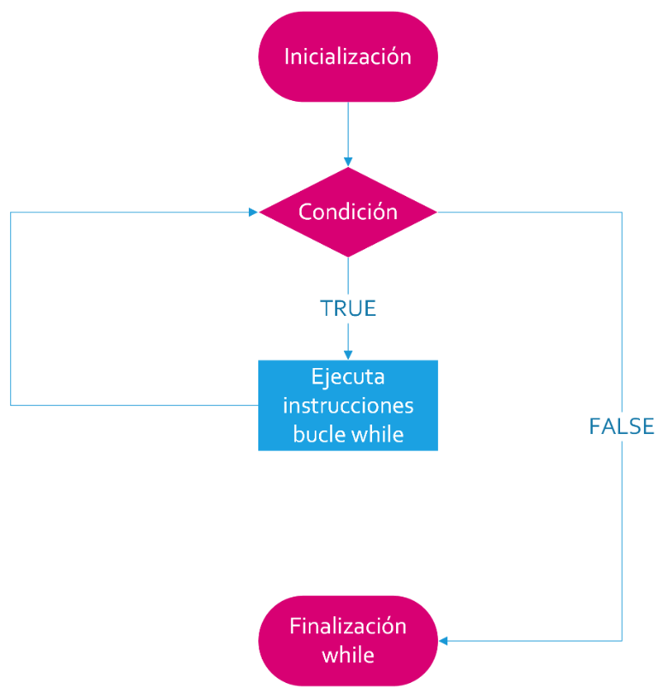
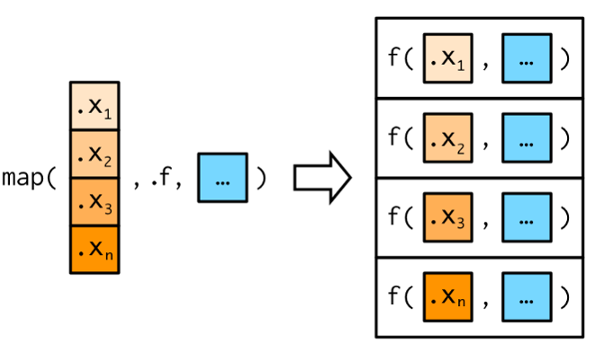

```{r setup, include=F}
library(quarto)
library(fontawesome)
library(tidyverse)
```

##  {#intro-diapo .invert data-menu-title="Control de flujo y funciones"}

[**Control de flujo y funciones**]{.custom-title}

[***Extra***]{.custom-subtitle}

## Estructuras de control de flujo {.title-top}

<br>

### Condicionales

<br>


- `if()`:  condicional SI


```{r}
#| eval: false
#| echo: true

if(Condición) {
  operaciones_si_la_condición_es_TRUE
}

```


<br>

Se utiliza mucho en funciones para hacer que el flujo de ejecución tome distintos caminos en función de que se cumpla cierta condición.

## Estructuras de control de flujo {.title-top}

<br>

### Condicionales

<br>


- `else()`: de otro modo (se usa combinado con `if()`)

```{r}
#| eval: false
#| echo: true

if(condición) {
  operaciones_si_la_condición_es_TRUE
} else {
  operaciones_si_la_condición_es_FALSE
}

```

<br>

Se aplica luego de un `if()` si queremos ejecutar acciones a partir de la negación de la condición.


## Estructuras de control de flujo {.title-top}

<br>

### Bucles tradicionales

- `for()`:  secuencia de elementos

- `while()`:  mientras una condición es verdadera

- `repeat()`:  repetición y control manual con `break` (*uso peligroso*)

<br>

### Mapeo con paquete purrr

- Familia funciones `map()`

## Función `for()` {.title-top}

<br>

{fig-align="center" width="750"}

## Función `for()` {.title-top}

<br>

```{r}
#| eval: false
#| echo: true

for (variable in vector) {
  
}
```

<br>

Donde `variable` se reemplaza por un índice (generalmente `i` pero puede llamarse como deseemos) que recorrerá un `vector` desde 1 a una determinada longitud. (habitualmente `1:length(x)`).

En cada vuelta la `variable` aumenta 1 hasta que alcanza el final del `vector`.

La variable `i` se utiliza en el cuerpo del `for()` para recorrer índices de objetos.


## Función `while()` {.title-top}

{fig-align="center" width="750"}

## Función `while()` {.title-top}

<br>

```{r}
#| eval: false
#| echo: true

while (condition) {
  
}
```

<br>

Donde `condition` es una condición lógica. Si se cumple el bucle continúa, de lo contrario se sale de él.

Dentro del cuerpo de la estructura debemos proceder a manejar los cambios en lo que se evalúa en la condición. Si eso no sucede, el bucle puede llegar a ser infinito.

El control es más "artesanal" que el bucle `for()` y depende completamente del usuario del lenguaje.

## Paquete purrr {.title-top}

<br>

Paquete con herramientas que buscan remplazar las formas tradicionales de bucles iterativos otorgándole compatibilidad con tidy data (datos ordenados).

- Se utiliza para aplicar funciones a vectores, dataframes y listas, dando lugar a la denominada "programación funcional" (FP).

- El paquete se instala y activa con tidyverse.

- Sus funciones son fáciles de escribir pero más difíciles de entender para usuarios sin conocimientos de programación.

- Las familia de funciones `map()` son similares en idea que la familia de funciones `apply()` de R base pero consistentes con el ecosistema tidyverse.
 
## Familia `map()`  {.title-top}

<br>

{fig-align="center" width="1100"}

## Familia `map()`  {.title-top}

<br>

La familia de funciones basadas en `map()` tiene 5 variantes más específicas, asociadas al tipo de dato:

- `map_int()`: vectores de números enteros
- `map_dbl()`: vectores de números reales
- `map_chr()`: vectores de caracteres
- `map_lgl()`: vectores de valores lógicos
- `map_vec()`: respeta el tipo de dato del vector ingresado (se usa para formatos factor, POSIX) siempre que su longitud sea 1.


## Creación de funciones {.title-top}

<br>

Las funciones personalizadas nos permiten automatizar tareas comunes de una manera más potente y general que copiar y pegar. 

Las podemos clasificar en 3 grupos:

- **Funciones vectoriales** que toman uno o más vectores como entrada y devuelven un vector como salida.

- **Funciones de tablas de datos** que toman un dataframe como entrada y devuelven un dataframe como salida.

- **Funciones gráficas** que toman un dataframe como entrada y devuelven un gráfico como salida.

## Esqueleto de una función {.title-top}

<br>

Basicamente las funciones tienen:

- Un **nombre**, que deberá cumplir con las caraterísticas que nos impone el lenguaje para nombres (no debe comenzar con un número, no debe utilizar palabras reservadas del lenguaje, no debe tener espacios entre los caracteres, etc.)

- **Argumentos**, puede no haber o haber varios, dependiendo de lo que se necesite para que la función trabaje. Van encerrados entre paréntesis y separados por coma.

- Un **cuerpo**, donde se desarrolla el código en cuestión, que se va a repetir cada vez que llamemos a la función. Este código deberá ser una abstracción generalizada de la solución al problema que abordemos para lograr que funcione en cualquier situación.


## Esqueleto de una función {.title-top}

<br>

La sintaxis de creación en R es:

```{r}
#| echo: true
#| eval: false
nombre_funcion <- function(variables) {
  < cuerpo de la función >
}  
```

donde:

- **nombre_funcion**: es el nombre que le queremos dar a la función creada
- **function()**: es la palabra reservada por el lenguaje para crear funciones
- **variables**: es el espacio donde se declaran el o los argumentos con los que trabajemos. Puede, en ocasiones, no haber ninguno.
- **{}**: entre estas llaves se encuentra el cuerpo de la función

## Funciones vectoriales {.title-top}

<br>

- Reciben vectores y devuelven vectores
- Son las funciones más sencillas para elaborar
- Se aplican en variables de un dataframe a través del ecosistema tidyverse por medio de los andamiajes `mutate()` o `summarise()`, ya se trate de modificar el vector o de resumirlo.
- Son útiles los bucles y las estructuras condicionales tipo `if(){}` (similar al `if_else()`).
- Para activar paquetes se suele utilizar la función `require()` que a diferencia de `library()` produce advertencias y no detiene la ejecución. 


## Funciones de tablas de datos {.title-top}

- Reciben tablas de datos (dataframes) y devuelven tabla de datos.
- Utilizan operadores de evaluación denominados **"embracing"** (abrazar). 
- Abrazar una variable le dice a **dplyr** que use el valor almacenado dentro del argumento y no el argumento como el nombre "literal" de la variable. {{ nombre_variable }}

```{r, eval=FALSE, echo=TRUE}
resumen <- function(datos, var) {
  
require(dplyr) # activa paquete sin devolver mensajes
    
datos |> summarise(
    min = min({{ var }}, na.rm = TRUE),
    ....
```  


## Funciones para gráficos {.title-top}

<br>

- Son similares a las funciones de tablas de datos porque al usar el paquete ggplot2 debemos "alimentar" a la función con datos de un dataframe.
- Reciben tablas de datos y devuelven gráficos.


```{r, eval=FALSE, echo=TRUE}
barras <- function(datos, var) {
  
require(ggplot2) # activa paquete sin devolver mensajes
    
  datos |> 
    ggplot(aes(x = {{ var }}, fill = {{ var }})) +
    geom_bar() +
    theme(legend.position = "bottom")
}
```  

## Operador morsa (:=) {.title-top}

<br>

El operador es necesario cuando queremos reutilizar el nombre de una variable definida por el usuario que aplica la función a la izquierda de una asignación de argumentos de *tidyverse*.

Se le denomina **morsa**, se escribe **:=** y significa igual (=).

```{r, eval=FALSE, echo=TRUE}
nombre <- function(datos, var) {
  
  ...
     mutate({{ var }} := fct_infreq({{ var }}))
  ... 
   
}
``` 


## Importar funciones propias {.title-top}

<br>

La función `source()` nos permite llamar scripts externos donde tengamos nuestras funciones personales.

Si mi script de funciones se llama ***"funciones.R"*** ejecutamos:

<br>

```{r}
#| eval: false
#| echo: true

source("funciones.R")
```

<br>


Cada vez que lo hagamos dentro del script de trabajo tendremos a disposición todas las funciones que se encuentran declaradas en el archivo ***"funciones.R"***.