```{r setup, include=F}
library(quarto)
library(fontawesome)
library(tidyverse)
```

##  {#intro-curso data-menu-title="Introducción al lenguaje R" .invert}


[**Introducción al lenguaje R**]{.custom-title} 

[***Unidad 1***]{.custom-subtitle}


## Introducción al lenguaje R {.title-top}

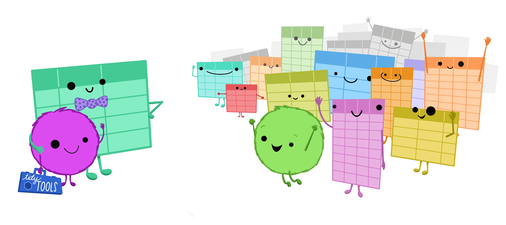{.absolute top="200" left="1250" width="650"}


> Unidad 1: Instalación e introducción al lenguaje R

. . .

> Unidad 2: Exploración, diagnóstico y limpieza de datos

. . .

> Unidad 3: Procesamiento de datos

. . .

> Unidad 4: Tratamiento de datos específicos

. . .

> Unidad 5: Estadística descriptiva

. . .

> Unidad 6: Inferencia estadística

. . .

> Unidad 7: Visualización de datos 

. . .

> Unidad 8: Comunicar con RStudio


## Esquema de trabajo {.title-top}

<br>

. . .

-   Cada semana comenzamos un nuevo tema en el aula virtual con material teórico-práctico, recursos extras, enlaces, bibliografía complementaria. También el primer encuentro sincrónico de la unidad de 10 a 12 hs, según cronograma.

. . .

-   El segundo encuentro será práctico y despejaremos dudas y preguntas.

. . .

-   En cada unidad tendrán una práctica para desarrollar y al finalizar la cursada un trabajo práctico integrador.

. . .

<br>

::: callout-warning
## Importante

En la plataforma moodle tienen el cronograma y la información administrativa del curso. 
:::

## Trabajos prácticos {.title-top}

<br>

-   Cada unidad tiene su trabajo práctico.

-   Es importante que lo intenten hacer y utilicen el foro para consultar las dudas y problemas.

-   Al finalizar cada unidad se subirá una resolución al aula virtual.

-   El trabajo practico integrador se inicia con la unidad 8 y se entrega el 31/08/2026.

<br>

::: callout-note
## Nota

Estas fechas pueden sufrir cambios como resultado del desarrollo de la cursada.
:::

## Conceptos y terminología de datos {.title-top}

### ¿Qué es un dato?

-   Unidad mínima de información que describe una característica observable de una unidad de análisis en la muestra o población.
-   **Ejemplo:** la edad registrada en una historia clínica.

{fig-align="center"}

**Idea clave:** un dato sólo tiene significado en su contexto (quién, cuándo, cómo) y recorta una porción de la realidad. 

## Variable vs Valor {.title-top}
 
::::: columns
::: {.column width="65%"}
-   **Variable:** característica que puede variar entre observaciones. Se ubica en columnas y tiene un tipo de dato definido.
:::

::: {.column width="35%"}
{fig-align="center"}
:::
:::::

. . .

::: {style="font-size: 90%;"}
-   Ej.: edad, sexo, diagnóstico, fecha de consulta.
:::

. . .

::: {style="font-size: 90%;"}
-   **Valor:** manifestación concreta de la variable para una unidad de análisis.
-   Ej.: edad = 45 (numérico); sexo = F (caracter); fecha de consulta = 2025-11-28 (fecha).
:::

## Variables {.title-top}

<br>

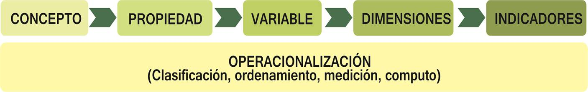{fig-align="center"}

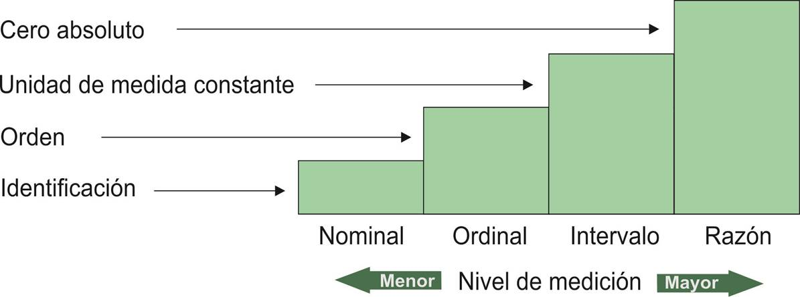{fig-align="center"}

## Unidad de análisis {.title-top}

::::: columns
::: {.column width="60%"}
-   Entidad básica sobre el que se registran los datos. Se ubica en las filas y constan de un conjunto de variables.
:::

::: {.column width="40%"}
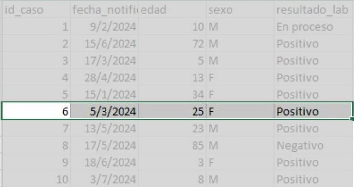{fig-align="center"}
:::
:::::

-   Ejemplos en salud: **Paciente**, **Consulta**, **Evento** (p. ej. notificación de enfermedad), **Hospital**, etc.

**Por qué importa:** la elección condiciona el diseño, la agregación, la dependencia y la interpretación.

## Tipos de variables {.title-top}

<br>

::: {.fragment .fade-in-then-semi-out}
-   **Cuantitativas o numéricas** (Continuas: p. ej. edad, peso o discretas: p. ej. número de consultas)
:::

::: {.fragment .fade-in-then-semi-out}
-   **Cualitativas o categóricas** (Nominales: p. ej. sexo, diagnóstico. u ordinales: p. ej. gravedad (leve/moderado/severo).
:::

::: {.fragment .fade-in-then-semi-out}
-   **Fechas / Tiempos** (Ej.: fecha de inicio de síntomas, fecha de notificación).
:::

::: {.fragment .fade-in-then-semi-out}
-   **Lógicas** (dicotómicas Verdadero - Falso)
:::


## Lenguaje R {.title-top}

{.absolute top="10" left="1600" width="300"}

<br>

El [sitio oficial](https://www.r-project.org/) del lenguaje dice que:

_**“R es un entorno de software libre para gráficos y computación estadística.**_ 

_**Se compila y se ejecuta en una amplia variedad de plataformas UNIX, Windows y MacOS.”**_

. . . 

<br>

Profundizando en su descripción podemos decir, más técnicamente, que:

> es un lenguaje de programación interpretado, orientado a objetos, multiplataforma y open source pensado para el manejo de datos estadísticos.

## Por lo tanto {width="8%"} ... {.title-top .smaller}

. . . 

**...es un lenguaje de programación estadístico**

Básicamente es un lenguaje de programación, con sus estructuras y reglas de sintaxis, que posee una gran variedad de funciones desarrolladas para estadística y otras librerías con diversas aplicaciones.

. . .

**...es un lenguaje Orientado a Objetos**


Implementa los conceptos de la programación orientada a objetos y esto le otorga simpleza y flexibilidad en el manejo de datos. 

. . .

**...es un lenguaje interpretado**

No es necesario compilar el código para construir ejecutables sino que directamente se ejecuta por medio del intérprete que el software instala.

. . . 

**...es multiplataforma**


Se puede instalar en diferentes sistemas operativos como Linux, Windows y Mac. 

. . . 

**...es Open Source y se distribuye bajo licencia GNU - GPL**

Se distribuye gratuitamente bajo [licencia GNU](https://es.wikipedia.org/wiki/GNU_General_Public_License) (General Public License) -- GPL y que los usuarios tienen la libertad de usar, estudiar, compartir (copiar) y modificar el software.

## Historia {.title-top}

<br>

:::: {.columns}

::: {.column width="70%"}

R es un lenguaje que fue desarrollado a partir del [***lenguaje S***](https://en.wikipedia.org/wiki/S_(programming_language)) que a su vez tiene sus orígenes en [Bell Labs](https://en.wikipedia.org/wiki/Bell_Labs) de la **AT&T** (actualmente Lucent Technologies) de mediados de la década del '70. Posteriormente, S fue vendido y dio origen a una versión propietaria denominada S-Plus que es comercializada por Insighful Corporation.

<br>

En 1995 dos profesores de estadística de la *Universidad de Auckland*, en Nueva Zelanda ([Ross Ihaka](https://en.wikipedia.org/wiki/Ross_Ihaka) y [Robert Gentleman](https://en.wikipedia.org/wiki/Robert_Gentleman_(statistician)), iniciaron el **"Proyecto R"**, con la intención de desarrollar un programa estadístico inspirado en el lenguaje S pero de dominio público.

:::

::: {.column width="30%"}

<br>


{width="100%"}
:::

::::

## Funcionamiento {.title-top}

<br>

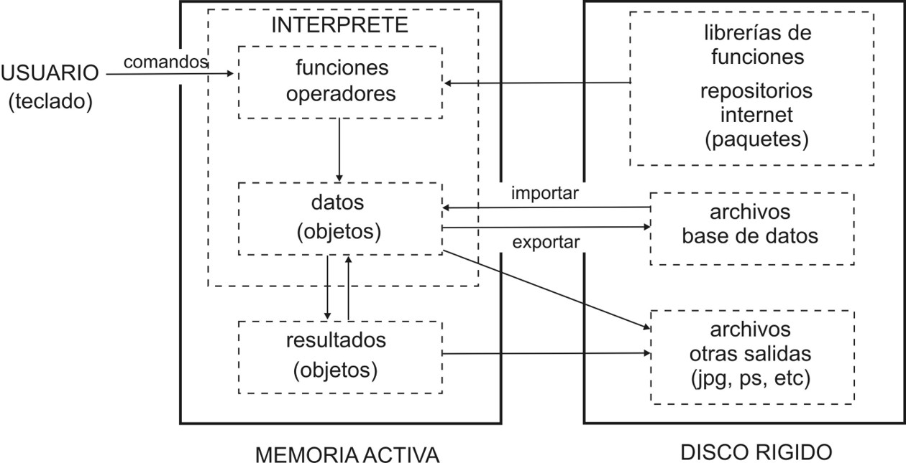{width="85%" fig-align="center"}


## Usuarios del lenguaje y enfoque "comunicativo" {.title-top}

<br>

- Plantea abordar el lenguaje R como un lenguaje para **_"comunicarse"_** (similar a un segundo lenguaje como el inglés, francés, etc.)

- Al dotar a R de una estructura particular **_semántica_**, **_gramatical_** y **_sintáctica_**.

- Se busca comenzar a **_"decir cosas con datos"_** y luego profundizar en las estructuras del lenguaje.

- Diferencias entre ser **_"usuario"_** y **_"programador"_** 

- Propuesto por *Riva Quiroga* de LatinR en el encuentro global de RStudio de 2021. Para profundizar ver ponencia *“How to do things with words: Learning to program with a ‘communicative approach’"* en [rstudio::global(2021)](https://rstudio.com/resources/rstudioglobal-2021/how-to-do-things-with-words-learning-to-program-in-r-with-a-communicative-approach/)

## R es un lenguaje de funciones (y argumentos) {.title-top}

<br>

Una función es un bloque de código que sólo se ejecuta cuando se llama.

- Existen funciones que forman parte de la base del lenguaje y otras que estan empaquetadas en librerías.

- Todas las funciones devuelven algo. Datos, un resultado o una acción determinada.

- La mayoría necesitan de ciertos datos que se declaran dentro de la función denominados **argumentos**. Algunos son obligatorios y otros opcionales.

```{r, eval=FALSE}
# Estructura sintáctica de una función

funcion(argumento1, argumento2, ...)
```

- Toda función se escribe con una sintaxis precisa y finaliza siempre con paréntesis. Los argumentos se separan por comas. 


## Paquetes de R {.title-top}

<br>


:::: {.columns}

::: {.column width="80%"}

- **Paquete** es sinónimo de *librería* y contiene una serie de funciones y/o datos con su documentación.

- El conjunto base de R tiene varias funciones fundamentales contenidas en algunos paquetes (base, stats, utils, graphics, methods, etc)

- Los paquetes se instalan, activan y desactivan. El sitio oficial donde se publican se encuentra en [CRAN - packages](https://cran.r-project.org/web/packages/available_packages_by_name.html)

- Visto como un lenguaje (idioma) los paquetes vendrían a ser conjuntos de palabras que *"agregamos"* a nuestro vocabulario para poder *"comunicarnos"* mejor o más fácilmente con el interprete de R.

:::

::: {.column width="20%"}

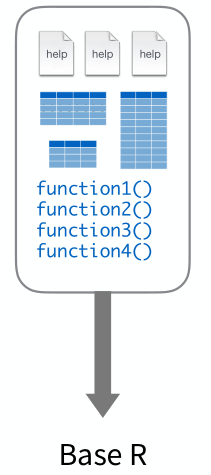{width="100%" fig-align="center"}

:::

::::

##

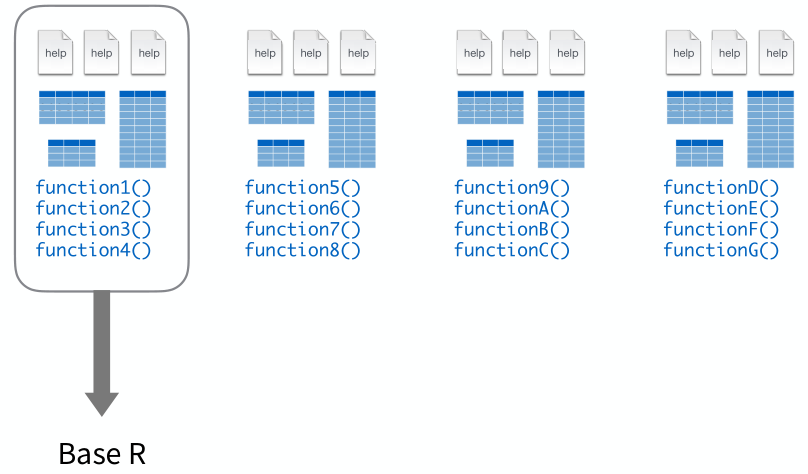{width="100%" fig-align="center"}

##

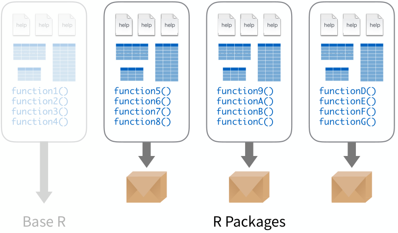{width="100%" fig-align="center"}


## 

{.absolute top="0" left="0" width="400"}

<br>

<br> <br> <br>

::: {.fragment .fade-in-then-semi-out}

-   IDE - Entorno de Desarrollo Integrado

:::

::: {.fragment .fade-in-then-semi-out}

-   Paneles

:::

::: {.fragment .fade-in-then-semi-out}

-   Proyectos

:::

::: {.fragment .fade-in-then-semi-out}

-   Scripts

:::

::: {.fragment .fade-in-then-semi-out}

-   Herramientas de edición

:::

::: {.fragment .fade-in-then-semi-out}

-   Gestión de paquetes

:::

## Tidyverse {.title-top}

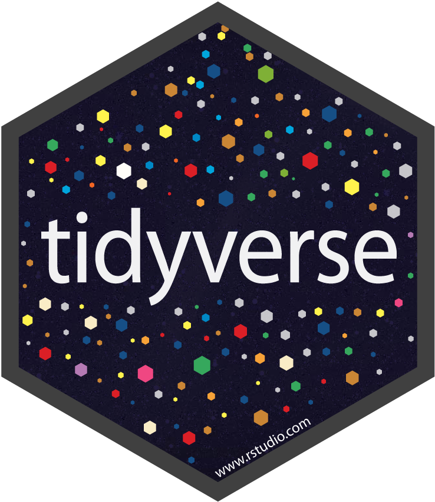{.absolute top="10" left="1700" width="150"}


<br> <br> <br>

Una colección de paquetes de R modernos, que comparten una **gramática** y filosofía común, diseñados para resolver los desafíos de la ciencia de datos.

<br>

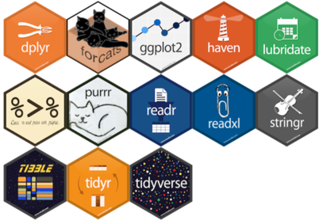{fig-align="center" width=35%}

## Fundamentos {.title-top .smaller}

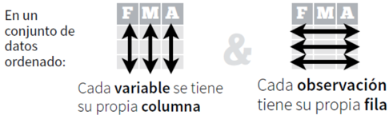{fig-align="center" width=50%}


- **Estructura ordenada de datos (tidy)**

  - Cada _variable_ es una _columna_ de la tabla de datos
  
  - Cada _observación_ es una _fila_ de la tabla de datos
  
  - Cada _tabla_ responde a una _unidad observacional_

- **Principios básicos** 

  - Reutilizar las estructuras de datos mediante el uso de tuberías
  
  - Resolver problemas complejos combinando varias piezas sencillas
  
  - Diseño para humanos incorporando una gramática específica al lenguaje (*que ya posee una sintaxis estricta y una semantica que le otorga significado*)


## 

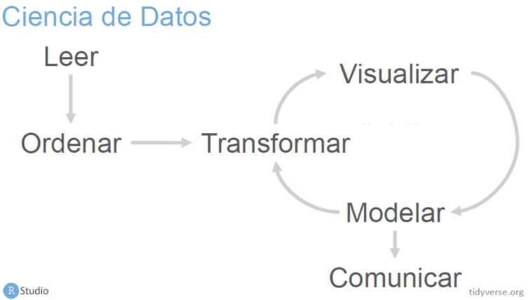{fig-align="center" width=100%}

##

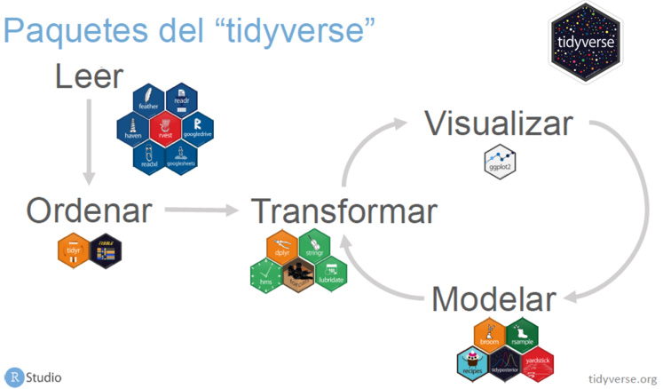{fig-align="center" width=100%}

## Tuberías {.title-top}

<br>

Las tuberías son operadores que permiten *"canalizar"* un objeto hacia una función o llamar a una expresión, lo que le permite expresar una secuencia de operaciones que transforman un objeto.

<br>

Existen dos tuberías conocidas: 

`%>%` perteneciente al paquete **magrittr** del tidyverse 

`|>` que es la propuesta **nativa** de R base a partir de la versión 4.1.0

La mayoría de los scripts del curso muestran la tubería nativa, pero se puede utilizar cualquiera de las dos.

## Tuberías {.title-top}

<br>

{width=40% fig-align="center"}


Para el uso general, la utilización de las dos tuberías es la misma, es decir que la forma simple de las tuberías inserta el lado izquierdo como primer argumento en la llamada del lado derecho. 

Esto posibilita la reutilización de las estructuras de datos y la escritura de porciones de código similares a *"oraciones"* de un párrafo.

Pulse [aquí](https://www.tidyverse.org/blog/2023/04/base-vs-magrittr-pipe/) para ver algunas caracteristicas comparativas de estas tuberías.


## Estructura de datos {.title-top}

<br>

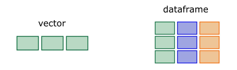{fig-align="center" width=50%}

Las estructuras de datos son los **objetos** **_contenedores de datos_** que el lenguaje ofrece.

Existe una variedad de estructuras de datos: vectores, matrices, arrays, dataframes, listas, etc.

Vamos a describir a las más relevantes dentro del ecosistema tidyverse y que serviran en estos inicios del curso: Los **vectores** y los **dataframes**.


## Vectores {.title-top}

<br>

- Son secuencias de elementos del mismo tipo de datos.

- Tienen dos atributos principales: longitud y tipo de datos.

- Los 6 tipos de datos que usaremos en R son:

  1. logical (`TRUE` - `FALSE`)
  2. integer (`15`)
  3. double (`24.64`)    
  4. character (`"Hola"`)
  5. factors (`"Si"` - `"No"` - `"Ns/Nc"`)
  6. date/datetime (`"2023-10-09"` - `"2023-10-09 01:00:00"`)
  
- Los vectores integer y double se conocen como vectores numéricos (numeric).


## Dataframes {.title-top .smaller}

<br>

:::: {.columns}

::: {.column width="60%"}

- Un dataframe, que se traduce como *marco de datos*, es similar a una tabla de datos construida por una colección de vectores ubicados verticalmente que mantienen la integridad de sus filas.

- Tienen dos dimensiones, las columnas verticales llamadas **variables** y las filas horizontales llamadas **observaciones**.

- Las columnas pueden ser de diferentes tipos, pero todas las filas de cada columna pueden tener un mismo tipo de dato.

- La combinación de datos de las diferentes columnas que conforman una fila es fija, por lo que se asegura la integridad de estas observaciones (principio de las bases de datos).

:::

::: {.column width="40%"}

<br>


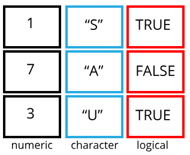{width="100%"}

:::

::::

## Tibbles {.title-top .smaller}

<br>

:::: {.columns}

::: {.column width="60%"}

- Los tibbles son una versión moderna del dataframe que introduce **tidyverse**.

- Tienen las mismas características que un dataframe normal con algunos atributos más agradables.

- Cuando importemos tablas de datos, estos se almacenarán como dataframes/tibbles.

- Dado que estamos centrados en tidyverse, utilizaremos los términos dataframe y tibble como sinónimos entre sí para su uso general.

- Los dataframes/tibbles son el tipo de datos fundamental en la mayoría de los análisis que llevaremos adelante.

:::

::: {.column width="40%"}

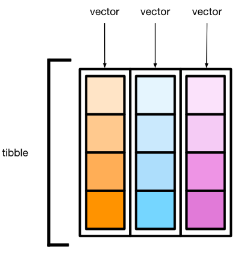{width="100%"}

:::

::::

## Archivos de datos {.title-top}

<br>

- El formato de archivos de datos estándar y universal es el **texto plano separado por comas** (archivos `csv`)

- Se pueden importar otros formatos comunes como `.xlsx`, o específicos provenientes de Stata, SPSS, y otros softwares de análisis a partir de paquetes que integran el tidyverse.

- El objeto al que asignemos la importación de estos archivos siempre será un **dataframe/tibble**.

- Otro formato de datos propio de R es `.RData`, que permite guardar varios objetos del lenguaje (vectores, dataframes, etc.) simultáneamente. Es como almacenar el entorno de trabajo completo.

## Archivos planos {.title-top}

<br>

::: incremental
-   Archivos que contiene tablas de datos
-   Están construidos con solo texto (se puede abrir desde un Block de Notas)
-   Formato simple: cada fila = observación, cada columna = variable.
-   Extensiones comunes: `.csv`, `.txt` (delimitado por comas, punto y coma o tabulador).
:::

. . .

<br>

**Ventajas:** interoperables y fáciles de leer en R (`readr::read_csv()`).

## Tablas relacionales (bases de datos) {.title-top}

<br>

-   **Estructura:** varias tablas vinculadas por variables identificadoras (claves).
    -   **Clave primaria:** identifica únivocamente una observación en su propia tabla
    -   **Clave foránea:** identifica unívocamente una observación en otra tabla

. . .

Ejemplo: `pacientes` (id_paciente) ↔ `consultas` (id_consulta, id_paciente).

<br>

**Ventaja:** evitar duplicación y mantener consistencia en datos complejos.

## Metadatos

<br>

::: incremental
-   *"Datos sobre los datos":* describen origen, fecha, definiciones, responsable.
-   Incluyen a los diccionarios de datos (siempre deben acompañar a las tablas de datos)
-   Ejemplos: fecha de actualización, fuente, variables derivadas, formato.
:::

. . .

<br>

**Por qué son críticos?:** permiten interpretar correctamente y mantener trazabilidad.

## Diccionario de datos {.title-top}

<br>

::: {style="font-size: 100%;"}
Delimitador de variables: ;

Delimitador de decimales: ,

| Variable           |       Tipo | Descripción           | Valores posibles |
|--------------------|-----------:|-----------------------|------------------|
| id_caso            |   numérico | Identificador único   | 1,2,3...         |
| edad               |   numérico | Edad en años          | 0–120            |
| sexo               | categórica | Sexo biológico        | M, F, O          |
| fecha_notificacion |      fecha | Fecha de notificación | AAAA-MM-DD       |
| diagnostico        | categórica | Código CIE10          | Formato CIE10    |
:::

## Consejos cuando trabajamos con datos {.title-top}

<br>
<br>

1.  Definir claramente la **unidad de análisis** antes de recolectar/analizar.
2.  Mantener un **diccionario de datos** actualizado (incluyendo variables construidas).
3.  Saber el **tipo de variable** para elegir análisis y gráfico adecuado.
4.  Guardar metadatos y versión de los archivos.


## Errores y advertencias {.title-top}

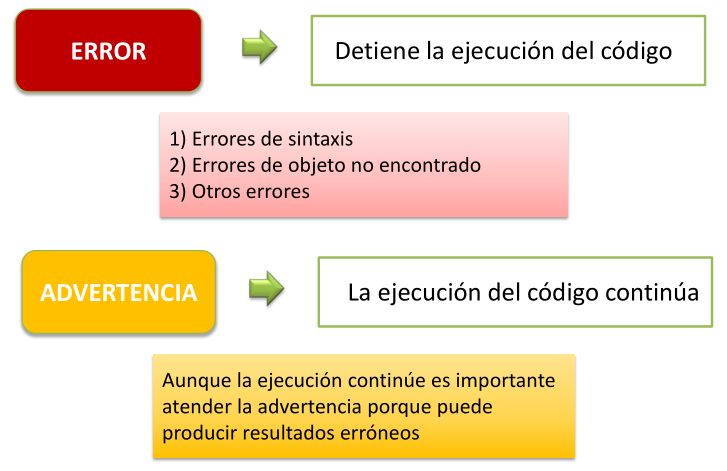{width="70%" fig-align="center"}


## Ayuda {.title-top}

<br>

- Todas las funciones del R base o de los paquetes vienen acompañadas con su respectiva **documentación**.

- Esta documentación se puede visualizar en el panel **Help** de RStudio navegando como si fuese un navegador web.

- La documentación tiene una estructura que se repite: descripción, uso, argumentos, detalles, valores, ejemplos.

- También se pueden hacer busquedas en buscadores web como Google, foros especializados, como por ejemplo **Stack Overflow** o **Rpubs**, canales de **slack** y más recientemente en IA´s como **chatGPT**, **Google Gemini**, **Claude**, etc.

## IA generativa como asistente de análisis de datos en R {.title-top}

-   **¿Qué es?**

**Sistemas de Inteligencia Artificial Generativa** (como **Gemini**, **Chatgpt**, **Claude** y otros) capaces de crear contenido nuevo (texto, código, imágenes) a partir de un prompt.

. . .

-   **En nuestro contexto (lenguaje R con tidyverse)**

Es una herramienta poderosa para traducir peticiones complejas sobre análisis de datos en código R funcional.

Convierte el lenguaje natural en el lenguaje de programación que necesitamos para el análisis en salud.

## Beneficios de la IA en análisis de datos {.title-top}

<br>

::: {style="font-size: 75%;"}

|  |  |
|----|----|
| **Ventaja** | **Descripción** |
| Acelera el aprendizaje | Permite obtener código funcional inmediato para tareas básicas (filtrar, resumir, graficar), reduciendo la frustración inicial de la sintaxis de R |
| Eficiencia y productividad | Genera código para tareas repetitivas o tediosas, liberando tiempo para enfocarse en la interpretación de los resultados |
| Descubrimiento de funciones | Puede sugerir el uso de funciones y paquetes tidyverse que el usuario no conocía, ampliando la caja de herramientas del analista |
| Traducción de ideas | Es útil para traducir conceptos epidemiológicos  ("quiero un gráfico de la evolución temporal de casos") a la lógica de programación requerida. |

::: 

## Cuidados y uso responsable (riesgos) {.title-top}

::: incremental

- El **"Riesgo de la alucinación"** (fallo de código): La IA puede generar código incorrecto, obsoleto o que no se ajusta a las últimas versiones de un determinado paquete. Siempre ejecuta y verifica el código línea por línea. No copiar y pegar sin entender.

- El principio de la **Caja Negra** (opacidad): Confiar ciegamente en el código genera una dependencia que inhibe el aprendizaje profundo de R y la lógica de programación. (pereza cognitiva). La IA debe ser una herramienta para *aprender*, no un reemplazo de la comprensión. El objetivo es comprender la lógica de cada función generada.

:::

## Cuidados y uso responsable (riesgos) {.title-top}

::: incremental

- Privacidad y datos sensibles (ética): **NUNCA ingreses datos reales** (incluso anonimizados) o sensibles de pacientes en el prompt de una IA pública. Usa datos ficticios o descripciones de la estructura del data frame (ej. "tengo una columna edad numérica y una columna diagnostico categórica").

- Sesgos y contexto: La IA no comprende el contexto epidemiológico o clínico complejo. El código puede ser correcto, pero la interpretación sigue siendo responsabilidad humana. El prompt debe ser lo más específico posible para mitigar ambigüedades. La validación del resultado final es indispensable.

:::

## La Regla de Oro: Vos sos el experto! {.title-top}

<br>

La IA genera código, pero como profesionales nosotros generamos el conocimiento y somos responsables de lo que informemos y/o publiquemos.

::: incremental

- Entender el código.

- Verificar los resultados.

- No compartir información confidencial.

:::

## ¿Qué es un Prompt? {.title-top}

<br>
<br>

::: {style="font-size: 130%;"}

Una instrucción, pregunta o entrada de texto que se proporciona a un modelo de Inteligencia Artificial (IA) generativa para obtener una respuesta, código o salida específica.

:::

## Con más detalle {.title-top}

<br>

::: {style="font-size: 120%;"}

El prompt es el *input* que guía la generación de la IA. 

Es la formulación del problema o la solicitud que especifica el contexto (p.ej., lenguaje R, tidyverse), el objetivo (p.ej., filtrar datos, crear un gráfico) y las restricciones (p.ej., formato de salida) para asegurar que el resultado sea preciso y relevante para la tarea requerida.

:::

## Dentro de nuestro contexto {.title-top}

<br>

El **prompt** en la generación de código


Para la programación, el prompt es la especificación precisa que le indica a la IA:

::: incremental

- Qué hacer (ej. calcular la media).

- Cómo hacerlo (ej. usar el paquete dplyr).

- Con qué datos (ej. data frame datos_salud y columna edad).

::: 

## Fundamentos de ingeniería de prompts avanzada {.title-top}

<br>

::: incremental

- La "personalidad" del prompt (*Actuar como..*) : Instruir a la IA para que asuma un rol mejora la calidad y el formato de la respuesta.

- Especificación del formato de salida: Define exactamente cómo quieres que se entregue el código.

- Iteración y refinamiento ("la conversación"): La ingeniería de prompts no es solo un prompt único, sino una conversación.

- Pensamiento crítico y verificación (el límite de la IA): El principio más importante es que el código generado por IA debe ser revisado y entendido.

:::

## Resumen  {.title-top}

<br>

::: {.fragment .fade-in-then-semi-out}

1. **Contexto de lenguaje y paquetes**: Especificar siempre que se necesita código R usando las librerías del tidyverse u otras. 

:::

::: {.fragment .fade-in-then-semi-out}

2. **Estructura de los datos (input)**: Describir el input. ¿Cómo se llama el data frame? ¿Cuáles son los nombres de las variables que van a usar? ¿Qué tipo de datos contienen (numéricos, categóricos, fechas)?

:::

::: {.fragment .fade-in-then-semi-out}

3. **Tarea específica (gestión/análisis)**: Indicar claramente qué se quiere lograr con el código (filtrar, agrupar, calcular la media, crear un gráfico, etc.).

:::

::: {.fragment .fade-in-then-semi-out}

4. **Resultado esperado (output)**: Mencionar cómo se espera que sea la salida. ¿Un nuevo data frame? ¿Una tabla resumida? ¿Un gráfico específico?

:::

## Algunas IA Generativas actuales {.title-top}

<br>

::: incremental

- [Google Gemini](https://gemini.google.com/)

- [OpenAI ChatGPT](https://chat.openai.com/)

- [Anthropic Claude](https://www.anthropic.com/)

- [Microsoft Copilot](https://copilot.microsoft.com/)

- [DeepSeek](https://chat.deepseek.com/)  

- [Perplexy IA](https://www.perplexity.ai/) 

:::

## Para reflexionar..  {.title-top}

<br>
<br>

::: {style="font-size: 120%;"}

*"El efecto de la IA actual no extiende la cognición, sino que la automatiza, convirtiendo el pensamiento en un servicio. En lugar de democratizar el aprendizaje, privatiza el acto de pensar bajo control corporativo."*  - Ronald Purser

:::

<br>

[AI is Destroying the University and Learning Itself - Noviembre 2025](https://www.currentaffairs.org/news/ai-is-destroying-the-university-and-learning-itself)


## Importar y exportar archivos de datos {.title-top}

<br>

- En el mundo informático existen numerosos formatos de archivos de tablas / base de datos.

- El lenguaje R permite importar y exportar de una amplia variedad de formatos a partir de utilizar diferentes paquetes. Muchos de ellos pertenecientes al ecosistema **tidyverse**.

- Hoy nos vamos a centrar en dos formatos básicos habituales donde tenemos almacenada comúnmente la información:
  - Archivos **texto plano separados por comas** u otro caracter (extensiones .csv, .txt, etc)
  - Archivos con formato **Excel** (.xls y .xlsx)

- Además mencionaremos otros formatos posibles y el propio de R

## Paquete readr {.title-top}

{fig-align="center" width="15%"}

El paquete **readr** se instala y activa cuando ejecutamos `library(tidyverse)`.

- Contiene una familia de funciones que permiten leer y escribir archivos de texto plano separados como coma o algún otro caracter (tabulación, punto y coma, etc)

- Sus funciones de lectura comienzan todas con **read_**

- Sus funciones de escritura comienzan con **write_**

<br>

## Lectura con funciones de readr {.title-top}

<br>

La primera función de lectura que vamos a presentar es `read_delim()`

El estructura de esta función sirve de base para las demás.

Sus principales argumentos son:

- **file**: nombre del archivo

- **delim**: caracter separador de columna

- **col_names**: Valor lógico. Si es *TRUE* lee la primera fila como nombres de las variables. Si es *FALSE* no lo hace.

- **skip**: número de líneas que saltea para comenzar a leer.

## Lectura con funciones de readr {.title-top}

<br>

La función tiene numerosos argumentos que nos permite controlar eficazmente la lectura, como vemos debajo, pero se suelen modificar pocos de ellos en la mayoría de las situaciones.

```{r}
#| echo: true

args(readr::read_delim)

```


## Lectura con funciones de readr {.title-top}

<br>

Para archivos separados por comas en formato regional Estadounidense se utiliza la función `read_csv()`.

Tiene la misma base de `read_delim()` pero asume:

- que el caracter delimitador es la `coma` ","
- que el caracter separador de coma decimal es el `punto` "."

```{r}
#| echo: true
#| eval: false

read_csv(file = "datos.csv")
```

## Lectura con funciones de readr {.title-top}

<br>

Para archivos separados por comas en formato regional Español/Argentino se utiliza la función `read_csv2()`.

Tiene la misma base de `read_delim()` pero asume:

- que el caracter delimitador es el `punto y coma` ";"
- que el caracter separador de coma decimal es la `coma` ","

```{r}
#| echo: true
#| eval: false

read_csv2(file = "datos.csv")
```

## Lectura de múltiples archivos {.title-top}

En ocasiones trabajamos con múltiples archivos que tienen una misma estructura interna, por ejemplo provenientes de proyectos longitudinales de vigilancia epidemiológica. Supongamos que tenemos el caso de vigilancia de una enfermedad donde se produce un archivo por mes, tipo `01_SUH.csv`, `02_SUH.csv`, `03_SUH.csv`, etc hasta el mes 12.

Podemos almacenar los nombre de los archivos en un vector y luego leerlos todos juntos, incorporando la identificación del archivo.

```{r}
#| eval: false
#| echo: true


archivos_SUH <- c("datos/01-SUH.csv", "datos/02-SUH.csv", "datos/03-SUH.csv")
read_csv(archivos_SUH, id = "archivo")

#>   archivo           mes     anio   ID    edad  
#>   <chr>             <chr>   <dbl>  <dbl> <dbl>
#> 1 datos/01-SUH.csv Enero  2019     1234     3
#> 2 datos/01-SUH.csv Enero  2019     8721     9
#> 3 datos/01-SUH.csv Enero  2019     1822     2
```


## Herramienta de lectura de RStudio {.title-top}

<br>

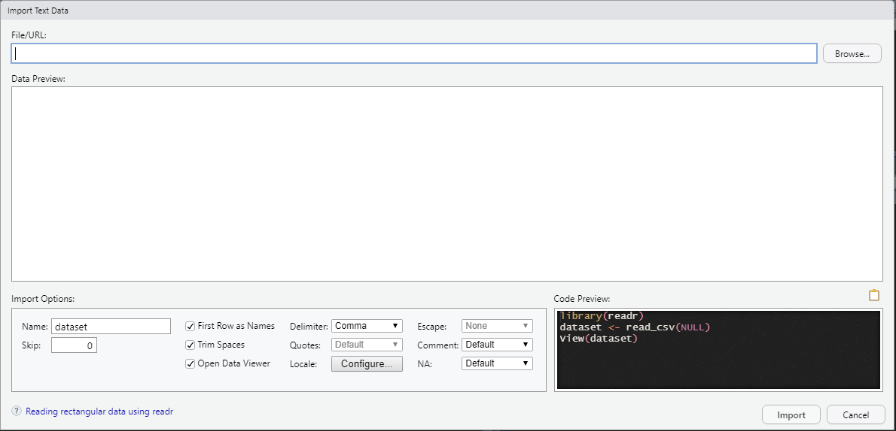{fig-align="center" width=80%}


## Paquete readxl {.title-top}

{fig-align="center"  width=15%}

El paquete **readxl** se instala con tidyverse pero hay que activarlo aparte mediante `library(readxl)`.

- Contiene funciones que permiten leer archivos de Microsoft Excel tan extendidos en nuestro trabajo cotidiano.

- La función comodín para leer, tanto formatos .xls como .xlsx, es `read_excel()`

<br>

## Lectura con funciones de readxl {.title-top}

<br>

La estructura de los argumentos de la función `read_excel()` es:


- **path**: nombre del archivo

- **sheet**: hoja del libro del archivo Excel

- **range**: rango de celdas (opcional)

- **col_names**: Valor lógico. Si es *TRUE* lee la primera fila como nombres de las variables. Si es *FALSE* no lo hace.

- **skip**: número de líneas que saltea para comenzar a leer.

## Paquete haven {.title-top}

{width=13% fig-align="center"}

Este paquete permite la importación de archivos provenientes de paquetes estadísticos como SPSS (.sav), Stata (.dta) y SAS (.sas7bdat) y también su exporatción.

- Sus funciones principales son `read_spss()`, `read_por()`, `read_stata()`, `read_dta()`, `read_sas()`  

- Las funciones de exportación comienzan con el prefijo `write_`

- Utiliza la librería ReadStat hecha en lenguaje C por Evan Miller.

- Tiene algunas limitaciones dependiendo de las versiones de los softwares.


## Formato nativo R {.title-top}

<br>

El propio lenguaje R tiene un formato nativo de almacenamiento del entorno de trabajo produciendo archivos con extensión `.RData`.

Las funciones, pertenecientes a R base, para guardar y leer los `.RData` son:

- `save()`: almacena el contenido del entorno de trabajo, pudiendo seleccionar cual o cuales objetos deseamos guardar.

- `load()`: lee archivos `.RData` y su contenido (sea este uno o varios objetos)

Cabe aclarar que cuando nos referimos a objetos estamos hablando de cualquier estructura de datos como dataframes, vectores, matrices, etc y también funciones propias. 

## Bibliografía de la cursada {.title-top}

<br>

[R para la Ciencia de Datos (2e)](https://davidrsch.github.io/r4ds-es/)

[Fundamentos de ciencia de datos con R](https://cdr-book.github.io/index.html)

[EpiRhandbook](https://epirhandbook.com/es/index.es.html)

[Data Visualization](https://socviz.co/)

[Big Book of R](https://www.bigbookofr.com/)