```{r setup, include=F}
#| label: setup
#| include: false


library(quarto)
library(fontawesome)
library(tidyverse)
```

##  {#intro-curso data-menu-title="Procesamiento de datos" .invert}


[**Procesamiento de datos**]{.custom-title} 

[***Unidad 3***]{.custom-subtitle}

## Introducción {.title-top}

<br>

La manipulación de datos agrupa todas las tareas necesarias para la gestión de las variables:

- su transformación, 
- la creación de nuevas variables, 
- los cambios de escala, 
- el formateo de categorías, 
- el filtro de algunas observaciones, etc., 
- es decir, todo aquello que debamos hacer con los datos antes o durante el analisis.

## Paquete dplyr {.title-top}

{fig-align="center" width=12%}

- **dplyr** es el paquete para **transformar datos** que pertenece al ecosistema **tidyverse**

- Implementa una **_gramática "humana"_**

- Está constituido por funciones definidas como **_"verbos"_**

- Las funciones primarias son: `select()`, `filter()`, `arrange()`, `mutate()` y `summarise()` 

- Otras funciones útiles son: `rename()`, `group_by()`, `count()`, `if_else()`, `case_when()`, `beteewn()`, `across()`, `rowwise()`, etc.

## select() {.title-top}

<br>

La función `select()` del inglés **seleccionar**, sirve para seleccionar variables (columnas) de una tabla de datos.

```{r}
#| echo: true
#| eval: false

select(datos, a, c)  

datos |> select(a, c)
```

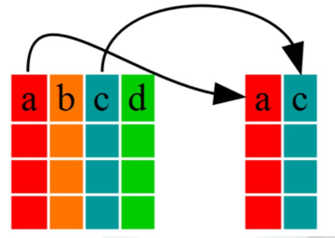{fig-align="center" width=30%}

## Ayudantes de selección {.title-top}

Además existe un abanico de funciones que **ayudan** a una mejor selección de nombres de variables.

:::: {.columns}

::: {.column width="50%"}

- `everything()`: coincide con todas las variables.

- `group_cols()`: seleccione todas las columnas de agrupación.

- `starts_with()`: comienza con un prefijo.

- `ends_with()`: termina con un sufijo.

- `contains()`: contiene una cadena literal.

- `matches()`: coincide con una expresión regular.

:::

::: {.column width="50%"}

- `num_range()`: coincide con un rango numérico como x01, x02, x03.

- `all_of()`: coincide con nombres de variables en un vector de caracteres. 

- `any_of()`: igual que `all_of()`, excepto que no se genera ningún error para los nombres que no existen.

- `where()`: aplica una función a todas las variables y selecciona aquellas para las cuales la función regresa TRUE.


:::

::::


## Ejemplo de select() {.title-top}

<br>

Tenemos estos nombres de variables de una tabla leída.

```{r}
#| echo: false
#| warning: false
#| message: false

library(tidyverse)

datos <- read_csv2("datos/Enterovirus_practicas_depuracion.csv", locale = locale(encoding = "latin1")) |> 
  mutate(Sexo = tolower(Sexo)) |> 
  janitor::clean_names()

names(datos) 
```

## Ejemplo de select() {.title-top}

<br>

Usamos `select()` con un ayudante para quedarnos con una parte de la tabla original 

```{r, echo = T, message=F, warning=FALSE}
# seleccionamos solo variables que comienzan con "s_" 
datos |> 
  select(starts_with("s_")) |> names()
```

## rename() {.title-top}

<br>

La función `rename()` posibilita **renombrar** a las variables de una tabla de datos.

La estructura básica es:

```{r}
#| echo: true
#| eval: false

rename(datos, new_name = old_name)  

datos |> rename(new_name = old_name)
```

La variación `rename_with()` permite **renombrar** variables de una tabla a través de aplicar determinadas funciones.

La estructura básica de esta función es:

```{r}
#| echo: true
#| eval: false

rename_with(datos, función, variables)  

datos |> rename_with(función, variables)
```

## Ejemplo de rename() y rename_with() {.title-top}

<br>

```{r, echo = T, eval=F}
# renombramos s_fiebre por fiebre

datos |> 
  rename(fiebre = s_fiebre) 
```


```{r, echo=FALSE, message=F, warning=FALSE}
datos |> 
  rename(fiebre = s_fiebre)   |> 
  names()

```
## Ejemplo de rename() y rename_with() {.title-top}

<br>

```{r, echo = T, eval=F}
# renombramos el grupo de variables que comienza con s_
# por sus nombres en mayúsculas

datos |> 
  rename_with(.fn = toupper, .cols = starts_with("s_")) 
```


```{r, echo=FALSE, message=F, warning=FALSE}
datos |> 
  rename_with(.fn = toupper, .cols = starts_with("s_"))  |>  
  names()

```

## filter()  {.title-top}

<br>

La función `filter()` del inglés **filtrar**, sirve para filtrar un subconjunto de observaciones (filas) de una tabla de datos a partir de una condición.

Para construir la condición se utilizan una serie de operadores de comparación y operadores lógicos similares a la de otros lenguajes de programación.

La estructura de la función puede ser cualquiera de las siguientes:

<br>

```{r}
#| echo: true
#| eval: false

filter(datos, condición)

datos |> filter(condición)
```

## Operadores de comparación {.title-top}

<br>

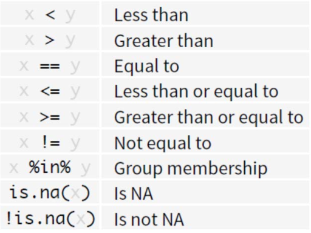{fig-align="center" width=50%}


## Operadores lógicos (booleanos) {.title-top}

<br>

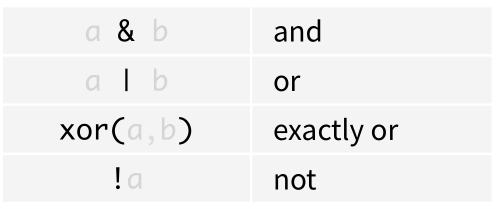{fig-align="center" width=50%}

## Operadores lógicos (booleanos) {.title-top}

<br>

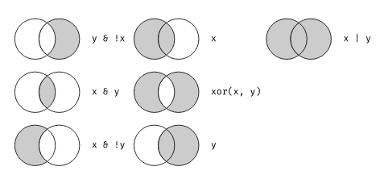{fig-align="center" width=60%}

## Ejemplo de filter()

<br>

```{r, echo = T}
# filtramos observaciones que cumplan con la siguiente condición
datos |> 
  filter(sexo == "f", 
         between(edad, 30, 50), 
         s_fiebre == "Si" | s_cefalea == "Si") |> 
  select(sexo, edad, s_fiebre, s_cefalea)
```

## arrange() {.title-top}

<br>

La función `arrange()` del inglés **ordenar**, sirve para ordenar observaciones de una tabla de datos a partir de una o más variables (columnas).

<br>

```{r}
#| echo: true
#| eval: false

arrange(datos, var1, var2, ...)   

datos |> arrange(var1, var2, ...) 
```

## arrange() {.title-top}

<br>

El ordenamiento _predeterminado_ es **_ascendente_**. 

Si la variable contiene números, las filas se van a ordenar ubicando esos números de menor a mayor (1,2,3...). Si es texto, las filas se van a ordenar ubicando las palabras alfabéticamente en forma ascendente (a,b,c...).

Si deseamos invertir el orden debemos incorporar la función **desc()** dentro de **arrange()**.

<br>

```{r}
#| echo: true
#| eval: false

datos |> arrange(var1)  # ascendente

datos |> arrange(desc(var1)) # descendente
```

## mutate() {.title-top}

<br>

La función `mutate()` del inglés **mutar o transformar**, sirve para crear nuevas variables, a partir de los valores de otras variables, dentro de la tabla de datos.

La o las nuevas variables creadas se incorporan al final de las columnas del conjunto de datos.

Dentro de los argumentos de `mutate()` se aplican funciones vectorizadas, lo que significa que la función toma un vector de valores como entrada y devuelve el mismo número de valores como salida.

<br>

```{r}
#| echo: true
#| eval: false

datos |> mutate(nueva_var = operación/función)
```

## mutate() {.title-top}

<br>

Algunas de las operaciones y funciones vectorizadas provistas por el lenguaje R son:


- Operadores aritméticos - **+**, **-**, __\*__, **/**, **^**   

- Aritmética modular - **%/%** - **%%** 

- Transformación - escala - **log()** - **log2()** - **log10()** - **exp()** - **sqrt()**

- Comparaciones - **>**, **>=**, **<**, **<=**, **==**, **!=**

- Atrasos/adelantos - **lag()** - **lead()**

- Ordenamiento - **min_rank()** - **percent_rank()**, etc...

- Acumulativos - **cumsum()** - **cummean()** - etc...

- Condicional - **if_else()** - **case_when()**.

## Ejemplo de mutate() {.title-top}

<br>

Coercionamos la variable aplicando `dmy()` y `as_date()` 

:::: {.columns}

::: {.column width="50%"}

```{r, echo=T}

datos |> select(fecha)

```

:::

::: {.column width="50%"}


```{r, echo=T}
datos |> 
  mutate(fecha = dmy(fecha),
         fecha = as_date(fecha)) |> 
  select(fecha)
```

:::

::::


## summarise() {.title-top}

<br>

La función `summarise()` del inglés **resumir**, se utiliza justamente para resumir las observaciones de una tabla de datos mediante alguna ***medida resumen***.

Otra forma de escribir la función es `summarize()`. Ambas realizan la misma operación.

<br>

```{r}
#| echo: true
#| eval: false

datos |> summarise(var_resumen = función_resumen)

datos |> summarize(var_resumen = función_resumen)
```

## summarise() {.title-top}

<br>

Algunas de las funciones resumen provistas por el lenguaje R son:


- tendencia central - **mean()** - **median()**

- posición - **min()** - **max()** - **quantile()**

- dispersión - **var()** - **sd()** - **IQR()** 

- conteo - **n()** - **n_distinct()**

- orden - **first()** - **last()**

La mayoría de estas funciones aplican en tipos de datos int (enteros), dbl (reales), date (fecha) y ddtm (fecha - hora).


## Ejemplo de summarise() {.title-top}

<br>
<br>

```{r, echo=TRUE}
# Resumimos la variable edad calculando media, 
# desvío estandar, mínimo y máximo

datos |> 
  summarise(Media = mean(edad),
            Desvio = sd(edad),
            Min = min(edad),
            Max = max(edad)) 
```

## group_by() {.title-top}

<br>

La función `group_by()` del inglés **agrupar por**, sirve para agrupar a partir de valores o categorías distintas.

Aplicado sólo no produce ningún resultado interesante, por eso está pensando para usarlo principalmente asociado a **summarise()**.

<br>

```{r}
#| echo: true
#| eval: false

datos |> group_by(variable)
```

<br>

Junto a esta función aparece `ungroup()` que deshace el agrupamiento.

<br>

```{r}
#| echo: true
#| eval: false

datos |> ungroup()
```

## Ejemplo de group_by() {.title-top}


```{r, echo=TRUE}
# Resumimos la variable edad según sexo 
# calculando media, desvío estandar, mínimo y máximo
datos |> 
  group_by(sexo) |> 
  summarise(Media = mean(edad),
            Desvio = sd(edad),
            Min = min(edad),
            Max = max(edad)) 
```

## Agrupamiento en summarise() {.title-top}

<br>

El agrupamiento o estratificación producido por `group_by()` es permanente mientras no desagrupemos y esto a veces ocasiona problemas.

<br>

En la última versión de **dplyr** se agregó un argumento en `summarise()` para lograr agrupamientos temporales, donde no hace falta desagrupar posteriomente al resultado.

<br>

```{r}
#| echo: true
#| eval: false

datos |> summarise(.by = variable_grupo)
```

## Ejemplo con .by en summarise()  {.title-top}


```{r, echo=TRUE}
# Resumimos la variable edad según sexo con .by
# calculando media, desvío estandar, mínimo y máximo
datos |> 
  summarise(Media = mean(edad, na.rm = T),
            Desvio = sd(edad, na.rm = T),
            Min = min(edad, na.rm = T),
            Max = max(edad, na.rm = T),
            .by = sexo) 
```


## count() {.title-top}

<br>

La función `count()` del inglés **contar**, sirve para contabilizar categorías o valores diferentes de variables resumiendo los datos en una **_tabla de frecuencia_**. 

Reconoce y también contabiliza los valores **NA** de las variables.

```{r}
#| echo: true
#| eval: false

datos |> count(variable)
```

Tiene algunos argumentos opcionales como:

- **name** (nombre de la variable que contabiliza - por defecto se llama n)
- **sort** (si es TRUE se ordena de mayor a menor)
- **wt** (variable peso / ponderación / expansión opcional)

También se pueden agregar más variables separadas por una coma.

## Ejemplo de count() {.title-top}

<br>

```{r, echo=T, message=F, warning=FALSE}
# Contamos las frecuencias de la variable sexo
# ordenadas de mayor a menor

datos |> 
  count(sexo, sort = T)
```

## if_else() {.title-top}

<br>

La función `if_else()` devuelve valores dependiendo del resultado de una condición lógica (TRUE/FALSE).

Los valores devueltos para cada observación se almacenan dentro de una variable definida en **mutate()**.

<br>

```{r}
#| echo: true
#| eval: false

datos |> 
  mutate(x = if_else(condicion, valor_T, valor_F))
```


## Ejemplo de if_else() {.title-top}

```{r, echo=T, message=F, warning=FALSE}
datos |> 
  summarise(Mediana_edad = median(edad))
```

```{r, echo=T}
# dividimos en dos grupos según la mediana de edad
datos |> 
  mutate(grupo_edad = if_else(edad <= 6, "<= 6", "> 6")) |>
  count(grupo_edad) 
```


## case_when() {.title-top}


<br>

La función `case_when()` ejecuta una vectorización múltiple de funciones `if_else()`.

Los valores devueltos para cada observación se almacenan dentro de una variable definida en `mutate()`.

<br>


```{r}
#| echo: true
#| eval: false

datos |> 
  mutate(x = case_when(
    condicion ~ valor_T, 
    ...,
    .default = valor))
```

## Ejemplo de case_when() {.title-top}


```{r, echo=T}
# creamos grupos etarios irregulares
datos |> 
  mutate(grupo_edad = case_when(
    edad < 18 ~ "1.Menor 18 años",
    edad > 17 & edad < 25 ~ "2.18 a 24 años",
    edad > 24 & edad < 35 ~ "3.25 a 34 años",
    edad > 34 & edad < 45 ~ "4.35 a 44 años",
    edad > 44 & edad < 65 ~ "5.45 a 64 años",
    edad > 64 ~ "6.65 y más años",
    .default = "Sin dato"
  )) |> 
  count(grupo_edad)

```

## between() {.title-top}

<br>

La función `between()` es una función atajo para operaciones de condición  _>=_ x _<=_ , implementado para vectores numéricos o de fecha/hora.

Se utiliza dentro de estructuras donde se escriben condiciones (`filter()`, `mutate()`, etc).


<br>

```{r}
#| echo: true
#| eval: false

datos |> filter(between(x, izquierda, derecha)) 
```


<br>

Los dos extremos (izquierda y derecha) se incluyen en el intervalo

## Ejemplo de between() {.title-top}

<br>

```{r,  echo=TRUE}
# filtramos observaciones donde la variable edad sea mayor 
# o igual a 6 y menor o igual 18 años

datos |> 
 filter(between(edad, 6, 18)) |> 
  count(edad)

```

## Uniones en datos relacionales {.title-top}

<br>

Existen situaciones donde debemos analizar datos que se encuentran en diferentes tablas.

Con el fin de responder a nuestras preguntas de interés en ocasiones deberemos unirlas previamente.

De manera general, se le llama **_datos relacionales_** a esas múltiples tablas de datos que provienen muchas veces de sistemas de bases de datos construidas bajo el modelo relacional o bien cuando las tablas de datos tienen fuentes distintas pero comparten alguna variable común que permita "conectarlas".


## Tipos de operaciones {.title-top}

<br>

Para trabajar con datos relacionales necesitamos de *funciones-verbos* que vinculen pares de tablas. 

Las tres familias de funciones del paquete **dplyr** diseñadas para trabajar con datos relacionales son:

- **Uniones de transformación** (del inglés *mutating joins*), agregan nuevas variables a una tabla a partir de observaciones coincidentes de otra tabla.

- **Uniones de filtro** (del inglés *filtering joins*), filtran observaciones de una tabla en función de la coincidencia o no coincidencia de otra tabla.

- **Operaciones en filas y columnas**,  sirven para unir tablas por columnas o por filas.


## Claves {.title-top}

<br>

- Las variables usadas para conectar cada par de variables se llaman **claves** (del inglés *key*)

- Una clave es una variable (o un conjunto de variables) que identifican de manera *única* una observación.

Existen dos tipos de claves:

- Una **clave primaria** identifica únicamente una observación en su propia tabla. 

- Una **clave foránea** únicamente identifica una observación en otra tabla. 


## Uniones de transformación {.title-top}

<br>

**Unión interior**

La forma más simple de unión es la unión interior (del inglés inner join). Una unión interior une pares de observaciones siempre que sus claves sean iguales

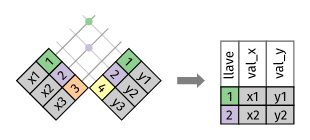{fig-align="center" width=50%}

## Unión interior {.title-top}

Una unión interior mantiene las observaciones que aparecen en ambas tablas. 

**Función inner_join()**

{fig-align="center" width=40%}


## Uniones de transformación {.title-top .smaller}

<br>

**Uniones exteriores**

:::: {.columns}

::: {.column width="50%"} 

<br>

Una unión exterior mantiene las observaciones que aparecen en al menos una de las tablas.

- Una unión izquierda (left join) mantiene todas las observaciones en x.

<br>

- Una unión derecha (right join) mantiene todas las observaciones en y.

<br>

- Una unión completa (full join) mantiene todas las observaciones en x e y.

:::

::: {.column width="50%"}

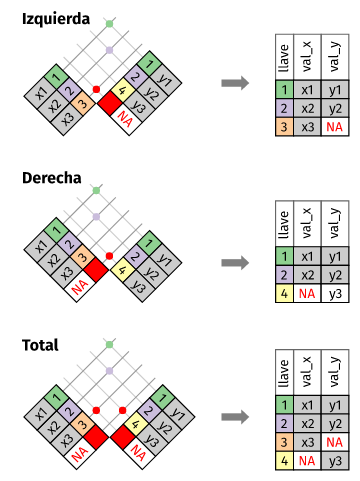{fig-align="center" width=60%}
:::

::::

## Uniones exteriores {.title-top}

<br>

**Función full_join()**

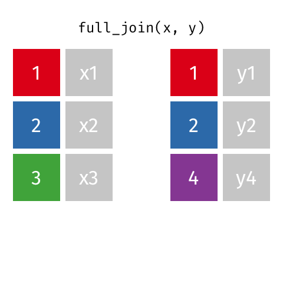{fig-align="center" width=40%}


## Uniones exteriores {.title-top}

<br>

**Función left_join()**

{fig-align="center" width=40%}

## Uniones exteriores {.title-top}

<br>

**Función right_join()**

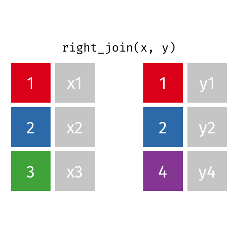{fig-align="center" width=40%}

## Uniones de transformación {.title-top}

Otra forma de ilustrar diferentes tipos de uniones es mediante un diagrama de Venn.

Sin embargo, tiene una limitante importante: un diagrama de Venn no puede mostrar qué ocurre con las claves que no identifican de manera única una observación

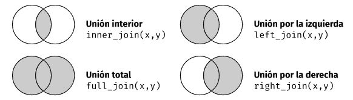{fig-align="center" width=80%}


## Claves duplicadas {.title-top}

<br>

Hasta ahora todas las situaciones han asumido que las claves son únicas. Pero esto no siempre es así.  

Existen dos posibilidades habituales:

- Una tabla tiene claves duplicadas producto de una relación uno a varios.

- Ambas tablas tienen claves duplicadas 

Siempre que unimos claves duplicadas, obtenemos todas las posibles combinaciones, es decir, el producto cartesiano


## Claves duplicadas {.title-top}

Ejemplo con **left_join()**

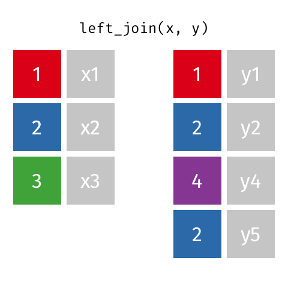{fig-align="center" width=40%}

## Uniones de filtro {.title-top}

<br>

**semi_join()**

**Mantiene** todas las observaciones de la tabla **x** donde la **_clave coincide_** con la clave de la tabla **y**

{fig-align="center" width=40%}


## Uniones de filtro {.title-top}

<br>

**anti_join()**

**Descarta** todas las observaciones de la tabla **x** donde la **_clave coincide_** con la clave de la tabla **y**

{fig-align="center" width=40%}

## Consejos útiles para evitar errores {.title-top}

<br>

- Identificar bien la variables que forman las claves de cada tabla.

- Verificar la completitud de las claves. Si existe algún valor faltante no se podrá identificar la observación.

- Verificar que las claves foráneas coinciden con las claves primarias de la otra tabla. Esto incluye comprobar coincidencia en el tipo de dato (numérico, caracter, etc)

- Verificar claves duplicadas (se puede hacer aplicando **count()**)

## Unión por filas y por columnas {.title-top}


En algunas ocasiones necesitamos unir tablas que tienen formatos particulares por medio de filas o por medio de columnas.

Las funciones de **dplyr** para esta tarea son:

- **bind_rows()** Une una tabla debajo de otra. Aplica cuando tenemos la misma estructura en tabla de datos divida en varios archivos (por ejemplo, producto de carga simultánea de datos en diferentes computadoras con diferentes data entry)

- **bind_cols()** Une una tabla al lado de la otra. Es peligroso su uso si la confundimos con las uniones de transformación porque perdemos integridad de datos en las observaciones. Sirve sólo si el "orden" de las observaciones pueden garantizar la misma identidad de las partes a unir.


## Datos ordenados (tidydata) {.title-top}

<br>

Llamamos **tidy data** o "datos ordenados" cuando:

-   Cada variable está en una columna
-   Cada observación está en una fila
-   Cada celda del cruce entre una columna y una fila es un valor
-   Cada tabla pertenece a una unidad de observación

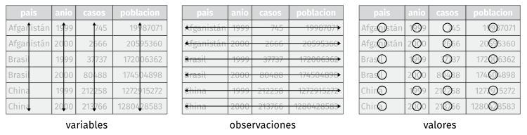{.absolute top="650" left="300" width="1200"}

## Problemas comunes {.title-top}

<br>

-   Una variable se extiende por varias columnas.

-   Una observación está dispersa entre múltiples filas

**Solución:**

{.absolute top="180" left="1220" width="600"}

Usamos funciones pivot del paquete **tidyr** de tidyverse

-   Función **pivot_longer()** - Convierte nombres de variables en valores de una nueva variable.

-   Función **pivot_wider()** - Convierte valores de una variable en variables nuevas.

## Pivoteos {.title-top}

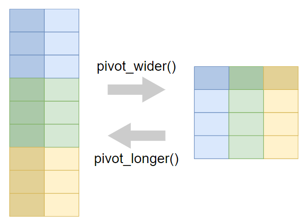{.absolute top="200" left="300" width="900"}

## `pivot_longer()` {.title-top}

<br>

- Soluciona cuando una variable se extiende por varias columnas (las categorías estan en la cabecera).

- Produce tablas "alargando" los datos, aumentando el número de filas y disminuyendo el número de columnas

```{r}
#| echo: true
#| eval: false

datos |> 
  pivot_longer(
    cols = <seleccion de columnas>,
    names_to = "variable_categorías",
    values_to = "variable_valores"
  )
```


## `pivot_wider()` {.title-top}

<br>

- Soluciona cuando una observación está dispersa entre múltiples filas.

- Produce tablas "estirando" los datos, aumentando el número de columnas y disminuyendo el número de filas.

```{r}
#| echo: true
#| eval: false

datos |> 
  pivot_wider(
    names_from = variable_nombres,
    values_from = variable_valores
  )
```


