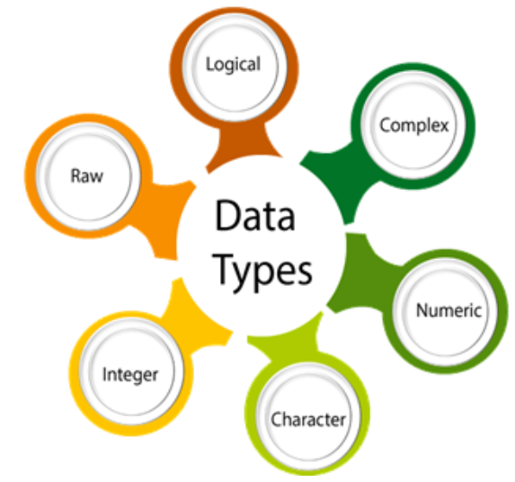
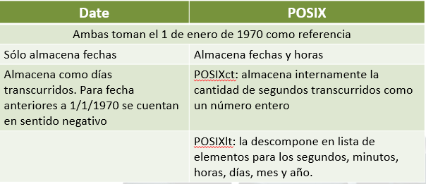
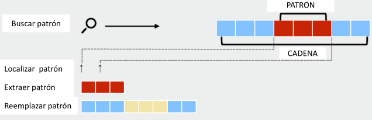
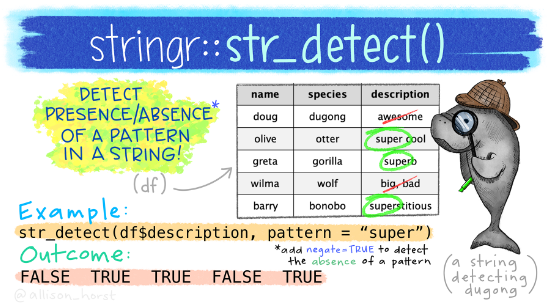

```{r setup, include=F}
#| label: setup
#| include: false


library(quarto)
library(fontawesome)
library(tidyverse)
```

##  {#intro-curso .invert data-menu-title="Tratamiento de datos específicos"}

[**Tratamiento de datos específicos**]{.custom-title}

[***Unidad 4***]{.custom-subtitle}

## Tipos de datos {.title-top}

{.absolute top="200" left="1200" width="650"}

Los tipos de datos en lenguaje R se reconocen por:

> **int** (integer): números enteros

> **num** o **dbl** (numeric): números reales

> **chr** (character): caracteres (texto)

> **logi** o **lgl** (logical): valores lógicos

> **Date**: fechas

> **dttm** (date-time): fechas y horas

> **fct** (factor): factores

## Coerciones {.title-top}

::: {style="font-size: 0.8em;"}
Existen funciones de R base que permiten comprobar y coercionar los tipos de datos.

| Tipo      | Comprobación     | Coerción         |
|-----------|------------------|------------------|
| character | `is.character()` | `as.character()` |
| numeric   | `is.numeric()`   | `as.numeric()`   |
| integer   | `is.integer()`   | `as.integer()`   |
| double    | `is.double()`    | `as.double()`    |
| factor    | `is.factor()`    | `as.factor()`    |
| logical   | `is.logical()`   | `as.logical()`   |
| NA        | `is.na()`        | `as.na()`        |

Las coerciones, en ocasiones, provocan que se asignen valores NA porque no son posibles de realizar.

**Ejemplo**: puedo coercionar un múmero a caracter pero no puedo hacer lo inverso.
:::

## Coerciones {.title-top}

<br>

::: {style="font-size: 0.8em;"}

Cuando se combinan distintos datos, el sistema convierte automáticamente el tipo original al tipo más simple que permita la operación:

| Desde / Hacia | Logical | Integer | Numeric | Character |
|------|------|------|------|------|
| Logical (Lógico)  | Mismo tipo     | Se vuelve 1 o 0     |  Se vuelve 1 o 0    | Se vuelve "TRUE" o "FALSE"     |
| Integer (Entero)     | 0 es FALSE, otro es TRUE     | Mismo tipo     | Sin cambios     | Se vuelve texto (ej. "5")     |
| Numeric (Numérico)     | 0 es FALSE, otro es TRUE     | Pierde decimales     | Mismo tipo     | Se vuelve texto (ej. "5.6")     |
| Character (Texto)     | No permitido     | Error o coerción no válida     | Error o coerción no válida     | Mismo tipo     |

:::

## Variables de tiempo {.title-top}

::: {style="font-size: 0.9em;"}
- Las variables de tiempo pueden estar expresadas en diferentes unidades y formatos (fecha, hora, dia, mes, año, etc...). Dependerá de la tabla de datos, el tipo de estudio, etc.

- Las fechas y las horas son complicadas porque tienen que reconciliar dos ***fenómenos físicos*** (la rotación de la Tierra y su órbita alrededor del sol), con todo un conjunto de ***fenómenos geopolíticos*** que incluyen: formatos distintos (dd/mm/aaaa - mm/dd/aaaa), husos horarios y horarios de verano (en algunas ocasiones y países).

<br>

- Para pensar lo complejo del asunto contestemos estas preguntas:
  - ¿Todos los años tienen 365 días?
  - ¿Todos los días tienen 24 horas?
  - ¿Cada minuto tiene 60 segundos?
:::

## Sistemas de fechas {.title-top}

Las variables de tiempo nos obliga a gestionar tipos de datos fecha y hora, así como también intervalos entre esos instantes.

Coexisten 2 clases de objetos básicos en el lenguaje R

{fig-align="center" width="60%"}

::: tiny
**POSIX** (acrónimo de **P**ortable **O**perating **S**ystem **I**nterface, y **X** viene de UNIX como seña de identidad de la API) es una norma escrita por la *IEEE*, que define una interfaz estándar del sistema operativo y el entorno. Los objetos fecha-hora se denominan formalmente tipos `POSIXt`, `POSIXct`, o `POSIXlt` (la diferencia no es relevante)
:::

## Gestión de datos de tiempo {.title-top}

{.absolute top="70" left="1200" width="500"}

<br>

. . .

> Convertir a formato Date o POSIX

. . .

<br>

> Extraer componentes (día, año, mes, semana epidemiológica, nombre del día, etc)

. . .

<br>

> Trabajar con lapsos de tiempo (intervalos, duraciones y períodos)

. . .

<br>

> Operaciones y cálculos con variables de tiempo

## Definiciones {.title-top}

- Un **date** es un día almacenado como el número de días desde el *01/01/1970* (si es anterior los números son negativos)

```{r}
#| echo: true
#| message: false
#| warning: false

library(tidyverse)
```

```{r}
#| echo: true

as_date(20628) # cantidad de días
as_date(-1)
```

- Un **datetime** es un punto en el tiempo, almacenado como el número de segundos desde el *01/01/1970 00:00:00 UTC*

```{r}
#| echo: true

as_datetime(1782345000) # cantidad de segundos
```

## Paquete lubridate {.title-top}

::::: columns
::: {.column width="50%"}
- Convierte cadenas en fechas

```{r}
#| echo: true

dmy("07/06/2024")

dmy("07/06/2024") |> class()

dmy_h("07/06/2024 09")

dmy_hms("07/06/2024 09:57:04")

dmy_hms("07/06/2024 09:57:04")

dmy_hms("07/06/2024 09:57:04 -03")
```
:::

::: {.column width="50%"}
- Extrae partes de una fecha

```{r}
#| echo: true

fecha <- dmy("07/06/2024")

fecha

# extraemos el año

year(fecha)

# extraemos la 
# semana epidemiológica
epiweek(fecha)
```
:::
:::::

## Lapsos de tiempo {.title-top}

{.absolute bottom="180" left="1300" width="500"}

:::::: {style="font-size: 0.9em;"}
<br>

Un año trópico dura 365 días 5 hs 48 min 45,10 s (365,242189 días), por lo que se produce un desfasaje con respecto a nuestro año calendario.

Para realizar operaciones con fechas y date-times sorteando estas dificultades, **lubridate** ofrece tres tipos de lapsos:

<br>

::::: columns
::: {.column width="70%"}
- **Intervalos**: lapso de tiempo que ocurre entre dos instantes específicos.

- **Duraciones**: lapso de tiempo medidos en segundos exactos (máxima unidad temporal con una longitud consistente).

- **Períodos**: intervalo de tiempo en unidades "humanas" mayores que segundos (minutos, días, meses, etc)
:::

::: {.column width="30%"}
:::
:::::
::::::

## Operaciones de tiempo {.title-top}

Calculo de tiempo entre dos fechas

<br>

```{r}
#| echo: true

fecha1 <- dmy("26/05/1973")
fecha2 <- dmy("07/06/2024")

# creamos un intervalo entre las dos fechas
intervalo <- interval(start = fecha1, 
                      end = fecha2)
intervalo

# el intervalo puede ser divido por 
# duraciones que tienen unidades diferentes
# Las duraciones comienzan con d
# ejemplo: dyears()
```

## Operaciones de tiempo {.title-top}

<br>

Calculo de tiempo entre dos fechas

<br>

```{r}
#| echo: true

intervalo / dyears(1) # años

intervalo %/% dyears(1) # solo enteros

intervalo / ddays()

18640 / 365.25 # calculo de años
```

## Cadenas de caracteres (texto) {.title-top}

- Para el lenguaje R, todo caracter que se encuentre entre comillas es una cadena de caracteres (en inglés llamada **“string”**).

- Las cadenas de caracteres pueden contener letras (**“a”**), números (**“1”**) y símbolos (**“&”**) o una combinación de todos ellos.

Ejemplos de datos tipo cadena regular:

| Valores ejemplo | Descripción      |
|-----------------|------------------|
| B188            | Códigos CIE10    |
| C34.9           | Topografía CIE-O |
| 9061/6          | Morfología CIE-O |
| GAAUUCG | Secuencia ARN    |
| 7600XAD         | Códigos postales |

## Paquete stringr {.title-top}

{.absolute top="10" left="1700" width="180"}

<br> El paquete **stringr** se instala y activa cuando ejecutamos `library(tidyverse)`.

<br>

- Contiene una familia de funciones diseñadas para trabajar con cadenas de caracteres.

<br>

- Permite utilizar [expresiones regulares](https://es.wikipedia.org/wiki/Expresi%C3%B3n_regular) (**regex**).

<br>

- Sus funciones comienzan con el prefijo **str\_**

## Algunas de sus funciones comunes {.title-top}

<br>

. . .

> `str_lengtht()`: devuelve longitud de cadena

. . .

> `str_sub()`: extrae o reemplaza caracteres por posición

. . .

> `str_to_upper()`: convierte a mayúsculas

. . .

> `str_to_lower()`: convierte a minúsculas

. . .

> `str_trim()`: elimina espacios en blanco

. . .

> `str_pad()`: agrega espacios en blanco u otros caracteres

. . .

> `str_glue()`: une cadenas de caracteres

## Expresiones regulares {.title-top}

{.absolute top="750" left="500" width="850"}

Una expresión regular es una cadena de texto especial para describir un patrón de búsqueda que se puede utilizar generalmente para:

::: {.fragment .fade-in-then-semi-out}
- localizar cadenas de caracteres (ubicar - filtrar)
:::

::: {.fragment .fade-in-then-semi-out}
- extraer una porción de los datos (extraer)
:::

::: {.fragment .fade-in-then-semi-out}
- modificar los datos localizados (reemplazar)
:::

. . .

Una expresión regular habitualmente se construye concatenando la especificación de caracteres secuenciados.

## Operaciones y funciones que permiten expresiones regulares {.title-top}

{.absolute top="600" left="500" width="800"} 

- Detectar patrones `str_detect()`: Devuelve vector lógico

- Filtrar patrones `str_subset()`: Devuelve coincidencia en patrón

- Extraer patrones `str_extract()`: Extrae coincidencias

- Localizar patrones `str_locate()`: Localiza comienzo y final del patrón

- Reemplazar patrones `str_replace()`: Reemplaza por otra cadena

## Expresiones regulares {.title-top}

::: {style="font-size: 0.8em;"}
| Símbolos y metacaracteres | Descripción |
|-----------------------------|-------------------------------------------|
| \^ | Inicio de la cadena |
| \$ | Final de la cadena |
| \[ \] | Cualquier carácter del conjunto entre paréntesis |
| \[\^\] | Cualquier carácter no incluido en el conjunto |
| ? | Cero o una ocurrencia de lo que precede al símbolo |
| \+ | El caracter que le precede debe aparecer al menos una vez |
| \* | El caracter que le precede debe aparecer cero, una o más veces |
| {x} | x ocurrencias del caracter que lo precede |
| {x,z} | Entre x y z ocurrencias del caracter que lo precede |
| {x,} | x o más ocurrencias de lo que lo precede |
:::

## Expresiones regulares {.title-top}

::: {style="font-size: 0.8em;"}
| Símbolos y metacaracteres | Descripción |
|-------------------------------------|-----------------------------------|
| \| | Une subexpresiones |
| . | Concuerda con cualquier carácter individual |
| ( ) | Agrupa subexpresiones |
| 0-9 a-z A-Z | Rangos de números, letras… |
| \\ | Marca el carácter siguiente como un carácter especial |
| \\. | Representa un punto dentro del patrón |
| \\s | Representa un espacio en blanco dentro del patrón |
| \\n | Representa un salto de línea dentro del patrón |
| \\d | Representa un dígito numérico dentro del patrón |
| \\w | Representa un carácter alfanumérico dentro del patrón |
:::

## Expresiones regulares {.title-top}

<br>

Algunos ejemplos sencillos:

<br>

**\^\[ML\]\[0-9\]\$**

Cadenas que comiencen con M o L y finalicen con algún número entre 0 y 9

**4{3}**

Cadenas que contengan tres números 4 repetidos continuos

**\^E\\\\d**

Cadenas que comiencen con E y continúen con un número cualquiera

**\[A-z\]\$**

Cadenas que finaliza con alguna letra mayúscula o minúscula

## Un ejemplo {.title-top}

```{r}
#| echo: false

texto <- tribble(
  ~var_para_extraer,  
  "12.5 UI/ml",                  
  "11.4 UI/ml",                 
  "9.8 UI/ml"
)
  
```

<br>

Tenemos estos valores con unidades que estan en formato character.

```{r}
texto$var_para_extraer

```

Usando una expresión regular extraemos los valores numéricos.

```{r}
#| echo: true

texto |> 
  mutate(valor = as.numeric(str_extract(var_para_extraer,
                                        pattern = "\\d+\\.\\d+"))) 
```

## Expresiones regulares e IA {.title-top}

<br>

Los sitios de IA generativa son muy útiles a la hora de construir patrones de expresiones regulares.

<br>

*"Necesito un patrón de expresión regular para incluir dentro de un código escrito en R, con el paquete stringr, que detecte todos los código del CIE10 que mencione el cáncer de pulmon."*

<br>


```{r}
#| echo: true
#| eval: false

library(stringr)

str_detect(codigo_cie10,
           "^C(33|34)(\\.[0-9A-Z]+)?$")

```

Cómo en todo los casos, debemos validarlo antes de aplicar al código.

## Factores en R {.title-top}

- Los factores son el formato de datos que el lenguaje R reserva para trabajar con **variables categóricas**, es decir, variables que tienen un conjunto fijo y conocido de valores posibles (*categorías cerradas*).

<br>

- Están compuesto por valores numéricos internos asociados a etiquetas que definen cada uno de los **niveles** (categorías de la variable).

<br>

- Son necesarios, por ejemplo, cuando necesitamos mostrar variables de caracteres en un **orden** específico (no alfabético).

## Paquete forcats {.title-top}

{.absolute top="50" left="1500" width="200"}

<br> <br> <br>

- El paquete forcats proporciona un conjunto de herramientas útiles que resuelven problemas comunes con factores en R.

<br>

- Respeta los principios del tidyverse

<br>

- Todas sus funciones comienzan con el prefijo **fct\_**

## Funciones mas relevantes {.title-top}

<br>

. . .

> `fct_recode()`: recodifica niveles

. . .

> `fct_relevel()`: reordena niveles

. . .

> `fct_expand()`: agrega nuevos niveles al factor

. . .

> `fct_drop()`: elimina niveles no utilizados

. . .

> `fct_rev()`: revierte orden de los niveles

. . .

> `fct_unique()`: muestra valores válidos del factor

## Funciones mas relevantes {.title-top}

<br>

> `fct_infreq()`: ordena niveles por frecuencia

. . .

> `fct_reorder()`: reordena los niveles del factor ordenados por otra variable

. . .

> `fct_explicit_na()`: explicita valores NA (agrega etiqueta al nivel)

. . .

> `fct_other()`: unifica niveles concretos en "otros"

. . .

> familia `fct_lump()`: unifica niveles en "otros" (por frecuencia absoluta, por frecuencia proporcional, a partir de un valor n, etc.)


## Ejemplo de factor {.title-top}

<br>

```{r}
#| echo: false


factores <- tribble(
  ~var_categorica,       ~var_codigo,  
  "si",              1,    
  "si",             1,    
  "no",             2,    
  "no",            3,    
  NA,             1 
)
```

Valores ordenados naturalmente por el lenguaje R en forma alfabética

```{r}
#| echo: true

factores |> 
  count(var_categorica)

```

## Ejemplo de factor {.title-top}

<br>

Valores reordenados primero "si", luego "no", como factores.

```{r}
#| echo: true
factores |> 
  mutate(var_categorica = fct_relevel(.f = var_categorica, "si")) |> 
  count(var_categorica)
```
