```{r setup, include=F}
#| label: setup
#| include: false


library(quarto)
library(fontawesome)
library(tidyverse)
```

##  {#intro-curso data-menu-title="Inferencia estadística" .invert}


[**Inferencia estadística**]{.custom-title} 

[***Unidad 6***]{.custom-subtitle}

## Introducción  {.title-top}

<br>

:::: {.columns"}

::: {.column width="70%"}

::: incremental

La **estadística inferencial** es la rama que permite formular conclusiones sobre una población a partir del análisis de una muestra. 

Se apoya en dos actividades principales:

1.  **Estimación de parámetros**: Calcular valores aproximados de parámetros poblacionales desconocidos (ej. prevalencia de una enfermedad).
2.  **Pruebas de hipótesis**: Evaluar afirmaciones sobre uno o más parámetros basándose en evidencia estadística (habitualmente comparaciones).

:::

:::

::: {.column width="30%"}

```{r}
#| echo: false
#| fig-align: center
#| out-width: 60%
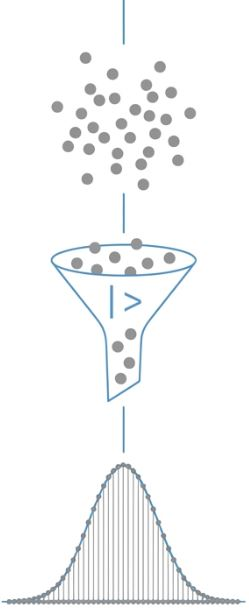
```

:::

::::

## La lógica de la Inferencia {.title-top}

El puente entre lo que observamos y lo que desconocemos.

```{r}
#| echo: false
#| fig-align: center
#| out-width: 80%
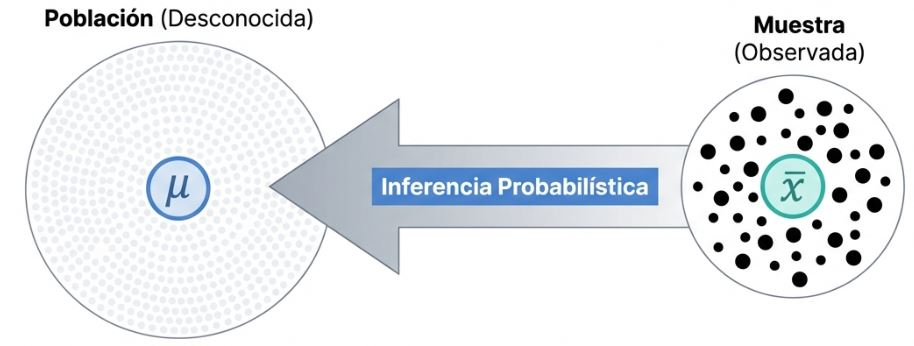
```

**Incertidumbre**: Las conclusiones siempre son *probabilísticas*, nunca absolutas.

## Parámetros vs. Estadísticos {.title-top}

<br>

::: incremental

Es fundamental distinguir entre la población y la muestra:

-   **Parámetros**: Medidas de la población (ej. media poblacional $\mu$).
-   **Estadísticos (o estimadores)**: Medidas obtenidas de la muestra (ej. media muestral $\bar{x}$).

:::

. . .

La **distribución muestral** permite cuantificar la incertidumbre asociada a estas estimaciones. 

Cada tipo diferente de variable posee, según su naturaleza, una distribución muestral probabilística que la caracteriza (Normal, Poisson, binomial, etc).


## Definiciones relevantes {.title-top}

<br>

::: {.fragment .fade-in-then-semi-out}

**Distribución muestral**
Es la distribución de todos los valores posibles que el estadístico puede tomar al calcularse en muestras aleatorias del mismo tamaño extraídas de una misma población. Este concepto es central en la inferencia estadística, ya que permite cuantificar la incertidumbre asociada a las estimaciones.

:::

::: {.fragment .fade-in-then-semi-out}

**Teoría del muestreo**
Estudio de las técnicas de selección que garantizan la representatividad y permiten cuantificar el error de nuestras estimaciones. Utiliza el azar y el método para analizar la relación entre los estadísticos de la muestra y los parámetros de la población midiendo su incertidumbre. 

:::

## Distribución Normal {.title-top}


:::: {.columns"}

::: {.column width="50%"}

- Es una distribución de probabilidad continua para una variable aleatoria, caracterizada por su forma simétrica de campana.

- La curva es simétrica respecto a su centro. Esto implica que la media, la mediana y la moda coinciden en el mismo valor central.

- Está definida por dos parámetros: la media (determina la ubicación del centro de la distribución) y la varianza o desvío estándar (determina qué tan "ancha" o "delgada" es la campana).


:::

::: {.column width="50%"}

<br>

```{r}
#| echo: false
#| fig-align: center
#| out-width: 100%
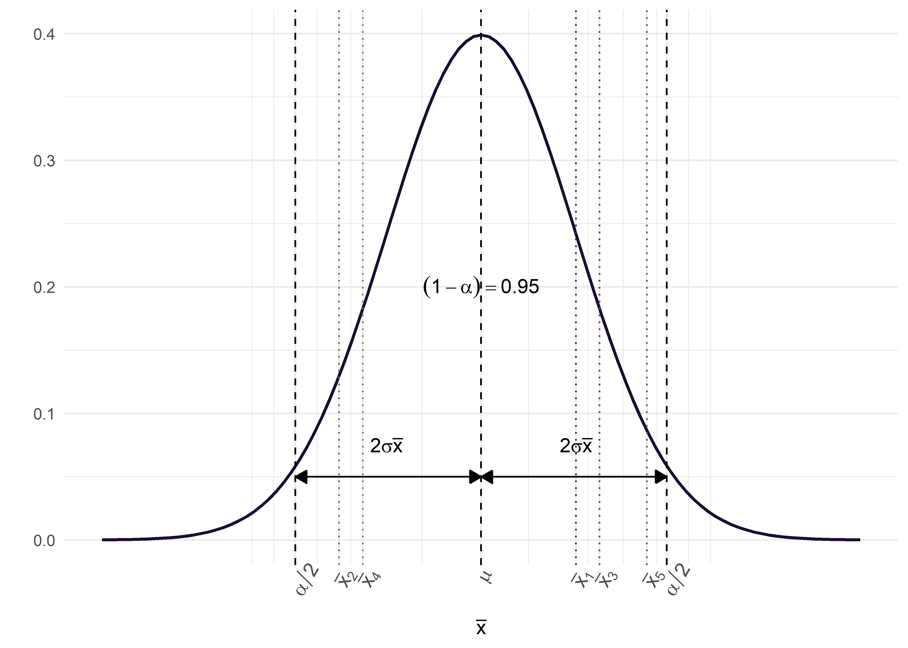
```

:::
::::


## Teorema del Límite Central (TLC) {.title-top}

<br>

::: incremental

- Si se toman muestras aleatorias de tamaño $n$ de cualquier población (incluso no Normal), la distribución de las **medias muestrales** tenderá a seguir una distribución Normal a medida que $n$ aumenta.

- Plantea que la media de los promedios es igual a la media de la población.

- Y que la variabilidad de los promedios (denominada error estándar) disminuye al aumentar el tamaño de la muestra $EE = \frac{\sigma}{\sqrt{n}}$

- Es el "puente" que justifica el uso de tests paramétricos (como el t-test o ANOVA) y el cálculo de intervalos de confianza en poblaciones que no siguen exactamente una campana de Gauss pero se aproximan.

:::

## Intervalos de Confianza (IC) {.title-top}

El IC proporciona un rango de valores donde se espera encontrar el parámetro poblacional con un cierto nivel de confianza.

$$ IC = \text{estimador puntual} \pm (\text{coef. de confiabilidad}) \times (\text{error estándar}) $$
```{r}
#| echo: false
#| fig-align: center
#| out-width: 40%
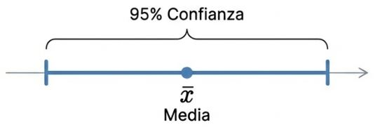
```

IC para la media basado en la distribución Normal

. . .

**Interpretación**: Si repetimos el muestreo **infinitas** veces, el 95% de los intervalos contendrán la media real (parámetro).

## Intervalos de Confianza (IC) {.title-top}

<br>

**Factores que afectan la amplitud del IC**:

- **Nivel de confianza**: A mayor confianza ($1-\alpha$), es decir mayor probabilidad que el parámetro se encuentre en el intervalo, mayor amplitud.
- **Tamaño muestral ($n$)**: Al aumentar $n$, disminuye el error estándar y el IC se vuelve más preciso.

$$EE_{\bar{x}} = \frac{s}{\sqrt{n}}$$

## Intervalos de Confianza (IC) {.title-top}

<br>

- Se pueden calcular IC de distribuciones aproximadas a la Normal mediante el esquema anterior.

- Si la distribucion es sesgada y/o tiene outliers conviene usar la mediana e IC calculados por métodos no paramétricos para conseguir estadísticos robustos.

- Aprovechando la capacidad computacional actual se pueden calcular mediante bootstrap (remuestreo).

## IC en R: Paquete `DescTools` {.title-top}

Aunque no es compatible de forma directa con *tidyverse*, el paquete `DescTools` facilita estos cálculos. Posee funciones para la media y la mediana con métodos ortodoxos y de remuestreo.

```{r, echo=TRUE, eval=FALSE}
library(DescTools)
# Forma básica
MeanCI(base$EDAD_DIAGNOSTICO, conf.level = 0.95)

# Integración con tidyverse
base |> 
  summarise(
    media = mean(EDAD_DIAGNOSTICO),
    ic_lower = MeanCI(EDAD_DIAGNOSTICO)[2],
    ic_upper = MeanCI(EDAD_DIAGNOSTICO)[3]
  )
```

<br>

```{r}
#| echo: false
#| fig-align: center
#| out-width: 30%
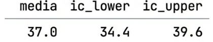
```


## Pruebas de hipótesis {.title-top .smaller}

<br>

La prueba de hipótesis es la herramienta que nos permite decidir si lo que vemos en la muestra es lo suficientemente fuerte como para creer que también ocurre en la población. Suele plantearse como una comparación de dos o más grupos y posee una estructura que consta de:

::: {.fragment .fade-in-then-semi-out}

- Hipótesis nula ($H_0$): Afirma que no existe diferencia entre los grupos que se comparan, es decir, que las variaciones observadas se deben únicamente al azar.

:::

::: {.fragment .fade-in-then-semi-out}

- Hipótesis alternativa ($H_1$) : Es la conjetura o suposición que plantea el investigador, estableciendo que sí existe una diferencia entre los grupos. Generalmente es complementaria de la $H_0$

:::

::: {.fragment .fade-in-then-semi-out}

- Estadístico de prueba: Es el valor calculado a partir de los datos muestrales que se utiliza para tomar la decisión sobre la $H_0$.

:::

::: {.fragment .fade-in-then-semi-out}

- Valor crítico o Región crítica: La región crítica se establece en función del nivel de significación ($\alpha$) y consiste en el conjunto de valores extremos del estadístico de prueba que, de ser alcanzados, llevarían a rechazar la $H_0$.

::: 

## Regla de decisión {.title-top}

<br>

::: incremental

- Si el valor del estadístico de prueba calculado a partir de la muestra cae en la región crítica, se rechaza la $H_0$ y se concluye que las diferencias observadas **son estadísticamente significativas**.

- Si el valor no cae en la región crítica, no se rechaza la $H_0$; esto indica que las diferencias entre lo observado y lo esperado pueden explicarse por el azar. Es decir, **no son estadísticamente significativas**.

:::

## Pruebas o test paramétricos y no paramétricos {.title-top}

<br>

- **Tests paramétricos**: Asumen que los datos provienen de una población con una distribución específica y se centran en estimar parámetros. Son más "potentes" pero requieren que se cumplan ciertos supuestos. Son sensibles a los datos atípicos.

- **Tests no paramétricos**: No asumen una distribución previa ("distribución libre"). Suelen trabajar con el orden o rangos de los datos en lugar de sus valores exactos. Tienen menor potencia estadística pero no necesitan de cumplimniento de supuestos. Son robustos a datos atípicos.

## Supuestos: Normalidad y homocedasticidad {.title-top}

Antes de cualquier test debemos conocer nuestros datos y como se comportan. Entonces procederemos a validar dos supuestos relevantes a la hora de cumplir con lo requerido por las pruebas paramétricas: la normalidad y la homocedasticidad.

::: {.fragment .fade-in-then-semi-out}

- **Normalidad**: Es el supuesto que los datos de la población de la cual extrajiste la muestra siguen una distribución Normal o aproximada (la famosa Campana de Gauss)

:::

::: {.fragment .fade-in-then-semi-out}

- **Homocedascitidad**: Es el supuesto de que la varianza es constante entre los grupos que comparas.

:::

. . . 

Vamos a usar para esta tarea diagnósticos visuales (gráficos) y analíticos (pruebas de bondad de ajuste).

## Diagnósticos gráficos {.title-top}

<br>

Mediante **Q-Q plots**: gráfico de dispersión que compara los cuantiles observados de tus datos frente a los cuantiles teóricos de una distribución de referencia (Normal).


```{r}
#| echo: false
#| fig-align: center
#| out-width: 60%
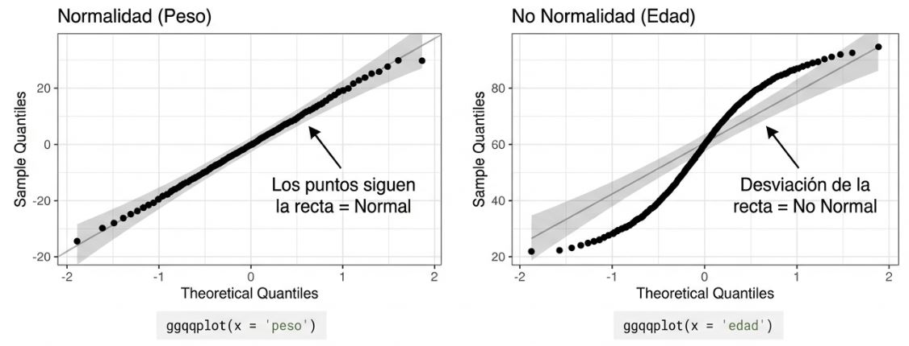
```

Se puede hacer en R mediante paquetes como `dlookr` o `ggpubr`.


## Diagnósticos analíticos {.title-top}

<br>

**Normalidad**

- **Medidas de forma**: Curtosis (kurtosis) y asimetría (skewness).

- **Pruebas de bondad de ajuste**: Test de Shapiro-Wilk (para n ≤ 50) o Lilliefors (para n > 50)

En el lenguaje R podemos usar `kurtosis()` y `skewness()` del paquete **moments**, `shapiro_test()` de **rstatix** y `lillie.test()` de **nortest**.


## Diagnósticos analíticos {.title-top}

<br>

**Homocedasticidad**

:::: {.columns"}

::: {.column width="50%"}

- **F-test**: compara varianzas de 2 grupos

- **Test de Barlett**: compara varianzas en más de 2 grupos

- **Test de Levene**: permite comparar varianzas en grupos que no se aproximan a la distribución normal. 

:::

::: {.column width="50%"}


```{r}
#| echo: false
#| fig-align: center
#| out-width: 60%
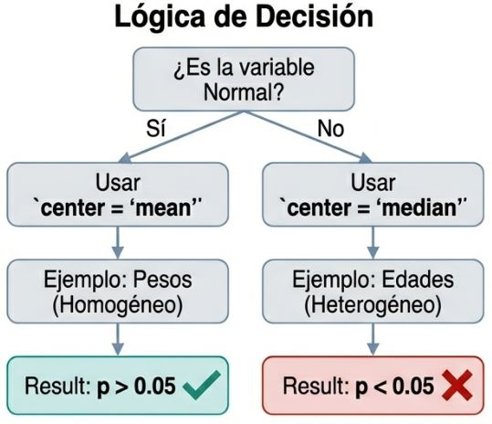
```

:::

::::

## Errores {.title-top}

<br>

```{r}
#| echo: false
#| fig-align: center
#| out-width: 70%
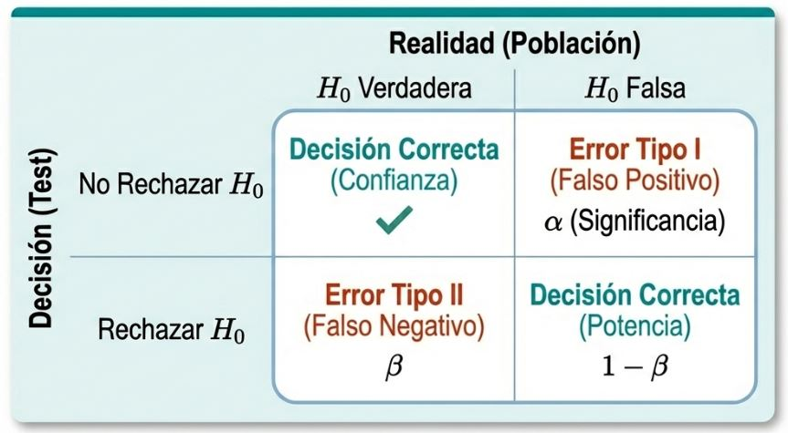
```

## ¿Qué test se debe aplicar en cada caso?

Preguntas que debo responder: 

  - ¿Qué tipo de variable dependiente tengo? 
  - ¿Qué se está comparando?

<br>

```{r}
#| echo: false
#| fig-align: center
#| out-width: 70%
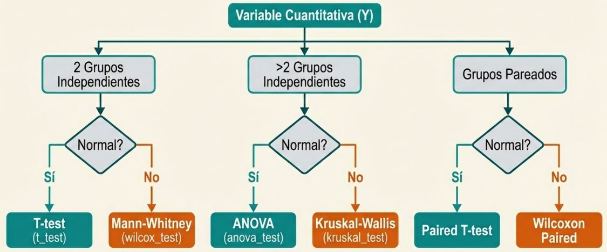
```

## Inferencia de datos categóricos  {.title-top}

<br>

- Prueba de $X^2$ (Chi-cuadrado): en tablas $2x2$ y $2xn$. Con muestras independientes, para homogeneidad, tendencia y bondad de ajuste

- Prueba Exacta de Fisher: Crucial cuando los tamaños de muestra son pequeños en tablas de contingencia (o celdas con $n<5$)

- Prueba de McNemar: Pruebas pareadas (antes-después)

<br>

```{r, echo=FALSE}
library(flextable)

datos <- matrix(c("Expuesto", "No expuesto", "Total", "a", "b", "a+b", "c", "d", "c+d", "a+c", "b+d", "a+b+c+d"), nrow = 3)

# 2. Asignar nombres a las filas (usualmente el desenlace o enfermedad)
colnames(datos) <- c("-", "Enfermo", "Sano", "Total")

# 4. Convertirlo formalmente en una tabla (opcional, mejora la visualización)
tabla_2x2 <- as.data.frame(datos)

# Mostrar el resultado
flextable(tabla_2x2) |>
  fontsize(size = 28, part = "all")  |> 
  autofit() |> 
  theme_box()  
  

```


## El balance de la inferencia estadística {.title-top}


:::: {.columns"}

::: {.column width="50%"}

Hay 4 elementos que están íntimamente relacionados en este *"juego"* de los test de hipótesis:

- Nivel de significación (Error de tipo I)
- Tamaño de efecto (hay diferentes medidas estandarizadas para cuantificar su magnitud)
- Potencia (Error de tipo II)
- Tamaño de la muestra

El paquete `pwr` en R, incorpora funciones que dados tres de ellos, calcula el cuarto elemento. 

:::

::: {.column width="50%"}

<br>

```{r}
#| echo: false
#| fig-align: center
#| out-width: 80%
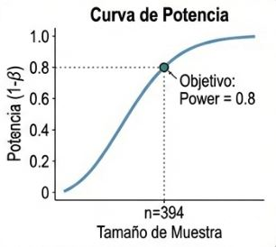
```

:::

::::

## Funciones de `rstatix` {.title-top}

<br>

Las funciones del paquete `rstatix` tienen una estructura consistente, son compatibles con la filosofía tidyverse y sus nombres son similares al grupo de funciones de R base pero cambian el punto por un guión bajo (así `t.test()` se reemplaza por `t_test()` y `chisq.test()` por `chisq_test()`, por ejemplo). 

Algunos de sus argumentos transversales son:

- `data`: dataframe con el que trabajamos
- `formula`: formula con la relación de variables del input
- `paired`: si los datos son pareados es TRUE
- `var.equal`: si las varianzas son iguales en los grupos es TRUE
- `alternative`: especifica el tipo de hipótesis alternativa ("two.sided", "greater" o "less")

## ANOVA {.title-top}

:::: {.columns"}

::: {.column width="50%"}

<br>

Una de las pruebas más útiles y con mayor variedad es el ANOVA (*análisis de varianza*), que en el fondo no deja de ser una extensión del modelo lineal.

Donde la $H_0$ es que las medias de los diferentes grupos (+ de 2) es igual y la $H_1$ que, al menos, alguno de ellos tiene una media diferente.

:::

::: {.column width="50%"}

```{r}
#| echo: false
#| fig-align: center
#| out-width: 80%
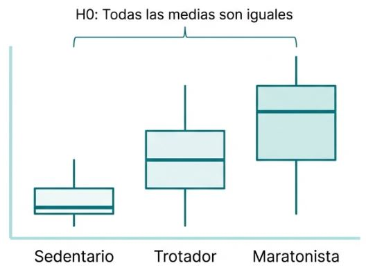
```

:::

::::

## ANOVA {.title-top}

:::: {.columns"}

::: {.column width="50%"}

<br>

En el *análisis de varianza*, la variabilidad total se descompone en dos componentes:

- **Intervarianza**: Variabilidad entre los grupos
- **Intravarianza**: Variabilidad dentro de los grupos

:::

::: {.column width="50%"}
```{r}
#| echo: false
#| fig-align: center
#| out-width: 80%
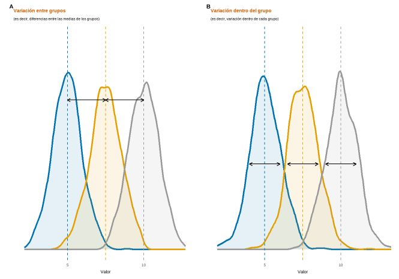
```

:::

::::

## Comparaciones múltiples {.title-top}

<br>


Una vez que comprobamos que existen diferencias significativas entre grupos, nos interesa saber **cuáles grupos son diferentes entre sí**. 

. . . 

Existen distintos algoritmos de comparaciones múltiples con sus respectivas correcciones. Uno de ellos es test de Tukey (Diferencia Honestamente Significativa de Tukey). 

Esta prueba se aplica para grupos equilibrados (mismo tamaño) y varianzas similares (homocedásticas). Es una prueba conservadora, dado que mantiene bajo el error de tipo I, sacrificando la capacidad de detectar diferencias existentes.

. . .

En `rstatix` viene implementado bajo la función `tukey_hsd()`

