```{r setup, include=F}
#| label: setup
#| include: false


library(quarto)
library(fontawesome)
library(tidyverse)
```

##  {#intro-curso .invert data-menu-title="Visualización de datos"}

[**Visualización de datos**]{.custom-title}

[***Unidad 7***]{.custom-subtitle}

## Visualización {.title-top .invert}

::: {style="font-size: 1.2em; margin-top: 2em;"}
“Un simple gráfico ha brindado más información a la mente del analista de datos que cualquier otro dispositivo”. — *John Tukey*
:::

## Objetivos de la visualización {.title-top}

<br>

> La visualización de datos es la rama del diseño de información que consiste en transformar datos en diagramas, gráficos, mapas, etc.

- **Análisis exploratorio**: descubrir y describir patrones en los datos (parte del Análisis Exploratorio de Datos - EDA)

<br>

- **Presentación y comunicación**: capacidad de transmitir el mensaje de forma clara y atractiva.

## Por qué visualizamos? {.title-top}

<br>

Visualizamos porque los sentidos y el cerebro humanos evolucionaron para detectar patrones rápidamente y excepciones de esos patrones.

<br>

{fig-align="center" width="60%"}

## Señales visuales {.title-top}

{fig-align="center" width="70%"}

## Gramática de gráficos {.title-top}

::::: columns
::: {.column width="50%"}
De manera similar a la gramática lingüística, *"La gramática de gráficos"* define un conjunto de reglas para construir gráficos estadísticos combinando diferentes tipos de capas.

Esta gramática fue creada por **Leland Wilkinson** (*2005, The Grammar of Graphics (Statistics and Computing). Secaucus, NJ, USA: Springer-Verlag New York, Inc.*)
:::

::: {.column width="50%"}
{fig-align="center" width="100%"}
:::
:::::

## Codificación de datos {.title-top}

<br>

La visualización de datos consiste en asignar datos a atributos de objetos, comúnmente formas abstractas llamadas *"marcas"* o *"formas"*.

Estos atributos que varían en relación con los datos se denominan *“canales visuales”*.

{fig-align="center" width="80%"}

[*Extraído de <https://openvisualizationacademy.org/>]{style="font-size: 0.7em;"}

------------------------------------------------------------------------

{width="60%" fig-align="center"}

------------------------------------------------------------------------

{fig-align="center"}

{fig-align="center" width="30%"}

**ggplot2** es un paquete que se autodefine como librería para ***“crear elegantes visualizaciones de datos usando una gramática de gráficos”***

El paquete propone un sistema que se basa en la idea que cualquier gráfico se puede construir usando tres componentes básicos:

## Esquema gráfico ggplot2 {.title-top}

<br>

::: incremental
- **Datos** con estructura "ordenada"

- Mapeo estético (**aes**thetic) de los datos

- Objetos **geom**étricos que dan nombre al tipo de gráfico

- **Coord**enadas que organizan los objetos geométricos

- Escalas (**scale**) definen el rango de valores de las estéticas

- **Facet**as que agrupan en subgráficos
:::

## Esquema gráfico ggplot2 {.title-top}

<br>

- La estructura siempre comienza con la función **ggplot()**

- Las capas se componen con funciones del paquete o compatibles con el paquete (todas finalizan en () y deben/pueden contener argumentos)

- Estas capas se unen con el signo **+** (es similar a las tuberías vistas)

- Hay muchos tipos de gráficos y cada uno tiene muchas opciones/detalles. Aunque algunas tareas son extremadamente comunes para todos.

## Las geometrias definen el tipo de gráfico {.title-top}

<br>

{fig-align="center" width="80%"}

## Dataviz {.title-top}

{fig-align="center" width="40%"}

[<https://www.data-to-viz.com/>]{style="font-size: 0.7em;"}

## El esquema básico de un gráfico {.title-top}

<br>

```{r, eval=FALSE, echo=T}
<DATOS> |>  
  ggplot(mapping = aes(<MAPEO>)) +
  <GEOM_FUNCION>()
```

Las capas posteriores son opcionales. Algunas de ellas son:

```{r, eval=FALSE, echo=T}
[dataframe] |>  
  ggplot(mapping = aes(x = [x-varible],
                       y = [y-variable])) +
  geom_xxx() +
  scale_x_...() +
  scale_y_...() +
  scale_fill_...() +
  otras capas más
```


------------------------------------------------------------------------

{width="80%" fig-align="center"}

## Ingeniería inversa {.title-top}

::: incremental
- Pensemos en partir del objetivo deseado, es decir un tipo de gráfico que ya existe, o un bosquejo de lo imaginado garabateado en un papel. Aquí juega la intención de lo que se quiere comunicar y la audiencia a la que va dirigido.

- El segundo paso es determinar cuales son las variables necesarias para construir ese gráfico y donde se mapean.

- El tercer paso es trabajar con los datos y transformarlos, si es necesario, para que estén preparados para graficar.

- El cuarto es el nucleo gráfico basico.

- Y el ultimo paso sería la personalización estética (solo si es para comunicar).
:::

## Ejemplo de gráficos objetivos {.title-top}

<br>

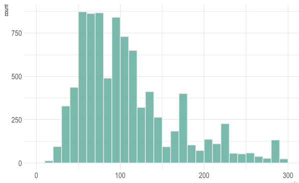{width="60%" fig-align="center"}

## Ejemplo de gráficos objetivos {.title-top}

<br>

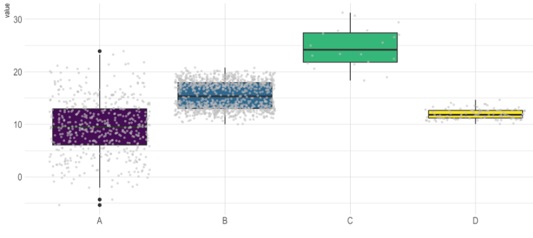{width="40%" fig-align="center"}

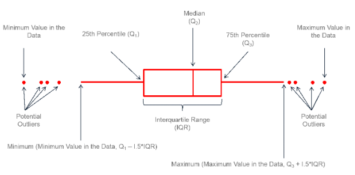{width="30%" fig-align="center"}

## Ejemplo de gráficos objetivos {.title-top}

<br>

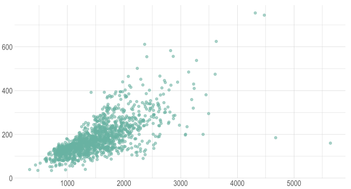{width="65%" fig-align="center"}

## Ejemplo de gráficos objetivos {.title-top}

<br>

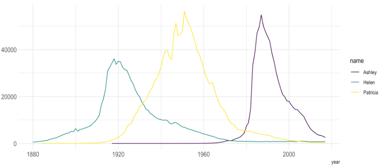{width="70%" fig-align="center"}

## Mapeos globales y locales {.title-top}

Si los mapeos se determinan dentro del `aes()` incluido en el `ggplot()` principal, son llamados **globales** y rigen para todos los elementos geométricos del gráfico.

Si los mapeos se definen solo dentro del `aes()` de una geometría, solo rigen exclusivamente en ese elemento del gráfico.

:::: columns
::: {.column width="50%"}

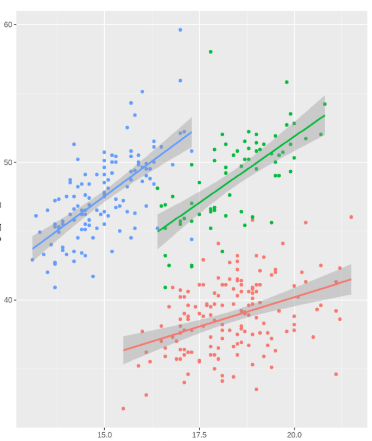{width="60%" fig-align="center"}

:::

::: {.column width="50%"}

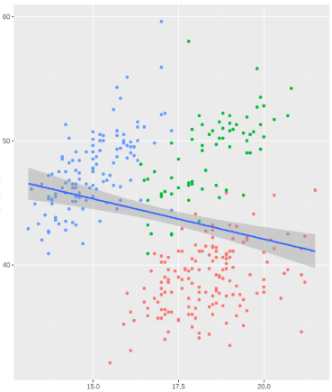{width="60%" fig-align="center"}

:::
::::

## Estéticas más usadas {.title-top}


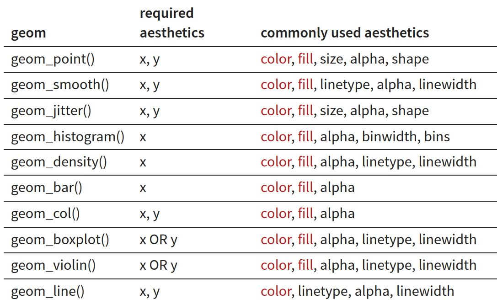{width="80%" fig-align="center"}


## Geometrías clásicas {.title-top}

<br>

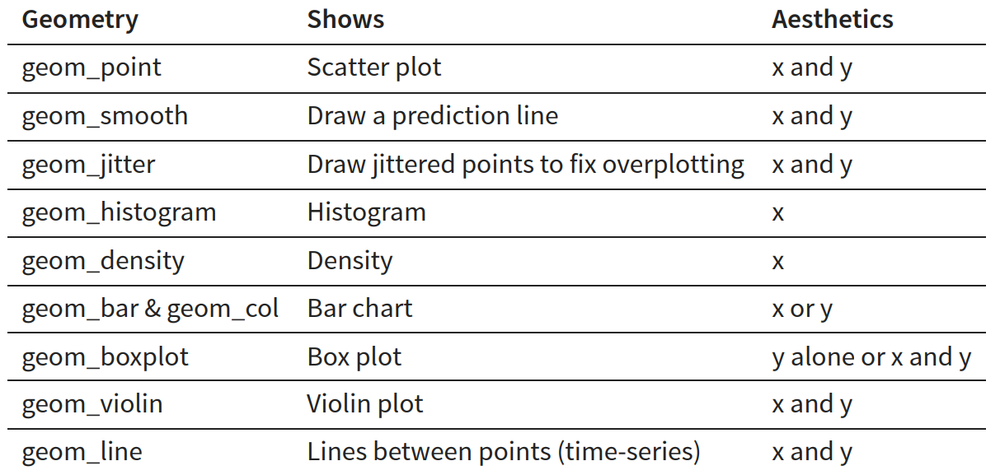{width="80%" fig-align="center"}

## Colores  {.title-top}

<br>

Se puede usar colores bajo el argumento **color** para geometrías de puntos, líneas y contornos y **fill** para rellenos de polígonos.
Existen varias formas de especificarlos (mostramos los tres mas comunes):

::: incremental

- **Nombre:** el lenguaje tiene 657 colores con nombres bajo la función `colors()`. Estos van encerrados entre comillas y RStudio los detecta mostrando una previsualización del color elegido. (ej: "maroon") 

- **Código hexadecimal:** "códigos" para la cantidad de luz roja, verde y azul. (ej: "#B0E0E6"). Paleta de 16.777.216 colores posibles.

- **RGB:** clásica mezcla de luces roja, verde y azul. (ej: rgb(176, 224, 230, maxColorValue = 255))

:::

## Formas (shapes)  {.title-top}

<br>

En el caso del elemento geométrico **punto** hay disponibles una serie de formas (**shape**) bajo estos código numéricos.

<br>

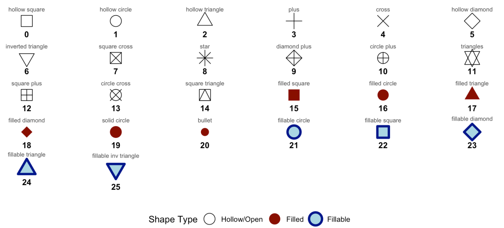{width="60%" fig-align="center"}

## Tamaño y transparencia {.title-top}

<br>

Otras dos propiedades visuales son el tamaño (**size** o **linewidth**) y la transparencia u opacidad (según desde donde se lo mire) llamada **alpha**. 

Esta propiedad tiene valores de 0 a 1, 0 es todo transparente (no se visualiza) y 1 es todo opaco (no tiene transparencia)

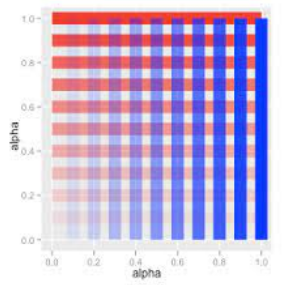{width="30%" fig-align="center"}

## Facetas {.title-top}

<br>

Las facetas son una técnica de visualización que divide un conjunto de datos en subconjuntos y representa cada uno en un panel independiente. 

Las funciones posibles son `facet_wrap()` (secuencia unidimensional) y `facet_grid()` (matriz bidimensional).

<br>

::::: columns
::: {.column width="50%"}

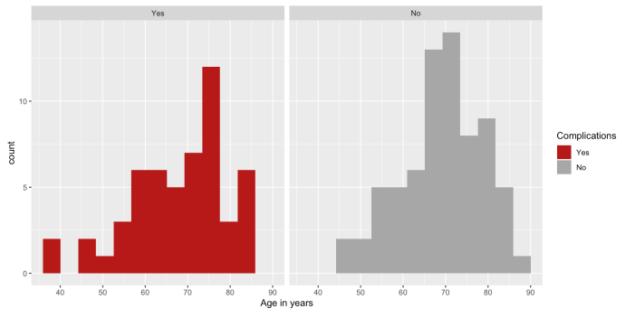{width="90%" fig-align="center"}

:::

::: {.column width="50%"}

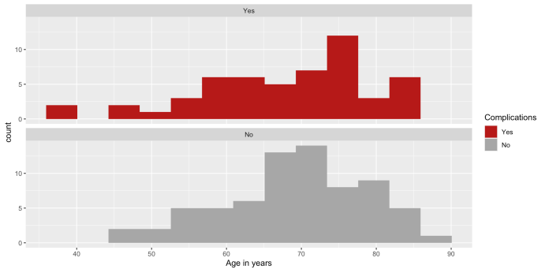{width="90%" fig-align="center"}

:::
:::::


## Coordenadas {.title-top}

<br>

Las coordenadas definen el sistema de representación del gráfico. `coord_polar()` permite pasar de coordenadas cartesianas a polares para crear gráficos de sectores.

::::: columns
::: {.column width="50%"}

<br>

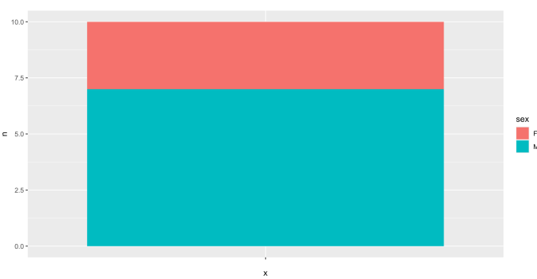{width="90%" fig-align="center"}

:::

::: {.column width="50%"}

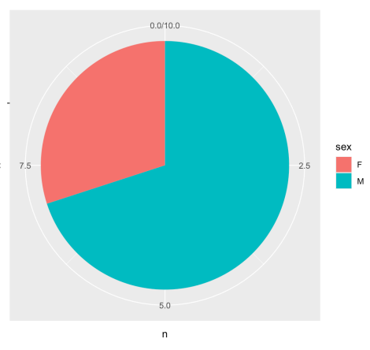{width="80%" fig-align="center"}

:::
:::::

## Temas {.title-top}

Los temas con la función `theme()`, permiten personalizar la apariencia no relacionada con los datos, modificando elementos como títulos, ejes, leyendas, fuentes, colores y márgenes del gráfico. (apariencia estética)

**ggplot2** incluye temas predefinidos como:

| Tema | Característica |
|---|---|
| `theme_gray()` | Tema predeterminado de ggplot2. |
| `theme_bw()` | Fondo blanco, útil para publicaciones. |
| `theme_minimal()` | Diseño limpio con pocos elementos visuales. |
| `theme_classic()` | Similar a gráficos tradicionales, sin cuadrícula. |
| `theme_light()` | Cuadrícula suave y aspecto moderno. |
| `theme_void()` | Elimina todos los elementos del gráfico. |

## Estructura de gráficos pensados para comunicar {.title-top}

<br>

**Título** (obligatorio)

Debe responder, en la medida de lo posible a tiempo + lugar + persona:

- ¿Qué variable se muestra?
- ¿En quiénes?
- ¿Dónde?
- ¿Cuándo?

Ejemplos:

*Incidencia de dengue por provincia. Argentina, 2025.*

*Distribución de edades de pacientes internados por COVID-19. Hospital X, marzo-junio de 2021.*

## Estructura de gráficos pensados para comunicar {.title-top}

<br>

**Ejes correctamente identificados** (obligatorio)

Los ejes deben indicar:

- Variable
- Unidad de medida (escala)

Ejemplos:

Eje Y: *Tasa de incidencia (por 100.000 habitantes)*

Eje X: *Semana epidemiológica*

Las escalas deben tener intervalos regulares, origen en cero cuando corresponda y
evitar escalas truncadas que exageren diferencias.

## Estructura de gráficos pensados para comunicar {.title-top}

<br>

**Leyenda ** (si es necesaria)

Cuando existen:

- múltiples grupos,
- colores,
- símbolos,
- líneas.

No es necesaria si los grupos pueden etiquetarse directamente.

## Estructura de gráficos pensados para comunicar {.title-top}

**Subtítulo** (recomendable)

Permite agregar detalles metodológicos.

Ejemplo: *Casos confirmados por laboratorio notificados al SNVS 2.0.*

**Pie de gráfico** (recomendable)

Contiene información que no conviene poner en el título.

Puede incluir:

- Fuente de datos.
- Definiciones operativas.
- Aclaraciones metodológicas.
- Abreviaturas.

Ejemplo: *Fuente: Sistema Nacional de Vigilancia de la Salud (SNVS 2.0). Datos preliminares al 15/05/2026.*

## Estructura de gráficos pensados para comunicar {.title-top}

<br>

**Tamaño muestral (n)** (obligatorio en algunos casos)

Especialmente importante en: histogramas, boxplots, comparaciones de grupos, gráficos de encuestas.

Ejemplo: *n = 235 pacientes.*

<br>

**Fecha de actualización** (recomendable)

Muy útil en vigilancia epidemiológica.

Ejemplo: *Actualizado al 20/06/2026.*

## Estructura de gráficos pensados para comunicar {.title-top}

<br>

**Elementos opcionales según el objetivo**

**Intervalos de confianza**: Cuando se comunican estimaciones.

Ejemplos: *prevalencias, incidencias, odds ratios, medias poblacionales.*

**Valores exactos**: Sobre barras o puntos.

Útil cuando: *hay pocas categorías, interesa la precisión.**

**Anotaciones o llamados de atención**: Para resaltar eventos importantes.

Ejemplo: *Inicio de campaña de vacunación*.

**Líneas de referencia**: Muy utilizadas en vigilancia:

Ejemplo: *promedio histórico, percentil 90, umbral epidémico, meta programática.*

**Otros**: Logotipos institucionales (en contextos formales).


## Exportar gráficos de ggplot2 {.title-top}

<br>

- Desde el **_panel Plot_** de **RStudio**

- En formatos conocidos como JPG, PNG, PDF, etc

- Mayor control con la función `ggsave()`

```{r, eval=FALSE, echo=T}
ggsave(filename,               # nombre del archivo
  plot = last_plot(),          # nombre del objeto gráfico
  device = NULL,               # formato de salida "jpeg", "png", "tiff", "pdf", etc
  width = NA,                  # ancho en unidades de units
  height = NA,                 # alto en unidades de units
  units = c("in", "cm", "mm"), # unidades de medidas
  dpi = 300)                   # resolución de salida en dpi
```

## Paquete patchwork {.title-top}

**Patchwork** es un paquete diseñado para combinar múltiples gráficos de **ggplot2** de forma simple y declarativa. 

Permite organizar gráficos en filas, columnas o diseños más complejos utilizando operadores matemáticos.

Es especialmente útil para crear paneles comparativos, figuras para publicaciones científicas y tableros de visualización.

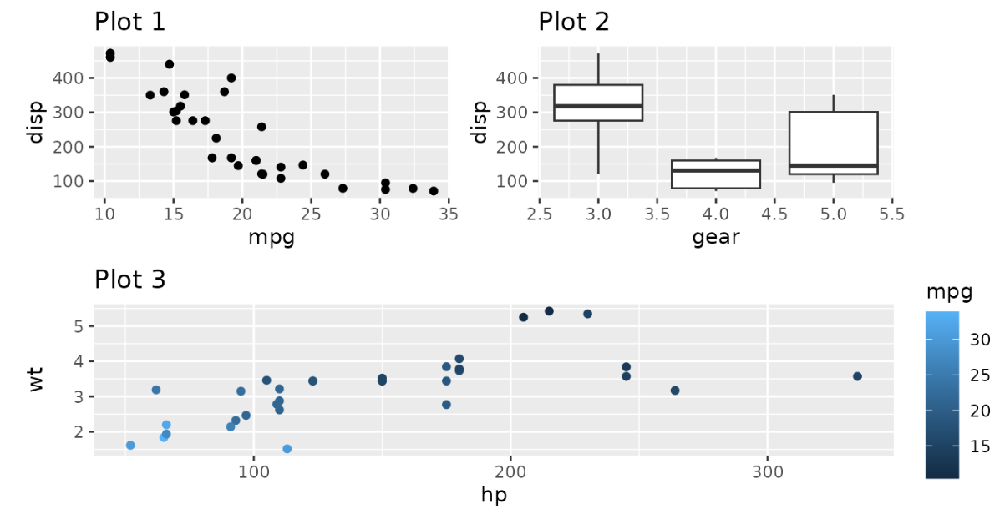{width="50%" fig-align="center"}

## Paquete patchwork {.title-top}

<br>

**Operadores principales**

`+` : combina gráficos.

`|` : organiza gráficos en una fila.

`/` : organiza gráficos en una columna.

`plot_layout()` : controla el número de filas, columnas y proporciones.

`plot_annotation()` : agrega títulos, subtítulos y notas al conjunto de gráficos.

<br>

```{r, echo = T, eval=F}

(g1 | g2) +
  plot_annotation(
    title = "Ttiulo del grafico compuesto",
    subtitle = "Subtitlo"
  )

```

<https://patchwork.data-imaginist.com/index.html>

## Extensiones del ggplot2 {.title-top}

<br>

**ggplot2** cuenta con un amplio ecosistema de paquetes complementarios que amplían sus capacidades de visualización. 

Estas extensiones permiten incorporar nuevos tipos de gráficos, etiquetas avanzadas, escalas de colores, composiciones multipanel, animaciones e interactividad, manteniendo la misma filosofía basada en capas (*Grammar of Graphics*).

<br>

Algunas extensiones populares:

**ggrepel**: mejora la ubicación de etiquetas evitando superposiciones.

**ggthemes**: incorpora temas y estilos predefinidos.

**ggforce**: agrega nuevas geometrías y funcionalidades avanzadas.

**ggridges**: crea gráficos de densidad superpuestos (ridgeline plots).

**plotly**: transforma gráficos estáticos en visualizaciones interactivas.

**gganimate**: genera animaciones a partir de gráficos de ggplot2.