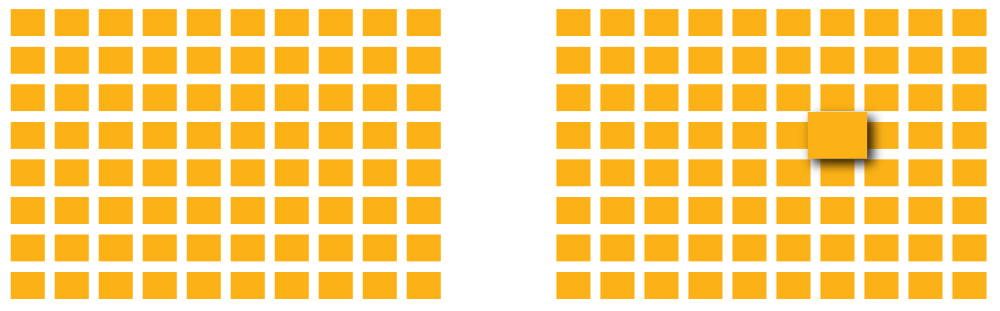
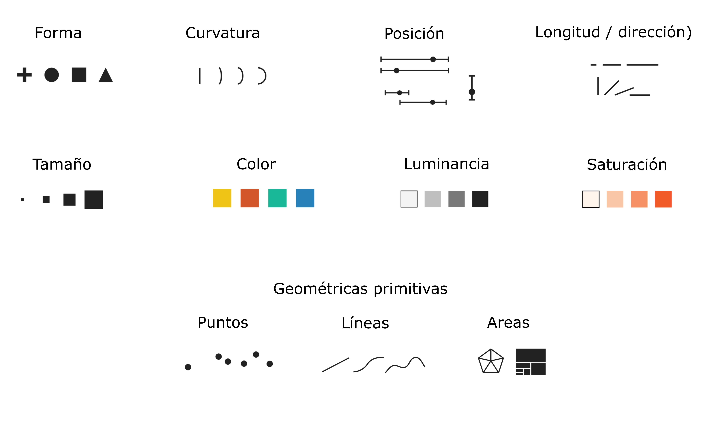
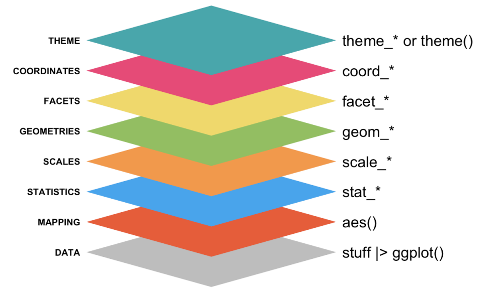
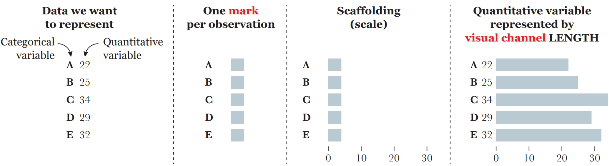
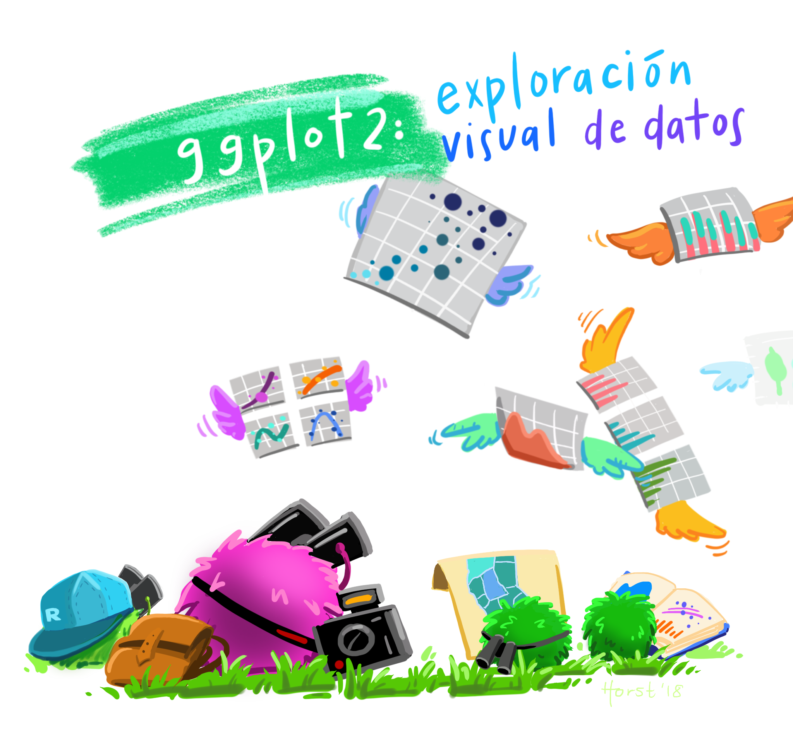
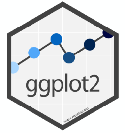
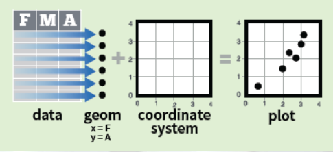
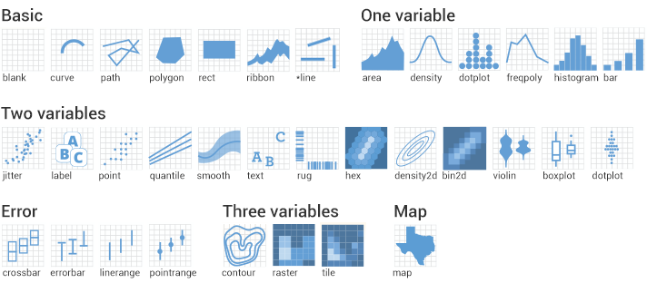
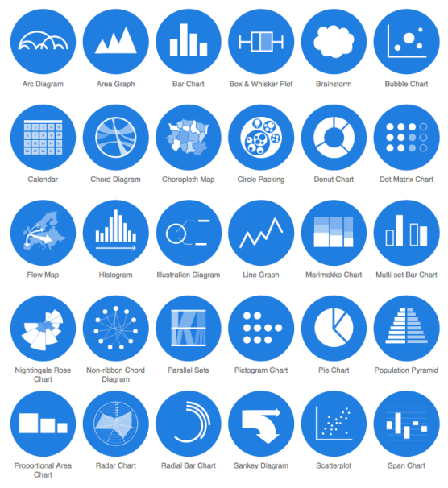
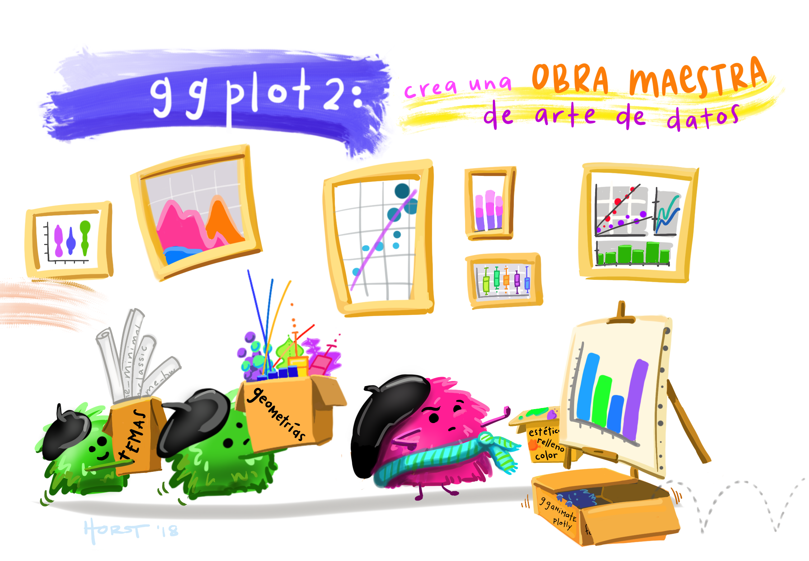

```{r setup, include=F}
#| label: setup
#| include: false


library(quarto)
library(fontawesome)
library(tidyverse)
```

##  {#intro-curso .invert data-menu-title="Visualización de datos"}

[**Visualización de datos**]{.custom-title}

[***Unidad 7***]{.custom-subtitle}

## Visualización {.title-top .invert}

::: {style="font-size: 1.2em; margin-top: 2em;"}
“Un simple gráfico ha brindado más información a la mente del analista de datos que cualquier otro dispositivo”. — *John Tukey*
:::

## Objetivos de la visualización {.title-top}

<br>

> La visualización de datos es la rama del diseño de información que consiste en transformar datos en diagramas, gráficos, mapas, etc.

- **Análisis exploratorio**: descubrir y describir patrones en los datos (parte del Análisis Exploratorio de Datos - EDA)

<br>

- **Presentación y comunicación**: capacidad de transmitir el mensaje de forma clara y atractiva.

## Por qué visualizamos? {.title-top}

<br>

Visualizamos porque los sentidos y el cerebro humanos evolucionaron para detectar patrones rápidamente y excepciones de esos patrones.

<br>

{fig-align="center" width="60%"}

## Señales visuales {.title-top}

{fig-align="center" width="70%"}

## Gramática de gráficos {.title-top}

::::: columns
::: {.column width="50%"}
De manera similar a la gramática lingüística, *"La gramática de gráficos"* define un conjunto de reglas para construir gráficos estadísticos combinando diferentes tipos de capas.

Esta gramática fue creada por **Leland Wilkinson** (*2005, The Grammar of Graphics (Statistics and Computing). Secaucus, NJ, USA: Springer-Verlag New York, Inc.*)
:::

::: {.column width="50%"}
{fig-align="center" width="100%"}
:::
:::::

## Codificación de datos {.title-top}

<br>

La visualización de datos consiste en asignar datos a atributos de objetos, comúnmente formas abstractas llamadas *"marcas"* o *"formas"*.

Estos atributos que varían en relación con los datos se denominan *“canales visuales”*.

{fig-align="center" width="80%"}

[*Extraído de <https://openvisualizationacademy.org/>]{style="font-size: 0.7em;"}

------------------------------------------------------------------------

{width="60%" fig-align="center"}

------------------------------------------------------------------------

{fig-align="center"}

{fig-align="center" width="30%"}

**ggplot2** es un paquete que se autodefine como librería para ***“crear elegantes visualizaciones de datos usando una gramática de gráficos”***

El paquete propone un sistema que se basa en la idea que cualquier gráfico se puede construir usando tres componentes básicos:

## Esquema gráfico ggplot2 {.title-top}

<br>

::: incremental
- **Datos** con estructura "ordenada"

- Mapeo estético (**aes**thetic) de los datos

- Objetos **geom**étricos que dan nombre al tipo de gráfico

- **Coord**enadas que organizan los objetos geométricos

- Escalas (**scale**) definen el rango de valores de las estéticas

- **Facet**as que agrupan en subgráficos
:::

## Esquema gráfico ggplot2 {.title-top}

<br>

- La estructura siempre comienza con la función **ggplot()**

- Las capas se componen con funciones del paquete o compatibles con el paquete (todas finalizan en () y deben/pueden contener argumentos)

- Estas capas se unen con el signo **+** (es similar a las tuberías vistas)

- Hay muchos tipos de gráficos y cada uno tiene muchas opciones/detalles. Aunque slgunas tareas son extremadamente comunes para todos.

## Las geometrias definen el tipo de gráfico {.title-top}

<br>

{fig-align="center" width="80%"}

## Dataviz {.title-top}

{fig-align="center" width="40%"}

[<https://www.data-to-viz.com/>]{style="font-size: 0.7em;"}

## El esquema básico de un gráfico {.title-top}

<br>

```{r, eval=FALSE, echo=T}
<DATOS> |>  
  ggplot(mapping = aes(<MAPEO>)) +
  <GEOM_FUNCION>()
```

Las capas posteriores son opcionales. Algunas de ellas son:

```{r, eval=FALSE, echo=T}
[dataframe] |>  
  ggplot(mapping = aes(x = [x-varible],
                       y = [y-variable])) +
  geom_xxx() +
  scale_x_...() +
  scale_y_...() +
  scale_fill_...() +
  otras capas más
```


------------------------------------------------------------------------

{width="80%" fig-align="center"}

## Ingeniería inversa {.title-top}

::: incremental
- Pensemos en partir del objetivo deseado, es decir un tipo de gráfico que ya existe, o un bosquejo de lo imaginado garabateado en un papel. Aquí juega la intención de lo que se quiere comunicar y la audiencia a la que va dirigido.

- El segundo paso es determinar cuales son las variables necesarias para construir ese gráfico y donde se mapean.

- El tercer paso es trabajar con los datos y transformarlos, si es necesario, para que estén preparados para graficar.

- El cuarto es el nucleo gráfico basico.

- Y el ultimo paso sería la personalización estética (solo si es para comunicar).
:::

## Ejemplo de gráficos objetivos {.title-top}


## Mapeos globales y locales {.title-top}


## Estéticas más usadas {.title-top}


## Geometrías clásica {.title-top}


## Colores  {.title-top}

<br>

Se pueden especificar colores de varias formas (mostramos los tres mas comunes):

::: incremental

- **Nombre:** el lenguaje tiene 657 colores con nombres. Estos van encerrados entre comillas y RStudio los detecta mostrando una previsualización del color elegido. (ej: "maroon") 
"powderblue"

- **Código hexadecimal:** "códigos" para la cantidad de luz roja, verde y azul. (ej: "#B0E0E6")

- **RGB:** clasica mezcla de luces roja, verde y azul. (ej: rgb(176, 224, 230, maxColorValue = 255))

:::


## Escalas {.title-top}


## Facetas {.title-top}

## Coordenadas {.title-top}

## Temas {.title-top}