```{r setup, include=F}
#| label: setup
#| include: false


library(quarto)
library(fontawesome)
library(tidyverse)
```

##  {#hola-quarto-title data-menu-title="Bienvenidxs a Quarto" background-image="images/bienvenidxs2.png" aria-label="Un cometa de Quarto" visibility="uncounted"}

[***Unidad 8***]{.custom-subtitle}

[basado en tom mock, mine centikaya<br>y elaboración propia. artwork por allison horst]{.custom-artwork}


## Qué es Quarto®? {.title-top}

<br>

> **Quarto® es un nuevo sistema de publicación científica y técnica de código abierto construido sobre [Pandoc](https://pandoc.org/)** [^1]

[^1]: conversor de documentos libre y de código abierto, mayormente usado como una herramienta de escritura (especialmente por académicos) ver en [Wikipedia](https://es.wikipedia.org/wiki/Pandoc)

. . .

> Mezcla texto narrativo y código para producir resultados con un formato elegante en documentos, tableros interactivos, páginas web, publicaciones de blogs, libros y más.

. . .

> Es independiente del lenguaje R (incluso trabaja con otros lenguajes como Python y Julia).

## Comunicar como parte de programar {.title-top}

<br>

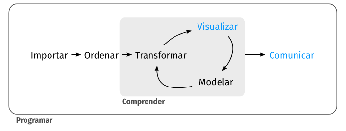{fig-align="center" width=90%}

## Ecosistema de RMarkdown {.title-top .nostretch}

<br>


::: {.fragment .fade-up}
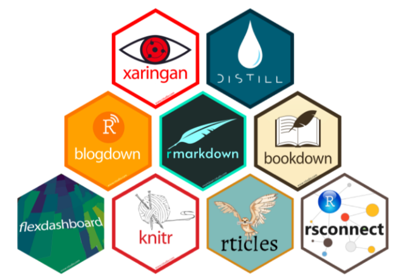{fig-align="center" fig-width=100%}
:::


## RMarkdown en Rstudio {.title-top}

-   Desarrollo del paquete **knitr** desde 2011
-   Desarrollo de **RMarkdown** desde 2014 (rmarkdown + pandoc)
- 10 años de experiencia en `knitr` + `rmarkdown` se volcaron al desarrollo de Quarto.

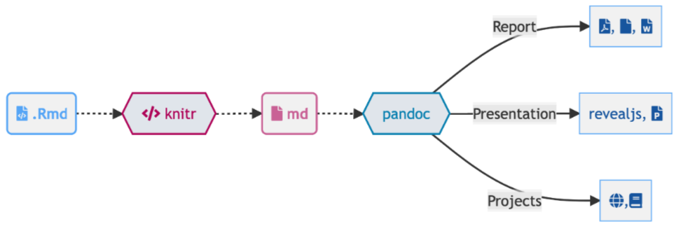{.absolute top="370" left="250" width="1100"}

## Como funciona Quarto? {.title-top .centrado}

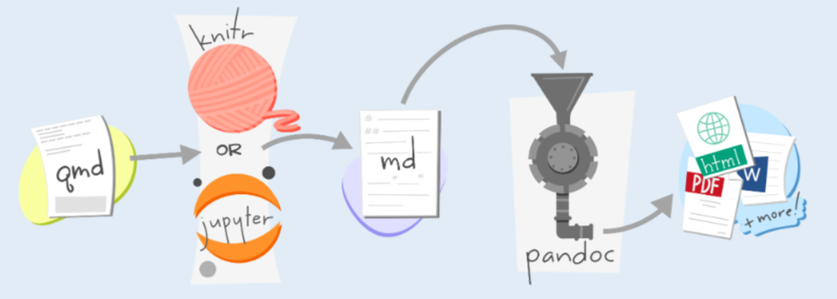{.absolute top="200" left="150" width="1600"}

## Como funciona Quarto? {.title-top .centrado}

<br>

::: {.fragment .fade-in-then-semi-out}

Quarto usa `knitr` o `jupyter` como motor para ejecutar código y generar una salida temporal (**.md**).

:::

::: {.fragment .fade-in-then-semi-out}

El archivo temporal se procesa mediante los filtros **Lua** de `Pandoc` y `Quarto` + `Bootstrap CSS` para **HTML** o `LaTeX` para **PDF** y se convierte a un formato de salida final.
:::

::: {.fragment .fade-in-then-semi-out}

Los filtros Lua escritos por desarrolladores de `R`/`Python`/`Julia` son intercambiables entre formatos.

:::

::: {.fragment .fade-in-then-semi-out}

Quarto además incluye soporte nativo para `Observable JS`, un conjunto de mejoras a JavaScript básico creado por *Mike Bostock* (también autor de `D3`).

:::

::: {.fragment .fade-in-then-semi-out}

Observable JS se distingue por su tiempo de ejecución reactivo, que es 
especialmente adecuado para la exploración y el análisis de datos interactivos.

:::

## Ejemplo interactivo con Observable JS {.title-top}

<br>

Conversor de temperatura de ℃ a ℉

<br>

```{ojs}
viewof temp = Inputs.range([0, 99], {step: 1, value: 0, label: htl.html`Temp. &#x2103;`})
```

Celsius = \${d3.format(".0f")(temp)}℃ y Fahrenheit = \${d3.format(".1f")(temp \* 9/5 + 32)}℉.

. . . 

<br>
````code
```{{ojs}}
viewof temp = Inputs.range([0, 99], {step: 1, value: 0, label: htl.html`Temp. &#x2103;`})
```
Celsius = \${d3.format(".0f")(temp)}℃ y Fahrenheit = \${d3.format(".1f")(temp \* 9/5 + 32)}℉.

````


## Entonces, ¿qué es Quarto? {.title-top}

> Quarto es una interfaz de *línea de comandos* (**CLI**) que representa formatos de texto sin formato (**.qmd**, .rmd, .md) o formatos mixtos (**.ipynb**/Jupyter notebook) en informes estáticos *PDF*/*Word*/*HTML*, *libros*, *sitios web*, *presentaciones* y más.

```{py}
#| eval: false
#| echo: true
#| code-line-numbers: "|1|4|10"
cballejo$ quarto --help

  Usage:   quarto
  Version: 1.9.37

  Description:
    Quarto CLI

  Options:
    -h, --help     - Show this help.                            
    -V, --version  - Show the version number for this program.  

  Commands:
    render          [input] [args...]   - Render input file(s) to various document types.            
    preview         [file] [args...]    - Render and preview a document or website project.          
    serve           [input]             - Serve a Shiny interactive document.                        
    create-project  [dir]               - Create a project for rendering multiple documents          
    convert         <input>             - Convert documents to alternate representations.            
    pandoc          [args...]           - Run the version of Pandoc embedded within Quarto.          
    run             [script] [args...]  - Run a TypeScript, R, Python, or Lua script.                
    install         <type> [target]     - Installs an extension or global dependency.                
    publish         [provider] [path]   - Publish a document or project. Available providers include:
    check           [target]            - Verify correct functioning of Quarto installation.         
    help            [command]           - Show this help or the help of a sub-command.    
```

## Software Quarto {.title-top .centrado}

<br>

-   El sitio web de `Quarto` es <https://quarto.org/>

-   La **versión actual** es 1.9.37 (Windows) del 09/04/2026

-   La **guía oficial** se puede encontrar en <https://quarto.org/docs/guide/>

-   **RStudio Desktop** incluye una versión de Quarto en su instalación desde la versión 2022.07.01 pero conviene actualizarlo de forma independiente

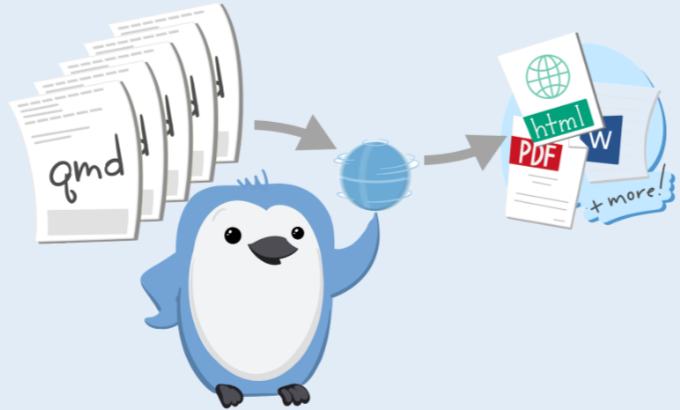{.absolute top="500" left="620" width="550"}


## Otras características {.title-top}

::: {.fragment .fade-in-then-semi-out}

- Tiene múltiples formatos modernos de salidas unificado la funcionalidad de muchos paquetes del ecosistema R Markdown (rmarkdown, bookdown, distill, xaringan, etc.)

:::

::: {.fragment .fade-in-then-semi-out}

- Implementa funciones más atractivas y útiles en todos los productos: pestañas, resaltado de sintaxis, diagramas, etc.

:::

::: {.fragment .fade-in-then-semi-out}

- Se pueden renderizar los documentos viejos `.rmd` (RMarkdown) o `.ipynb` (cuadernos jupyter de python) con Quarto.

:::

::: {.fragment .fade-in-then-semi-out}


- Viene incluido en otros editores como VS Code

:::

::: {.fragment .fade-in-then-semi-out}

- Soporta `htmlwidgets` en R y Jupyter widgets para Python/Julia además de Observable JS

:::

## Por qué usar Quarto en lugar de RMarkdown? {.title-top}

. . . 

- Quarto no es muy diferente a **RMarkdown**, más bien es un RMarkdown de nueva generación (*next-generation*)

. . .

- Posee mejor accesibilidad y funciones más completas listas para usar

. . .

- **RMarkdown** aún tiene soporte pero todas las novedades y mejoras se están desarrollando solo para `Quarto`

. . .

- Si en el futuro incorporas algún otro lenguaje de programación/análisis podes seguir utilizandolo

. . .

- Podes elegir otros editores y `Quarto` seguirá funcionando


## El universo de Quarto es enorme {.title-top transition="zoom"}

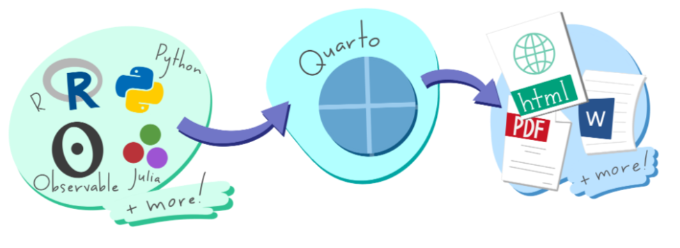{.absolute top="200" left="140" width="1650"}


## Anatomia de un `.qmd` {.title-top .smaller}

. . .

Al igual que los **.Rmd** de **RMarkdown** el archivo fuente de `Quarto` es de texto plano

. . .

Tiene una cabecera `YAML` con metadatos 


:::: {.columns style="font-size: 50px;"}

::: {.column width="45%"}

``` yaml
format: html
engine: knitr
```

:::

::: {.column width="55%"}

``` yaml
format: html
engine: jupyter
```

:::

::::

. . . 

Suele tener código incluido


:::: {.columns style="font-size: 50px;"}

::: {.column width="45%"}

````code
```{{r}}
library(dplyr)
mtcars |> 
  group_by(cyl) |> 
  summarize(mean = mean(mpg))
```
````

:::

::: {.column width="55%"}

````code
```{{python}}
from siuba import *
(mtcars
  >> group_by(_.cyl)
  >> summarize(avg_mpg = _.mpg.mean()))
```
````

:::

::::

. . .

Y texto narrativo

::: {style="font-size: 50px;"}
``` markdown
# Cabecera 1
Esto es texto en **negrita**, esto en *itálica* y esta otra una 
{fig-alt="Texto alternativo para esta imagen"}.
```

:::

## Ejemplo de un .qmd {.title-top}

Los archivos `.qmd` responden estructuralmente al modelo de programación literaria ([Literate programming](https://es.wikipedia.org/wiki/Programaci%C3%B3n_literaria))

<br>

    ---
    title: "ggplot2"
    date: "18/04/2024"
    format: html
    ---

    ## Calidad del aire

    Esta es la relación entre la temperatura y el nivel de ozono.

    ```{{r}}
    #| label: fig-calidad_aire
    library(ggplot2)
    ggplot(airquality, aes(Temp, Ozone)) + 
      geom_point() + 
      geom_smooth(method = "loess"
    )
    ```


## Metadatos: YAML {.title-top}

. . . 

<br>

- Los metadatos que se definen en el encabezado YAML que todos los archivos `.qmd` tienen son procesados en muchas etapas del renderizado y puede influir en el documento final de varias formas. 

. . . 

- Siempre se colocan al principio del documento y lo lee **Pandoc**, **Quarto** y **knitr**. 

. . . 

- En su recorrido, la información que contiene suele afectar el código, el contenido y el proceso de renderizado.

. . . 

- Muchas de las opciones de código YAML para Quarto se pueden encontrar en su [documentación](https://quarto.org/docs/reference/)  

## Texto y otros elementos {.title-top}

. . . 

<br>

- `Quarto` se basa en **Pandoc** y utiliza su variación de [Markdown](https://es.wikipedia.org/wiki/Markdown) como sintaxis para documentos. 

. . . 

- El **Markdown** de Pandoc es una versión ampliada y ligeramente revisada de la sintaxis Markdown de [John Gruber](https://en.wikipedia.org/wiki/John_Gruber).

. . . 

- Markdown es un lenguaje de marcas sencillo diseñado para ser fácil de escribir y, lo que es más importante, fácil de leer.

. . . 

- Es el mismo que se utiliza en el formato anterior de RMarkdown (archivos .Rmd)

## Código {.title-top}

. . . 

- El código se puede insertar a través de chunks (fragmentos) en distintos lenguajes

````code
```{{r}}
#| Aquí van los metadatos con las opciones de ejecución

Aquí va el código
```
````
. . . 

- Las opciones de ejecución del código incluido dentro de estos fragmentos se realiza mediante metadatos con el formato #|

. . . 

- Se pueden definir opciones de salida, figura, procesado, etc. Ver [guía](https://quarto.org/docs/computations/execution-options.html).

. . . 

- También se puede incluir [código en línea](https://quarto.org/docs/computations/inline-code.html) en el texto. 

```{r}
#| echo: false

radio <- 5
```


````code
```{{r}}
radio <- 5
```
````
(El radio del circulo es \`\{r\} radio\`). El radio del circulo es `{r} radio`

## Algunos ejemplos para visualizar {.title-top}

::: columns
::: {.column width="50%"}

<br>

- [HTML paginado -estilo Tufte-](https://quarto-dev.github.io/quarto-gallery/page-layout/tufte.html)

- [Presentación revealjs](https://apreshill.github.io/palmerpenguins-useR-2022/)

- [Libro web](https://r4csr.org/)

- [Sitio web](https://sta210-s22.github.io/website/)

- [Documentos interactivos -shiny-](https://jjallaire.shinyapps.io/diamonds-explorer/)

- [Tableros](https://mine-cetinkaya-rundel.github.io/ld-dashboard/)

:::

::: {.column width="50%"}

<br>

{width="80%"}

:::

:::

## Cabecera YAML: Opciones de salida {.title-top}

<br>

``` yaml
---
format: html
---
```

. . .

``` yaml
---
format: pdf
---
```

. . .

``` yaml
---
format: typst
---
```

`typst` es un [nuevo sistema de composición tipográfica](https://typst.app/docs/) basado en marcas para ciencia.

. . .

Se le pueden agregar opciones. Las opciones deben estar debajo del formato principal (los espacios son importante y hay que respetarlos -identación-)

``` yaml
---
format: 
  html:
    toc: true
    code-fold: true
---
```

## YAML es sensible a la identación {.title-top}

::: columns
::: {.column width="70%"}
``` yaml
---
format:html # invalido, falta espacio luego de :
---

---
format: # invalido, se lee como formato ausente
html
---

---
format: 
  html: # valido pero necesita de opciones posteriores
---
```

El formato válido puede ser diferente según lo que se necesite.

``` yaml
format: html # valido - hay espacio

# valido - formato con opciones
format: 
  html:
    toc: true
```
:::

::: {.column width="30%"}
{.r-stretch}
:::
:::

## Ventajas de RStudio {.title-top}

<br>

RStudio (también algunos otros editores como VSCode) integran entre sus herramientas la finalización enriquecida: podemos comenzar con una palabra y tabular (TAB) para completar, o presionar `Ctrl + espacio` para ver todas las opciones disponibles.

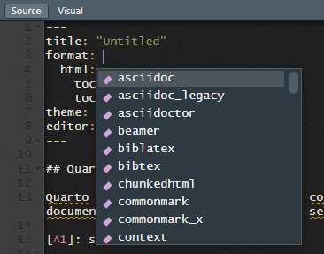{.absolute top="350" left="550" width="700"}

## Texto y Markdown {.title-top transition="zoom"}

<br>

Inicialmente y para el uso general conviene aprovechar el `modo Visual` de RStudio para incorporar marcas de lenguaje Markdown. Prácticamente todos los elementos incorporados con formato markdown aplican en los diferentes formatos de salida (HTML, pdf, etc)

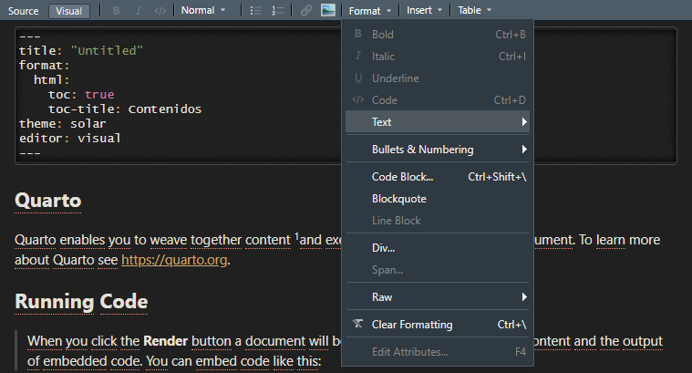{.absolute top="320" left="400" width="1000"}

## Bloques {.title-top}

Pandoc y, por tanto, Quarto aceptan bloques *Divs* y *Spans* propios del HTML con sintaxis delimitada por :::

Estructura general:

-   Comienza y termina con igual número de : - mínimo de 3 :::
-   Agregar llaves para indicar el inicio de la clase `{.class}` o `{varias-clase}`


. . .

```         
::: {style="border-left:10px solid purple"}

Este contenido tiene un diseño de borde izquierdo violeta

:::
```

. . .

::: {style="border-left:10px solid purple"}
*Este contenido tiene un diseño de borde izquierdo violeta*
:::

. . .

-   Se puede pensar en una división ::: como un `<div>` **HTML** pero que también sirve cuando la salida es en PDF.

## Bloques de llamadas {.title-top}

<br>

El formato básico de un bloque de llamadas es:

```{}
::: {.callout-*}
## Título del bloque

Texto incluído
:::
```

donde el * se reemplaza por el tipo de bloque. Además se puede configurar la apariencia y si se muestra o no el ícono asociado.

. . .

::: callout-note
## Nota {.title-top}

Existen cinco tipos de leyendas, que incluyen: `note` (nota), `tip` (consejo), `warning` (advertencia), `caution` (precaución), e `important` (importante)
:::


## Bloques de llamadas {.title-top}

<br>

::: callout-warning
## Advertencia

Estos bloques facilitan una forma sencilla de llamar la atención, por ejemplo, sobre esta advertencia.
:::

. . .

::: callout-important
## Importante

Se pueden editar los titulos con doble #. Por ejemplo: \## Importante
:::

. . .

::: callout-tip
## Consejo

Tip o consejo dado
:::

. . .

::: callout-caution
## Precaución

Esto se encuentra bajo construcción
:::

## Bloques de línea (Spans) {.title-top}

Estructura general:

-   Encerrar el texto con corchetes \[\].
-   Agregar llaves para indicar el inicio de la clase `{.class}` o `{varias-clases}`

\[texto\]{.class}

. . .

-   Estos spans entre corchetes [texto]{.class} se pueden considerar como un `<span .class>Texto</span>` de **HTML** pero nuevamente estos son compatibles para aplicar atributos nativos de Pandoc/Quarto.

<br>

Este es un texto con formato \[especial\]{style="color:orange;"}.

. . .

Este es un texto con formato [especial]{style="color:orange;"}.

-   Tanto los Divs como los Spans se pueden agregar desde el modo Visual: *Format -\> Div...* y *Format -\> Span...*

## Figuras {.nostretch .title-top}

-   Sintaxis básica de markdown

\


## Figuras {.nostretch .title-top}

-   Sintaxis markdown con opciones

\{width=120%}

{width="120%"}

## Figuras {.nostretch .title-top}

-   Desde código R

```{r}
#| echo: fenced
#| out-width: 50%
#| fig-align: right


```

## Fragmentos / columnas

::: columns
::: {.column width="50%"}
\{fig-align="left"}

{fig-align="left"}

Las columnas se construyen con bloques Divs ::: columns y luego ::: {.column width="50%"} para cada una de ellas (en este ejemplo que son 2). Cada bloque se cierra con :::
:::

::: {.column width="50%"}
\{fig-align="right" .lightbox}

{.lightbox fig-align="right"}

La opción `.lightbox` utiliza la librería de javascript [GLightbox](https://biati-digital.github.io/glightbox/) para mostrar un efecto sobre la imagen cuando pulsamos sobre ella.
:::
:::

## Pestañas (TabSet)  {.title-top}

::: panel-tabset
## Codigo

```{r}
#| echo: fenced
#| eval: false
head(datasets::iris)
```

Las pestañas son un bloque Divs especiales ::: {.panel-tabset} :::

El nombre de cada pestaña se establece con **\## Nombre**

Al ser dinámicas, solo funcionan en salidas HTML.

## Salida

```{r}
#| eval: true
#| echo: false
head(datasets::iris)
```
:::


## Enlaces web {.title-top}

<br>

Existen varios tipos de "enlaces" o hipervínculos.

<br>

::: columns
::: {.column width="65%"}
**Markdown**

``` markdown
Se pueden insertar links en formato Markdown vinculados 
a un texto como este de [Quarto](https://quarto.org/), 
URL directas como <https://www.ine.gov.ar/> y 
enlaces a [otros lugares](#docu-estaticos-title) 
en el mismo documento. 
La sintaxis es similar a incrustar un imagen en línea: 
. 
```
:::

::: {.column .fragment width="35%"}
**Salida**

Se pueden insertar links en formato Markdown vinculados a un texto como este de [Quarto](https://quarto.org/), URL directas como <https://www.ine.gov.ar/> y 
enlaces a [otros lugares](#docu-estaticos-title) en el mismo documento. 
La sintaxis es similar a incrustar un imagen en línea: {style="width:30px;"}.
:::
:::


## Listas {.title-top .smaller}

<br>

Listas sin orden:

::: columns
::: {.column width="50%"}
**Markdown:**

``` markdown
-   Lista sin orden       
    -   sub-item 1         
    -   sub-item 1         
        -   sub-sub-item 1 
```
:::

::: {.column .fragment width="50%" fragment-index="1"}
**Salida**

-   Lista sin orden
    -   sub-item 1\
    -   sub-item 1
        -   sub-sub-item 1
:::
:::

Listas ordenadas:

::: columns
::: {.column width="50%"}
**Markdown:**

``` markdown
1. Lista ordenada            
2. item 2                  
   i. sub-item 1          
      a.  sub-sub-item 1
```
:::

::: {.column .fragment width="50%" fragment-index="2"}
**Salida**

1.  Lista ordenada\
2.  item 2
    i.  sub-item 1
        a.  sub-sub-item 1
:::
:::

## Citas

<br>

**Markdown:**

``` markdown
> Cambiemos nuestra actitud tradicional hacia la construcción 
> de programas: en lugar de imaginar que nuestra tarea principal
> es indicarle a una computadora qué hacer, concentrémonos más
> bien en explicar a los seres humanos lo que queremos que haga
> una computadora. - Donald Knuth
```

. . .

<br>

**Salida:**

> Cambiemos nuestra actitud tradicional hacia la construcción de programas: en lugar de imaginar que nuestra tarea principal es indicarle a una computadora qué hacer, concentrémonos más bien en explicar a los seres humanos lo que queremos que haga una computadora. - Donald Knuth

::: aside
"Literate Programming", The Computer Journal 27 (1984), p. 97. (Reprinted in Literate Programming, 1992, p. 99.) Literate Programming (1984) <br> <br>
:::

## Tablas {.title-top}

<br>

Tablas Markdown

**Markdown:**

``` markdown
| Derecha | Izquierda | Predeterminado | Centrado |
|--------:|:----------|----------------|:--------:|
|    12   |    12     |       12       |    12    |
|   123   |   123     |      123       |   123    |
|     1   |     1     |        1       |     1    |
```

. . .

<br>

**Salida:**

| Derecha | Izquierda | Predeterminado | Centrado |
|--------:|:----------|----------------|:--------:|
|      12 | 12        | 12             |    12    |
|     123 | 123       | 123            |   123    |
|       1 | 1         | 1              |    1     |

## Tablas Grid (cuadrícula) {.title-top}

<br>

Las tablas cuadrícula son un tipo más avanzado de tablas de Markdown que permiten otros elementos (múltiples párrafos, bloques de código, listas, etc.)

<br>

**Markdown:**

``` markdown
+---------------+---------------+--------------------+
| Formato       | Extensión     | Ventajas           |
+===============+===============+====================+
| Documento     | pdf           | - Seguro           |
| portable      |               | - Universal        |
+---------------+---------------+--------------------+
| Word          | docx          | - Editable         |
|               |               | - Universal        |
+---------------+---------------+--------------------+

: Ejemplo tabla cuadrícula 
```

## Tablas Grid (cuadrícula) {.title-top}

<br>

**Salida:**

<br>

+--------------------+----------------+----------------+
| Formato            | Extensión      | Ventajas       |
+====================+================+================+
| Documento portable | pdf            | -   Seguro     |
|                    |                | -   Universal  |
+--------------------+----------------+----------------+
| Word               | docx           | -   Editable   |
|                    |                | -   Universal  |
+--------------------+----------------+----------------+

: Ejemplo tabla cuadrícula

## Tablas cuadrícula: Alineación {.title-top}

<br>

-   Las alineaciones se pueden especificar como en las tablas anteriores, colocando dos puntos en los límites de la línea de separación después del encabezado:

```         
+--------------------+---------------+--------------------+
| Derecha            | Izquierda     | Centrado           |
+===================:+:==============+:==================:+
| Documento portable | pdf           | -  Seguro          |
+--------------------+---------------+--------------------+
```

. . .

<br>

-   Para tablas sin encabezado, los dos puntos van en la línea superior:

```         
+--------------:+:--------------+:------------------:+
| Derecha       | Izquierda     | Centrado           |
+---------------+---------------+--------------------+
```

## Tablas cuadrícula: Creación {.title-top}


:::: columns

::: {.column width="50%"}

::: incremental
-   Tengamos en cuenta que las tablas cuadrícula son bastante complicadas de escribir con un editor de texto plano porque, a diferencia de las tablas comunes, los indicadores de columna deben alinearse.


-   ¡El Editor Visual puede ayudar a crear estas tablas! para profundizar ver [Guía Quarto](https://quarto.org/docs/visual-editor/content.html#editing-tables)


-   También podemos utilizar herramientas online como [TablesGenerator](https://www.tablesgenerator.com/markdown_tables)
:::

:::

::: {.column width="50%"}

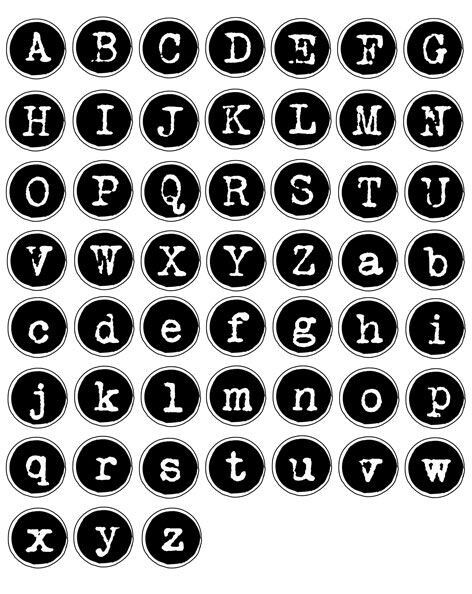{.absolute top="200" left="1250" width="500"}

:::

::::

## Fórmulas {.title-top}


Al igual que en RMarkdown se puede insertar fórmulas matemáticas Latex en linea o en imagen completa, utilizando \$ o \$\$ según corresponda.

-   Este es un ejemplo de formula en linea $\sqrt{\frac{\alpha}{2}}$

``` markdown
$\sqrt{\frac{\alpha}{2}}$
```


-   La siguiente es una formula completa:

$$
R(t)= A \left(\frac{E_0}{\rho_0}\right)^{1/5}t^{2/5}
$$
``` markdown
$$
R(t)= A \left(\frac{E_0}{\rho_0}\right)^{1/5}t^{2/5}
$$
``` 

## Caracteres especiales, emojis y listas de definiciones {.title-top}

{.absolute top="230" left="1050" width="600"}

<br>

En el modo Visual se pueden insertar facilmente caracteres especiales de distinto tipo, emojis y listas de términos. Por ejemplo:

<br>

Caracteres especiales:

② ≋ 𝄞 ⍾ ◴ ⭆

<br>

Emojis:

😀 🥶 👍 🤡

<br>

Listas de definición

**Clase** en programación orientada a objetos

:   Es una plantilla que define las características y comportamientos de una entidad


## Diagramas {.title-top}

`Quarto` tiene soporte nativo para incrustar diagramas [Mermaid](https://mermaid-js.github.io/mermaid/#/) y [Graphviz](https://graphviz.org/) . Esto permite crear diagramas de flujo, diagramas de secuencia, diagramas de estado, diagramas de Gantt y otros utilizando una sintaxis de texto plano inspirada en Markdown.

```{{{mermaid}}}
flowchart LR
  A[Inicio] --> B(Pre-proceso)
  B --> C{Decisión}
  C --> D[Resultado 1]
  C --> E[Resultado 2]
```

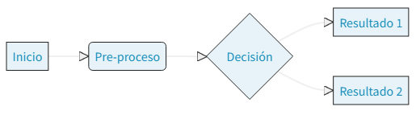{width="60%"}

-   Para ver más sobre la [documentación de Mermaid.js](https://mermaid-js.github.io/mermaid/#/flowchart)

## Inclusión de código en Quarto {.title-top}

<br>

En todo documento Quarto se puede incluir código de diferentes lenguajes de programación (R, python, julia, javascript, etc).

. . .

<br>

Habitualmente el código sirve para mostrar resultados estadísticos en forma de tabla y/o gráfico. Otras veces el código produce diversas tareas que no se muestran hasta tanto se produzca la salida de resultados. Y en ocasiones, cuando el producto tiene un fin docente sobre el lenguaje de programación en si, se muestran las líneas de código junto a lo que produce.

. . . 

<br>

Toda la ejecución del código se maneja desde las opciones de ejecución que se configuran como metadatos dentro de los fragmentos (chunks).

## Opciones de ejecución de código {.title-top}


Algunas de las opciones de control de ejecución de los chunck de código.

::: {style="font-size: 1em"}
+-----------+---------------------------------------------------------------------------------------------------------------------------------------------------------------------------------------------------+
| Opción    | Descripción                                                                                                                                                                                       |
+===========+===================================================================================================================================================================================================+
| `eval`    | Evalua el codigo del chunk (si es `false`, saltea el código y no lo ejecuta).                                                                                                                     |
+-----------+---------------------------------------------------------------------------------------------------------------------------------------------------------------------------------------------------+
| `echo`    | Incluye el código fuente en la salida                                                                                                                                                             |
+-----------+---------------------------------------------------------------------------------------------------------------------------------------------------------------------------------------------------+
| `output`  | Incluye el resultado de la ejecución del código en la salida (`true`, `false`, or `asis` para indicar que muestre los resultados en forma cruda).                                                 |
+-----------+---------------------------------------------------------------------------------------------------------------------------------------------------------------------------------------------------+
| `warning` | Gestiona las advertencias en la salida.                                                                                                                                                           |
+-----------+---------------------------------------------------------------------------------------------------------------------------------------------------------------------------------------------------+
| `error`   | Gestiona los errores en la salida.                                                                                                                                                                |
+-----------+---------------------------------------------------------------------------------------------------------------------------------------------------------------------------------------------------+
| `include` | Evita que se incluya cualquier salida (código o resultados) (por ejemplo `include: false` suprime toda la salida del bloque de código).                                                           |
+-----------+---------------------------------------------------------------------------------------------------------------------------------------------------------------------------------------------------+
| `message` | Gestiona los mensajes en la salida                                                                                                                                                                |
+-----------+---------------------------------------------------------------------------------------------------------------------------------------------------------------------------------------------------+
| `fig-*`   | Familia de opciones para las figuras (alto, ancho, alineación, nombre, resolución, etc)                                                                                                           |
+-----------+---------------------------------------------------------------------------------------------------------------------------------------------------------------------------------------------------+
:::


## Tablas desde código {.title-top}

<br>

Salida directa, igual que en consola y estéticamente feas.

```{r}
#| echo: fenced
library(datos)

pinguinos |> 
  slice(1:6)
```

## Tablas desde código {.title-top}

<br>

El paquete **knitr**, incuído en RStudio, puede convertir las salidas estos dataframes en tablas visuales con `knitr::kable()`:

<br>

```{r}
library(knitr)

pinguinos |> 
  slice(1:6) |> 
  kable()
```

## Tablas desde código {.title-top}

<br>

Existen numerosos paquetes para darle formato a las tablas producidas mediante código. 

Un ejemplo muy completo es el paquete **flextable**, que vimos en clases anteriores.

Además de salidas HTML es compatible con pdf y Word (docx). 

La documentación se encuentra en este [enlace](https://ardata-fr.github.io/flextable-book/)

<br>

```{r}
library(flextable)

head(pinguinos) |> 
flextable() |> 
fontsize(size = 26, part = "all") |> 
height_all(height = 1, part = "all", unit = "in") |> 
colformat_num(big.mark = "", decimal.mark = ",", digits = 2, na_str = "N/A") |>  
theme_zebra()
```

## Tablas desde código {.title-top}

<br>

Otro paquete para tablas elaboradas es **gt**. 

Aquí podemos encontrar [todo lo que ofrece](https://gt.rstudio.com/).

<br>

```{r}
#| output-location: column-fragment

library(gt)

head(pinguinos) |> 
  gt() |>
 tab_options(table.font.size = 40) |> 
  tab_style(
    style = list(
      cell_fill(color = "pink"),
      cell_text(style = "italic")
      ),
    locations = cells_body(
      columns = largo_pico_mm,
      rows = largo_pico_mm > 40
    )
  )
```


## Gráficos desde código {.title-top auto-animate="true"}

<br>

:::: columns

::: {.column width="50%"}

```` markdown
```{{r}}
library(datos)
library(ggplot2)

pinguinos |> 
  ggplot(aes(x = largo_pico_mm,
                     y = alto_pico_mm,
                     col = isla)) +
  geom_point()
```
````
:::

::: {.column .fragment width="50%"}

```{r}
#| echo: false
library(datos)
library(ggplot2)

pinguinos |> 
  ggplot(aes(x = largo_pico_mm,
                     y = alto_pico_mm,
                     col = isla)) +
  geom_point() +
  theme_grey(base_size = 18)
```

:::

::::

## Ejemplo: Gráficos desde código {.title-top auto-animate="true"}

<br>

::: columns
::: {.column width="50%"}
```` markdown
```{{r}}
#| fig-width: 5
#| fig-height: 3

library(datos)
library(ggplot2)

pinguinos |> 
  ggplot(aes(x = largo_pico_mm,
                     y = alto_pico_mm,
                     col = isla)) +
  geom_point()
```
````
:::

::: {.column .fragment width="50%"}
```{r}
#| echo: false
#| fig-width: 5
#| fig-height: 3

library(datos)
library(ggplot2)

pinguinos |> 
  ggplot(aes(x = largo_pico_mm,
                     y = alto_pico_mm,
                     col = isla)) +
  geom_point() +
  theme_grey(base_size = 18)
```
:::
:::

## Ejemplo: Gráficos desde código {.title-top auto-animate="true"}

<br>

::: columns
::: {.column width="50%"}
```` markdown
```{{r}}
#| fig-width: 5
#| fig-height: 3
#| fig-cap: "Tamaño de los pingüinos en 
tres islas del Archipelago Palmer."
#| fig-alt: "Diagrama de dispersión que 
muestra el tamaño de los picos de los 
pingüinos en tres islas"

library(datos)
library(ggplot2)

pinguinos |> 
  ggplot(aes(x = largo_pico_mm,
                     y = alto_pico_mm,
                     col = isla)) +
  geom_point()
```
````
:::

::: {.column .fragment width="50%"}
```{r}
#| echo: false
#| fig-width: 5
#| fig-height: 3
#| fig-cap: "Tamaño de los pingüinos en tres islas del Archipelago Palmer."
#| fig-alt: "Diagrama de dispersión que muestra el tamaño de los picos de los pingüinos en tres islas"


library(datos)
library(ggplot2)

pinguinos |> 
  ggplot(aes(x = largo_pico_mm,
                     y = alto_pico_mm,
                     col = isla)) +
  geom_point()+
  theme_grey(base_size = 18)
```
:::
::::


## Temas estéticos {.title-top}


Los documentos HTML renderizados con Quarto usan **Bootstrap 5** de forma predeterminada. Esto se puede personalizar a través de la opción de `theme:` en la cabecera YAML.

```{.yaml}
theme: default # bootstrap 5 predeterminado
theme: cosmo   # tema cosmo bootswatch 
theme: pandoc  # tratamiento de pandoc predeterminado
theme: none    # no usa ningún tema css 
```

Quarto incluye 25 temas del proyecto [Bootswatch](https://bootswatch.com/), entre los cuales se encuentran: `lumen`, `minty`, `journal`, etc.

En la cabecera YAML, junto al tema se puede definir algunas variables estéticas que se usarán al renderizar el documento, como `mainfont`, `fontsize`, `fontcolor`, etc. 

```{.yaml}
title: "Mi Documento"
format:
  html: 
    theme: lumen      # tema lumen
    fontsize: 12pt    # tamaño de la fuente en 12 puntos
    fontcolor: blue   # color azul
```

## Personalización {.title-top}

<br>

Podemos realizar una amplia personalización de temas utilizando [Sass](https://sass-lang.com/). Existen más de 1400 variables **Sass** que controlan fuentes, colores, relleno, bordes y mucho más. 

Este idioma, extensión de CSS, se utiliza en archivos `.scss` que se incluyen en la cabecera YAML.

```{.yaml}
theme:
  - lumen
  - custom.scss
```

<br>

El contenido del archivo `custom.scss`, que debe estar ubicado en la misma carpeta donde está el `.qmd`, podría ser:

```{.yaml}
/*-- scss:defaults --*/

$h2-font-size: 20pt;    # tamaño de fuente 20 pt en cabecera 2
$font-size-base: 12pt;  # tamaño de fuente 12 pt en texto base
$link-color: #af3434;   # color de enlace web
```

## Otros formatos de salida posibles {.title-top}

<br>

Editando la cabecera YAML se puede definir formatos de documentos distintos a HTML.

Entre las opciones de documentos con fines de impresión se encuentran:

<br>

::: columns
::: {.column width="40%"}

<br>

-   **PDF** (en base a **LaTeX**)

-   **PDF** (en base a **typst**)

-   **docx** (archivo **Word**)
:::

::: {.column width="60%"}
{.absolute top="350" left="900" width="700"}
:::
:::

## PDF (LaTeX) {.title-top}

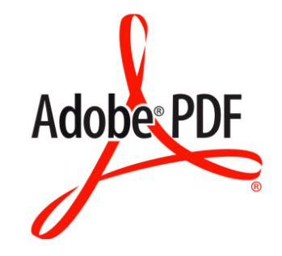{.absolute top="0" left="1500" width="280"}

<br> <br> <br>

. . .

Para procesar documentos PDF de Quarto (documentos tradicionales pdf de RMarkdown) nuestra computadora debe cumplir con el requerimiento de tener instalado una distribución actualizada de **Tex**.

. . .

Existen varios motores PDF pero se recomienda utilizar [TinyTeX](https://yihui.org/tinytex/) (basado en TexLive) que podemos instalar fácilmente desde RStudio.

. . .

<br>

Otras distribuciones posibles para Windows son: **MikTex** o **Tex Live**, pero deben descargase e instalarse independientemente de RStudio.

## TinyTex {.title-top}

<br>

**TinyTeX** es una distribución **LaTeX** personalizada, basada en *TeX Live*, que es pequeña en tamaño pero funciona bien en la mayoría de los casos, especialmente para usuarios de R.

Se instala ejecutando la siguiente linea en la **Terminal** de **RStudio**

<br>

``` markdown
quarto install tinytex --update-path
```

<br>

Luego activamos la opción:

**Use tinytex when compiling .tex files**

en **Global options** de RStudio y reiniciamos.

## Cabecera PDF {.title-top}

<br>

Las cabecera básica de documentos PDF basados en **LaTeX** es:

``` rmardown
---
title: "Mi Documento"
format:
  pdf:
    toc: true
---
```

\* en este ejemplo, además activamos tabla de contenidos.

La mayoría de las *opciones de ejecución* vistas para HTML sirven para este tipo de documentos.

Quarto utiliza clases de documentos [KOMA Script](https://ctan.org/pkg/koma-script) de forma predeterminada para libros y documentos PDF.

## Clases de documentos {.title-top}

<br>

La opción de ejecución `documentclass:` posibilita cambiar de clase utilizando la configuración KOMA Script.

| Opción   | Descripción                                                                                         |
|------------------------------------|------------------------------------|
| scrartcl | Es la clase estándar. Diseñada para artículos (más o menos cortos)                                  |
| scrreprt | Clase reportes, similar a los libros. Se diferencian principalmente en los valores predeterminados. |
| scrbook  | Diseñada para libros desde aproximadamente una docena hasta miles de páginas                        |

## Clases de documentos {.title-top}

<br>

Seleccionar que clase de documento pdf queremos tendrá que ver con lo que estemos produciendo.

Por ejemplo, los artículos estan configurados predeterminandamente con una sola cara, lo mismo que los reportes. En cambio, los libros son de doble cara.

De todas maneras, las opciones se pueden cambiar con `classoption:` (oneside, twoside)

<br>

::: {.callout-note .especial appearance="simple" icon="false"}
## Ejemplo

Configurar el documento de clase `scrbook` automatizará muchas de las necesidades comunes para imprimir y encuadernar archivos PDF en un libro físico (es decir, los capítulos comienzan en páginas impares, tamaños de márgenes alternos, etc.)
:::

## Otras opciones de ejecución {.title-top}

<br>

| Opción      | Descripción                                              |
|-------------|----------------------------------------------------------|
| `papersize` | Configura tamaño de papel                                |
| `lot`       | Activa tabla de tablas                                   |
| `lof`       | Activa tabla de figuras                                  |
| `fontsize`  | Tamaño de fuente                                         |
| `mainfont`  | Fuente principal                                         |
| `geometry`  | Llama a paquete latex geometrías - define margenes, etc. |

## Librerías latex {.title-top}

<br>

Algunas librerías Latex como `geometry` vienen implementadas dentro de **TinyTex** y asociadas a la cabecera YAML de Quarto. Otras librerías pueden llamarse desde la opción `include-in-header` para inyectar comandos **Latex**.

Por ejemplo, incluyendo una fuente específica para el texto.

``` markdown
format:
  pdf:
    include-in-header:
      - text: |
          \usepackage{sourcesanspro}
```

<br>

::: {.callout-note .especial appearance="simple" icon="false"}
Quarto instalará todos los paquetes especificados mediante inclusiones que aún no haya instalado localmente durante la renderización del documento usando TinyTex.
:::

## Latex puro {.title-top}

<br>

Al crear un documento PDF, Pandoc permite el uso de código **LaTex** puro entre el markdown.

::: columns
::: {.column width="40%"}
``` markdown
\begin{tabular}{ll}
A & B \\
A & B \\
\end{tabular}
```
:::

::: {.column width="60%"}
{.absolute top="200" left="1050" width="450"}
:::
:::

Si bien es muy conveniente para este formato, el código se ignora cuando se procesa en otros como HTML y Word.

<br>

> Tengamos en cuenta que en algunos casos, el LaTeX puro requerirá paquetes de LaTeX adicionales (que deberemos incluir en la cabecera).

## PDF (typst) {.title-top}

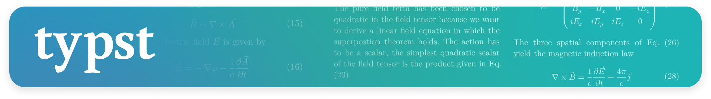{fig-align="center" width="70%"}

**Typst** es un nuevo sistema de composición tipográfica de código abierto basado en un lenguaje de marcas que está diseñado para ser tan potente como LaTeX y al mismo tiempo mucho más fácil de aprender y usar. Genera buenos resultados en PDF con tiempos de renderizado muy rápidos.

<br>

> Dado que Typst está en desarrollo activo y fue incorporado en la última versión de Quarto, todavía existen algunas limitaciones en el soporte. Es decir, que algunas caracterísiticas nativas como el diseño de página avanzado no están del todo implementadas.

## Cabecera typst {.title-top}

<br>

``` rmardown

---
title: "Mi Documento"
format:
  typst:
    columns: 2
---
```

\* en esta cabecera, además definimos 2 columnas para el documento.

La gran mayoría de opciones de cabecera generales de YAML para Quarto funcionan en **typst**.

## Diseño de página {.title-top}

<br>

Se puede controlar el diseño de la página mediante opciones de cabecera:

-   `papersize`: tamaño de la página ("a4", "us-letter", "us-legal", etc)
-   `margin`: márgenes de la página (top, right, bottom, left - medido en pulgadas `in` o centímetros `cm`)
-   `columns`: cuantas columnas tendrá el diseño (por defecto 1 columna)
-   `mainfont`: fuente principal (busca fuentes instaladas en el sistema pero se puede indicar rutas adicionales con `font-paths`)
-   `fontsize`: tamaño de fuente base (medida en puntos `pt`)

## typst puro {.title-top}

<br>

Al igual que el **LaTeX** se puede insertar bloques de código **typst** sin formato dentro del documento

``` markdown

```{=typst} 
#set par(justify: true)

== Título
Este es un ejemplo de texto en typst.


```

Para obtener más información sobre marcado **typst**, consulte el tutorial aquí: <https://typst.app/docs/tutorial/>

## Bloques nativos typst {.title-top}

<br>

Se puede cambiar la apariencia de bloques mediante llamadas nativas de **Typst**, utilizando la clase `.block` en un **Div** con los argumentos apropiados.

``` markdown

::: {.block fill="luma(230)" inset="8pt" radius="4pt"}

Este es un bloque con fondo gris y las aristas redondeadas. 

:::
```

## Fórmulas typst {.title-top}

<br>

Typst tiene composición tipográfica matemática incorporada y utiliza su propia notación.

La notación va encerrada entre signos \$, de forma similar al LaTeX.

``` markdown
{=typst} 
$ 7.32 beta +
  sum_(i=0)^nabla
    (Q_i (a_i - epsilon)) / 2 $
```

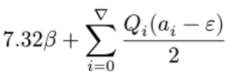{.absolute bottom="200" left="20" width="400"}

## Pantillas personalizadas {.title-top}


Existen plantillas typst preconfeccionadas que se pueden utilizar o bien personalizar una propia.

| Formato   | Uso                                                      |
|-----------|----------------------------------------------------------|
| Poster    | quarto use template quarto-ext/typst-templates/poster    |
| IEEE      | quarto use template quarto-ext/typst-templates/ieee      |
| AMS       | quarto use template quarto-ext/typst-templates/ams       |
| Letter    | quarto use template quarto-ext/typst-templates/letter    |
| Fiction   | quarto use template quarto-ext/typst-templates/fiction   |
| Dept News | quarto use template quarto-ext/typst-templates/dept-news |

En el siguiente [tutorial](https://typst.app/docs/tutorial/making-a-template/) de typst guian en la creación de una plantilla.

<br>

También en el sitio [Awesome Quarto](https://github.com/qjcg/awesome-typst#templates--libraries) hay páginas de plantillas de terceros disponibles para utilizar.


## Word (docx) {.title-top}

{.absolute top="0" left="1500" width="250"}

<br>

Las cabecera básica de documentos Word es:

``` rmardown
---
title: "Mi Documento"
format:
  docx:
    toc: true
    toc-depth: 2
    toc-title: Contenidos
---
```

\* en el ejemplo, además activamos tabla de contenidos, con una profundidad de 2 y título de tabla "Contenidos" (en español).

<br>

La mayoría de las opciones de ejecución vistas para HTML sirven para este tipo de documentos.


## Plantillas Word {.title-top}

Para personalizar la apariencia de los documentos resultantes en Word se puede añadir en la cabecera una plantilla con diseño modificado. Para esto se sigue el siguiente paso a paso:

::: {.fragment .fade-in-then-semi-out}

1. Desde Word se crea un nuevo documento y se modifica el estilo del documento (tipo de hoja, orientación, márgenes, fuentes, colores, etc)

:::

::: {.fragment .fade-in-then-semi-out}

2. Se almacena el archivo .docx resultante en la carpeta del proyecto RStudio donde estamos construyendo el documento Quarto.

:::

::: {.fragment .fade-in-then-semi-out}

3. En la cabecera YAML del documento Quarto se incluye la línea `reference-doc:` con el nombre del documento anterior (ejemplo: *plantilla.docx*)
:::

::: {.fragment .fade-in-then-semi-out}

4. Al renderizar Quarto toma las características de apariencia definidas y las reproduce en la salida del documento generado.

:::


## Tableros de Quarto® {.title-top}

<br>

Los dashboards o tableros de Quarto son archivos **HTML** que pueden ser:

- **Estáticos** 
Se representan una sola vez y los datos no cambian - pueden incluir elementos dinámicos.

- **Programados** 
Se representan a partir de un cronograma donde los datos se actualizan

- **Parametrizados** 
Se modifican a partir de parámetros

- **Interactivo** 
Mediante Shiny - requieren de servidor especial


## Cabecera YAML {.title-top}

<br>

El formato de la cabecera YAML de los tableros de Quarto es `dashboard`. 

<br>

````{.yaml}
---
title: "Mi tablero"
format: dashboard
---
````

<br>

La salida generada es HTML y la estructura se asemeja al uso del paquete flexdashboard de RMarkdown.

Se puede definir como será la orientación y si se habilita el `scrolling` de la página.

Otras opciones específicas de la cabecera YAML para tableros son los logotipos y los botones de navegación.

## Cabecera YAML {.title-top}

Se reconocen alias para botones especiales predeterminados: `linkedin`, `facebook`, `reddit`, `twitter` y `github`. También se pueden crear botones personalizados a partir de [íconos bootstrap](https://icons.getbootstrap.com/).

````{.yaml}
    logo: images/INE.gif
    nav-buttons: 
      - linkedin
      - twitter
      - github
      - facebook
      - reddit
      - icon: hospital
        href: https://www.ine.gov.ar
        target: _blank
````


## Componentes {.title-top}

Los tableros constan de varios componentes:

**Barra de navegación**: ícono, título y autor junto con enlaces a subpáginas (si se define más de una página).

**Páginas, filas, columnas y conjuntos de pestañas**: las páginas, filas y columnas se definen mediante encabezados de Markdown (con atributos opcionales para controlar la altura, el ancho, etc.). Los conjuntos de pestañas se pueden utilizar para dividir aún más el contenido dentro de una fila o columna.

**Tarjetas, barras laterales y barras de herramientas**: las tarjetas son contenedores para gráficos, visualización de datos y contenido de formato libre. El contenido de las tarjetas generalmente se asigna a celdas en el documento fuente. Las barras laterales y las barras de herramientas se utilizan para presentar entradas dentro de tableros interactivos.

## Diseño {.title-top}

<br>

Los elementos de diseño básico son `paginas`, `filas`, `columnas` y `pestañas`.

<br>

Las `paginas` se definen con encabezados tamaño 1 (#)

<br>

Las filas y columnas se declaran con encabezados tamaño 2 (##)

<br>

Las pestañas utilizan la clase `{.tabset}` en filas tipo ## y cada pestaña se declara con un encabezado de tamaño 3 (###)


## Páginas {.title-top}

<br>

````{.yaml}
# Pagina 1 

# Pagina 2 

# Pagina 3 
````

<br>


## Filas {.title-top}

<br>

:::: {.columns}

::: {.column width="30%"}

````{.yaml}
## Row {height=30%}

::: {.card title="Fila 30%"}
:::

## Row {height=70%}

::: {.card title="Fila 70%"}
:::
````

:::

::: {.column width="70%"}

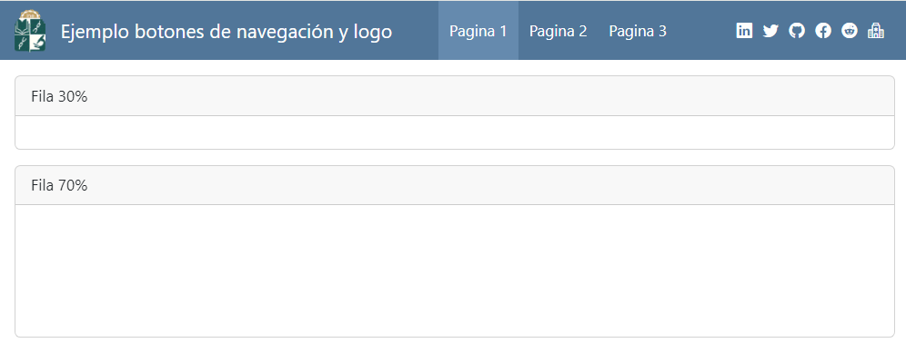

:::

::::


## Columnas {.title-top}

<br>

:::: {.columns}

::: {.column width="30%"}

````{.yaml}
## Column {width=30%}

::: {.card title="Columna 30%"}
:::

## Column {width=70%}

::: {.card title="Columna 70%"}
:::
````

:::

::: {.column width="70%"}

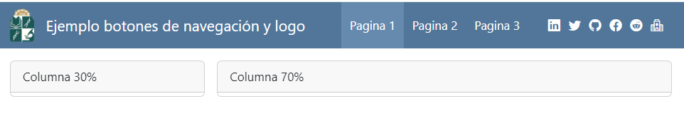

:::

::::


## Pestañas {.title-top}

<br>

:::: {.columns}

::: {.column width="30%"}

````{.yaml}
## Row {.tabset}

### Pestaña 1

::: {.card title=""}
:::

### Pestaña 2

::: {.card title=""}
:::
````

:::

::: {.column width="70%"}

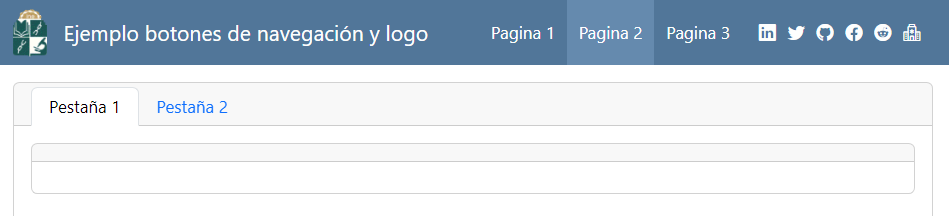

:::

::::

## Barra lateral {.title-top}

<br>

:::: {.columns}

::: {.column width="30%"}

````{.yaml}
## {.sidebar}

```{{r}}
cat("Barra lateral")

cat("Input 1")

cat("Input 2")

cat("Input 3")
```
````

:::

::: {.column width="70%"}

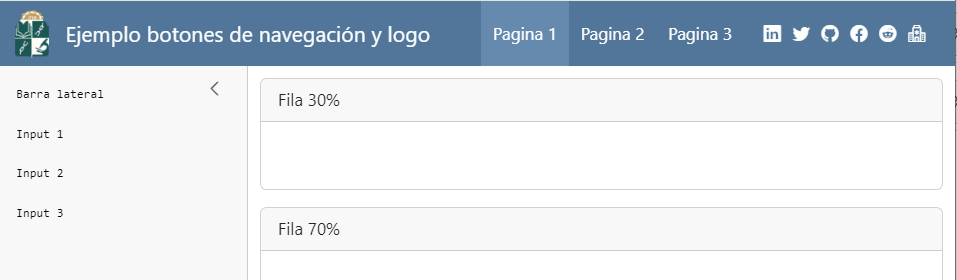

:::

::::

## Tarjetas {.title-top}

<br>

Las tarjetas que se ubican en las celdas que generan las filas, las columnas y/o las pestañas tienen un botón de expansión automático que maximiza la visualización.

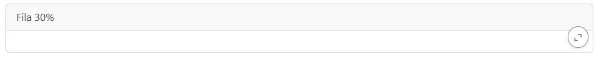{fig-align="center"}

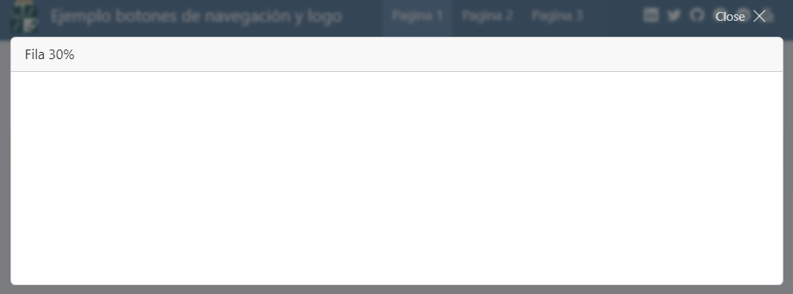{fig-align="center"}

## Tarjetas - contenido {.title-top}

<br>

La sintaxis de una tarjeta incluída en el diseño de página de un tablero tiene la forma:

````{.yaml}
::: {.card title="Título de la tarjeta"}

Aquí va el texto o elemento markdown / HTML a publicar

:::
````

<br>

El contenido de las tarjetas puede ser cualquiera de los elementos vistos anteriormente en Quarto basados en markdown o código HTML puro. También es útil incorporar valores dinámicos mediante código en línea. 

## Cajas de valor {.title-top}

<br>

Los cajas de valor son una excelente forma de mostrar valores simples de manera destacada dentro de un tablero.

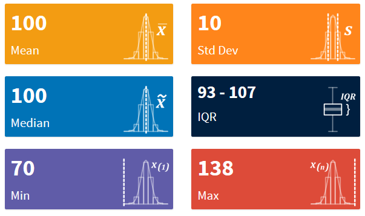{fig-align="center"}

## Cajas de valor {.title-top}

La sintaxis dentro de un fragmento de código R tiene la siguiente estructura:

````{.yaml}
```{{r}}
#| content: valuebox 
#| title: "Texto de la caja de valor" 
 
list(
  icon = "nombre-icono",
  color = "color de la caja",
  value = valor a mostrar)
)

```
````

Los íconos pueden ser cualquiera de los 2000 disponibles en [íconos de bootstrap](https://icons.getbootstrap.com/)

En color puede especificarse alguno de la paleta general hexadecimal o con palabras reservadas tipo `primary`, `success`, `danger`, etc. Estos colores variaran según el tema estético aplicado al tablero.

## Cajas de valor {.title-top}

<br>

También se pueden crear cajas de valores usando Markdown simple, en cuyo caso normalmente se incluye el valor mediante una expresión en línea. Por ejemplo:

<br>

:::: {.columns}

::: {.column width="70%"}

````{.yaml}
## Row

::: {.valuebox icon="heart-pulse-fill" color="danger"}
Cantidad de enfermos

´{r} enfermos´
:::
````

:::

::: {.column width="30%"}

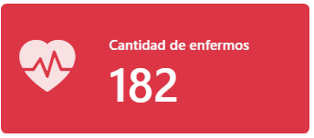

:::

::::


## Tablas desde código {.title-top}


Se pueden incluir tablas dentro de estos tableros de dos formas:

- Como una presentación tabular simple
- Como un widget interactivo que incluya, por ejemplo ordenamiento y filtrado.

Si lo que se quiere mostrar es una cantidad pequeña de observaciones se puede utilizar funciones de `knitr` o `flextable` sin problemas.

````{.yaml}
```{{r}}
knitr::kable(datos)

# o con flextable

datos |> 
  flextable()
```
```` 

Estas tablas tendrán composición Markdown simples y llenan automáticamente al  contenedor (desplazándose horizontal y verticalmente según sea necesario).


## Tablas desde código {.title-top}

<br>

Si la tabla que queremos mostrar tiene muchos registros o es conveniente que se pueda ordenar de formas ascendente o descendente por alguna/s variable/s o hacer alguna busqueda particular, tenemos que hacer uso de algún paquete que incluya cierta interactividad.

<br>

Por ejemplo, el paquete DT, esta basado en una interfaz de JavaScript DataTables y agrega filtrado, paginación y ordenamiento a sus salidas.

<br>

````{.yaml}
```{{r}}
library(DT)
datatable(datos)
```
```` 

## Tablas desde código {.title-top}


```{r}
#| echo: false

library(DT)
library(datos)

encuesta |> 
  select(estado_civil, edad, partido, ingreso) |> 
datatable(class = 'cell-border stripe', 
          rownames = F, 
          options = list(
            pageLength = 3, 
            autoWidth = TRUE))
```


## Gráficos desde código {.title-top}

<br>

Los gráficos son los elementos más comunes mostrados en tableros. Al igual que las tablas pueden ser estáticos o dinámicos/interactivos.

<br>

- Los estáticos serán gráficos generalmente producidos con **ggplot2**
- Los dinámicos estarán basados en alguna librería de JavaScript que incluyen los paquetes especiales `ggiraph`, `Plotly`, `highcharter`, `dygraphs`, etc.
- También hay algunas librerías para mostrar mapas como `Leaflet` o `mapview`

## Gráficos desde código {.title-top}

Ejemplo con `ggiraph`

```{r}
#| echo: false
#| message: false
#| warning: false
#| fig-align: center
#| fig-height: 4

library(ggplot2)
library(ggiraph)
data <- mtcars
data$carname <- row.names(data)

gg_point = ggplot(data = data) +
    geom_point_interactive(aes(x = wt, y = qsec, color = disp,
    tooltip = carname, data_id = carname), size = 2) + 
  theme_minimal()

girafe(ggobj = gg_point, options = list(
    opts_toolbar(saveaspng = TRUE)
  ))

```

## htmlwidgets {.title-top}

<br>

Estos componentes dinámicos / interactivos basados en JavaScript mostrados en los paquetes para tablas y gráficos anteriores pertenecen a htmlwidgets.

En el sitio <https://www.htmlwidgets.org/> perteneciente a RStudio / Posit se encuentran publicada la galería de librerías disponibles.

Cada uno de los 132 paquetes citados tienen su propia página con la referencia de sus funciones, modo de uso, ejemplos, etc.

Estos componentes se pueden incluir en dashboards con y sin servidor Shiny asociado y también en documentos HTML de Quarto.


## {#chau-quarto-title data-menu-title="Hasta la proxima"  background-image="images/Captura8.png" aria-label="Dos pinguinos mirando la luna de Quarto"}